[Home](../../README.md) &gt; [Nozzle Design Overview](./NozzleDesignOverview.md)

# Nozzle Design Overview

This document is a design reference for regeneratively cooled, shock-free bell nozzles. It covers
the physics and the reasoning behind two coupled design problems: generating a supersonic contour
via Axisymmetric Method of Characteristics, and designing a regenerative cooling architecture onto
that contour.

The two halves are not independent. The contour produced in Part I is the geometric input to
Part II: the method-of-characteristics wall becomes the hot wall that the cooling channels are
offset from, and the exhaust-side heat transfer correlation is evaluated against the local Mach
number and area ratio that the Mach net supplies.

## Document Scope

| Part | Subject | Produces |
|------|---------|----------|
| I | Supersonic contour generation via Axisymmetric Method of Characteristics | Shock-free wall contour, exit conditions, thrust coefficient |
| II | Regenerative cooling architecture | Gaussian-fluted helical channel jacket, 1-D heat transfer performance estimate |
| III | Worked design example | A 100 [kN] LOX/LH2 upper stage carried end to end |

The design carried through Part II is a hybrid Oxygen/HDPE engine at approximately 15 [MPa]
chamber pressure, and the worked example in Part III is a 100 [kN] LOX/LH2 upper stage. Neither
is a constraint on the methods themselves, which are propellant and scale agnostic.

## Nomenclature

Symbols are shared across both parts unless noted.

- $A =$ area
- $b =$ linear intercept
- $C_+ =$ left running characteristic
- $C_- =$ right-running characteristic
- $c_P =$ specific heat at constant pressure
- $c^* =$ characteristic velocity
- $c_{\tau} =$ thrust coefficient
- $D, d_H =$ diameter, hydraulic diameter
- $F_A, F_P, F_H =$ flute amplitude, pitch, and helix angle
- $f =$ flute amplitude coefficient (Part II geometry); friction factor (Gnielinski correlation)
- $H_f =$ helix angle
- $h =$ convective heat transfer coefficient
- $k =$ thermal conductivity
- $L =$ channel path length
- $L_{frac} =$ length fraction
- $LR =$ left-running
- $M =$ mach number
- $m =$ slope
- $MW =$ molecular weight
- $N =$ number of cooling channels
- $n_f =$ number of flutes
- $Nu =$ Nusselt number
- $P =$ static pressure
- $Pr =$ Prandtl number
- $\dot{Q} =$ heat transfer rate
- $R =$ specific gas constant; nozzle radius (Part II channel packing)
- $R_{COND}, R_{CONV} =$ conductive and convective thermal resistance
- $Re =$ Reynolds number
- $r =$ radial position; channel radius (Part II)
- $RR =$ right-running
- $T =$ temperature
- $t_{infill} =$ infill thickness between adjacent channels
- $v =$ velocity
- $w =$ channel wrap modifier
- $x =$ axial position

Greek:

- $\gamma =$ ratio of specific heats
- $\alpha =$ Sauer flow parameter
- $\Delta L =$ differential path length between cross sections
- $\epsilon =$ peak axial distance of mach 1 ahead of physical throat
- $\eta =$ trough axial distance of mach 1 behind of physical throat
- $\mu =$ mach angle; dynamic viscosity (Bartz correlation)
- $\nu =$ prandtl meyer angle
- $\theta =$ flow angle; pitch angle in the cross section fly operation
- $\sigma =$ Bartz boundary layer correction term
- $\tau =$ thrust
- $\Phi, \phi_i =$ total and differential cross section roll
- $\psi =$ yaw angle in the cross section fly operation

Subscripts:

- $differential =$ between two values
- $local =$ at a point in the flow
- $stagnation =$ in the chamber
- $throat =$ at the nozzle throat (smallest cross sectional area)
- $curvature, inlet/outlet =$ in reference to the incoming or outgoing throat curvature
- $streamline =$ in reference to a flow streamline
- $sonicline =$ values on Sauer's solution
- $sonic =$ velocity when Mach = 1 for a given fluid
- $axial =$ in the direction of the nozzle axis
- $flow =$ with respect to the local flow direction
- $sauer =$ any property that is a derivative of Sauer's solution
- $intersection =$ in reference to a property calculated at a characteristic intersection
- $wall =$ in reference to the known throat wall locations
- $guess =$ approximate value that will be numerically converged
- $max, adiabatic =$ assuming no heat transfer to the surroundings
- $u, d =$ in reference to *upstream* and *downstream* mach net points
- $HOT, COLD =$ exhaust side and coolant side of the cooling circuit
- $fluted =$ in reference to the fluted channel cross section
- $0 =$ initial/chamber properties
- $e =$ nozzle exit plane properties

Superscripts/Overheads:

- dot ($\dot{a}$) = per time
- bar ($\bar{a}$) = non-dimensional
- star (${a}^*$) = ratio

# Part I: Nozzle Contour Design

This part covers the design of converging-diverging nozzle contours via Axisymmetric Method of
Characteristics (AxMoC). The contour that comes out of this part is the hot wall that Part II
cools.

## Nozzle Design Background

From the absolutely massive F-1 engines that lifted the Saturn V, to the smallest Reaction Control thruster that orients a satellite in space, the physics of flow through supersonic nozzles and the fundamental design concepts that describe them are the same!

However, when it comes to the design of nozzles, there are a few different approaches. The design problem typically starts with some mission requirements that nail down important aspects of the design, such as propellant combination and thrust. With the defining parameters in place, the nozzle design may take either a very simple or dramatically complex approach:

The simple approach is to define the target outlet pressure that the exhaust flow will be expanding to, which is equivalent to specifying what altitude the nozzle is optimized for. Based on the propellants, we can use this information to define an exit mach number, and then specify the area ratio of the nozzle accordingly. This process assumes nothing of the geometry of this nozzle, just the geometric properties at the nozzle boundaries (namely the throat and exit areas and subsequent radii). This is nozzle design in its simplest form, just a list of critical requirement numbers.

However, we have to eventually make the thing so we need to define what shape is going to connect the throat and outlet of our nozzle. Depending on the use case, some designers may fall back on established principles and elect to make manufacturing easy by making the simplest possible nozzle design: a cone!

*[Figure: Cone Nozzle Reference Image]*
*Conical Nozzle Reference [7]*

For a cone of a 15 degree half angle between the specified throat and exit radii, the specific impulse ($I_{sp}$) efficiency (or how far off the measured $I_{sp}$ is from isentropically ideal $I_{sp}$) is near 98% [7]. For the uninitiated, $I_{sp}$ is vaguely comparable to a rocket engine's *fuel efficiency*, similar to miles per gallon (mpg) fuel efficiency for a car. The higher the number (for rockets $I_{sp}$ is generally somewhere around 300[s]), the more force you are able to generate per mass of propellant, and the term *isentropic* just means that the energy conversion to force was perfect. The unit of *seconds* can sometimes be confusing but it represents the duration of thrust production that is possible for a given amount of propellant to produce under its own weight. This 98% conversion rate is well good enough for designers that are only concerned with manufacturability and not inching out every fractional percentage point in performance, and is a common design choice for simple solid rockets and student projects.

However, conical nozzles are the longest a functional and efficient nozzle could be, because the distance traversed from the throat to the exit is linear. This becomes a problem as nozzles get very large or are intending to go to space and therefore need to maximize their weight efficiency. We could reach that target exit area much faster if we traversed the gap between throat and exit radii in a parabolic fashion instead, leading to the natural next step of bell nozzles!

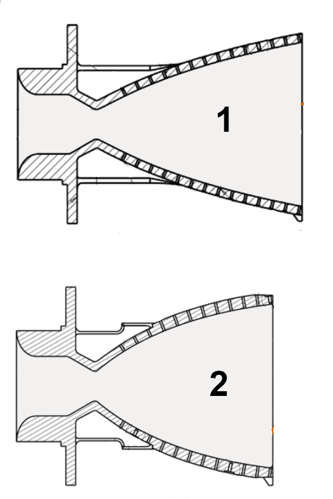

*Cross sections of a truncated ideal contour (1) and a parabolic contour (2) for the same throat and exit. Credit: NASA, public domain*

But how much shorter than a cone do we want to be? We could make a nozzle that is half the length of a cone, but will the flow still expand as efficiently as just using a cone? (Spoiler alert, no it won't) It is possible to move the wall too far from the flow and end up with another problem: supersonic flow slamming into your wall and bouncing off! This is also known as a shock! So, we want to cut down on length but we don't want to introduce shocks and therefore efficiency losses, so how long do we make a parabolic nozzle? The convention generally is around 75% of the length of an equivalent 15 degree conical nozzle, and this achieves similar performance at a length reduction of ~25%, which saves substantially on overall weight.

This is all fine and good, but it feels very imprecise. We are doing rocket science, after all, isn't there a better way? There sure is! Up until now we have been talking primarily about the desires of designers and ease of manufacturing, but have we stopped to consider what the supersonic flow wants? When you take a physics-first approach to solving the problem things get much more complicated, but the juice is worth the squeeze so-to-speak. What if there was a way to follow the supersonic expanding flow as it did what it naturally wants to, and just trace a line through it for our nozzle wall? That is the philosophy behind nozzle design through a Method of Characteristics approach.

### What is the Method of Characteristics?

#### It's all characteristics? Always has been.

It may be surprising if you have never heard of the term before, but the Method of Characteristics (MoC) has nothing to do with nozzle design specifically. MoC is just a technique for solving partial differential equations that apply to hyperbolic fields and is applicable far outside of its use in nozzle design.

Conveniently for us, however, the supersonic flow field after the throat of a converging-diverging nozzle is described by hyperbolic field equations that we can solve using the MoC approach, allowing us to build a supersonic flowfield after the throat of a nozzle. If we assume that the flow is comprised of an ideal gas that is steady and maintains constant total enthalpy, then we can model the flow using:

- *2$^{nd}$ Law of Thermodynamics (assuming shock-free, inviscid, irrotational flow)*
- *Conservation of Mass*
- *Conservation of Momentum*

$$
\begin{align}
    \vec{\nabla} \times \vec{v} = 0 \\
    \nabla \cdot \big(\rho\vec{v}\big) = 0 \\
    \rho {D \vec{v} \over{D t}} + \vec{\nabla} P = 0
\end{align}
$$

It can be shown (not here, for the interested reader of the full derivation see **Ferri, A., “The Method of Characteristics,” General Theory of High Speed Aerodynamics, edited by W. Sears, The Macmillan Co., 1951**) that these governing equations can be simplified to form the *four* differential equations we need to solve the flowfield, two *characteristic* equations and two *compatibility* equations (or rather one equation for each of the right and left-running characteristics from any one point in the field):

$$
\begin{align}
    \bigg({dr\over{dx}}\bigg)_{characteristic} =& tan\big(\theta \mp \mu \big) \\
    0 =& {dv\over{v}} \mp tan(\mu)d\theta - {tan(\mu)sin(\mu)sin(\theta)\over{cos\big(\theta \pm \mu \big)}}{dx\over{r}}
\end{align}
$$

The *compatibility* equations that we are solving for our 2D Axisymmetric flow case are of the form:

$$
\begin{align}
    d(\theta \mp \nu) = {1 \over{\sqrt{M^2-1} \pm cot(\theta)}} {dr \over{r}}
\end{align}
$$

which can be shown to be writable in the form of equation (5) through some heavy manipulation that is present in the referenced paper for the interested reader. Both forms will be of use to us moving forward.

For me it helped to remember that the terms *right-running* and *left-running* are speaking with respect to the nozzle axis, so when looking along the axis the *left-running* characteristic goes to the left and is denoted as $C_+$ and the *right-running* characteristic goes to the right and is denoted as $C_-$.

*[Figure: MoC Reference Image]*

Partial differential equations can sometimes be challenging to solve, and there are simplifying assumptions and techniques that can be employed to solve these equations describing the flowfield. One simplification is to assume that the flow is perfectly planar (or 2D), and in such a case we can reduce the PDEs that describe the flowfield down to simple algebraic expressions that are outright solvable given initial conditions of the flow. This is the common approach explored in an undergrad fluids class, where the implementation is simple and effective at explaining the concept.

We, however, are not quite as lucky. The flowfield is *not* actually 2D, which would be more representative of flat nozzles that are used in supersonic wind tunnels. Our flow is more closely approximated by assuming that the flow is axisymmetric about the nozzle axis, which leads us naturally to bell nozzles. In our case, instead of simple algebra, we are tasked instead with solving the system of Ordinary Differential Equations (ODEs) given by the *characteristic* and *compatibility* equations (4, 5). More on the implementation of the governing equations later.

Once the flowfield is described, we can simply trace a streamline through the flow to draw our desired nozzle contour. Building the flowfield is a process that happens in stages that are defined by what properties of the flow we are able to assume at each stage. The MoC approach employed here is broken into 3 distinct sections: throat kernel, inner expansion mesh, and flow straightening section.

*[Figure: Characteristic Mesh Sections]*

The Mach net (or the collection of all mesh points at which we now know the mach number and flow angle) is generated in that order, and each step will be further detailed below. Sounds simple enough (maybe) but there are a few things that we need to pin down before we can actually generate a nozzle contour.

### Initial Conditions: Sauer's Transonic Solution

#### Sauer, what a guy.

In order to propagate flow information downstream of the throat and build out our flowfield, we need to prescribe some boundary conditions. One set of conditions that we can know with confidence are the flow properties at the throat of the nozzle, thanks to the work of Sauer [2]. Sauer and his extensive study of transonic flows at the throat of converging-diverging nozzles gives us a wealth of information that is critical to nozzle design. Using his technique, we are able to characterize the sonic line in the nozzle throat (where a much more appropriate approximation of the transition to Mach 1 occurs) and use the information there as an initial condition for our MoC solution.

*[Figure: Sauer Reference Image]*

Sauer's solution involves the use of two parameters, $\alpha$ and $\epsilon$ (and also $\eta = \epsilon$ for round nozzles), to determine the location of the sonic line at the nozzle throat:

$$
\begin{align}
    \alpha   =& \sqrt{{2\over{\big(\gamma + 1\big)r_{throat}r_{curvature.inlet}}}} \\
    \eta = \epsilon =& {r_t\over{8}} \sqrt{2(\gamma + 1){r_{throat}\over{r_{curvature,inlet}}}}
\end{align}
$$

where we can build a distribution of points describing the sonic line by:

$$
\begin{align}
    x_{sonicline}(r) =& -{\gamma + 1 \over{2}} \alpha r^2 + \epsilon \\
    0 &\leq{r} \leq{r_{throat}} \\
\end{align}
$$

and we can sample Mach numbers to calculate flow velocity at varying radii by solving:

$$
\begin{align}
    \textcolor{green}{M_{Sauer}} \sqrt{\gamma R T_{stagnation} \over{1 + {\gamma - 1 \over{2}}\textcolor{green}{M_{Sauer}}^2}} - v_{axial} = 0 \\
    v_{axial}(r) = v_{sonic} \bigg(1 + \big[\alpha \big(x_{sonicline}(r) - \epsilon\big) + {\gamma + 1 \over{4}}(\alpha r)^2\big]\bigg) \\
    v_{sonic} = \sqrt{\gamma R T_{sonic}} \\
    T_{sonic} = {T_{stagnation} \over{1 + {\gamma - 1 \over{2}}}}
\end{align}
$$

for $\textcolor{green}{M_{Sauer}}$ using some numerical zero-ing technique.

The parameter $\epsilon = \eta$ represents the physical distance before and after the throat where the location of Mach 1 actually occurs (see the above reference image), and what I am calling the "flow parameter" $\alpha$ is a constant of proportionality applied to the velocity potential equations when solving the initial flow field described in the $x$ and $y$ directions by:

$$
\begin{align}
    u(x,r) =& \alpha x + {\gamma+1\over{4}}\alpha^2 r + ... \\
    v(x,r) =& {\gamma+1\over{2}}\alpha^2 xr + {{\gamma+1}^2\over{16}}\alpha^3r^3 + ... \\
\end{align}
$$

A reasonable initial guess for that solve is the ratio of the local axial velocity to the sonic velocity, which converges quickly for the full range of throat radii of curvature of interest.

### Initial Conditions: Diverging Section

#### Rao, what another guy.

Another influential individual in the nozzle design space is G.V.R. Rao [3,7], who determined empirical relationships for nozzle throat inlets and outlets through extensive study and experimentation. Today, the Rao throat inlet and outlet are considered synonymous with nozzle design and you will widely see the values for throat curvature cited essentially as fact. It is important to note that there are other ways to generate nozzle throat geometry (one of which involves a MoC approach that propagates backwards and defines the throat contour) but Rao nozzles have been shown to be incredibly efficient so for now that can serve as a boundary condition for our purposes.

The values for Rao's throat curvature are:

$$
\begin{align}
    r_{curvature,inlet} =& 1.5r_{throat} \\
    r_{curvature,outlet} =& 0.382r_{throat} \approx{0.4r_{throat}}
\end{align}
$$

These should look familiar from the reference image between conical and bell nozzles above.

For the diverging section of the nozzle we only need $r_{curvature,outlet}$, however both are useful to define for the generation of the converging section of the nozzle in the future.

By convention, the Rao throat diverging section extends out to a wall angle equal to 1/4 of the Prandtl-Meyer angle at the target exit Mach Number. The Prandtl-Meyer angle of a supersonic flow turning as it passes an expanding section is defined as:

$$
\begin{align}
    \nu = \sqrt{{\gamma + 1 \over{\gamma -1}}}\arctan{\bigg(\sqrt{{\gamma - 1 \over{\gamma + 1}}(M^2 - 1)}\bigg)} - \arctan\big({\sqrt{M^2 - 1}}\big)
\end{align}
$$

With the throat wall and Sauer solution boundary conditions defined, we can visualize the initial conditions of our non-dimensional design space using the relationships from equations (8, 17):

*[Figure: Boundary Conditions]*

### Kernel Generation: Creating the Mach Net

#### Propagate those characteristics, they do be intersectin'

At every point in the forthcoming Mach net we will be keeping track of the Mach Number and the Flow Angle at that location (as well as the (x, r) coordinates themselves). With our boundary conditions defined, we can calculate the first point of our Mach net by calculating where Sauer's solution intersects our throat wall. This is accomplished by solving:

$$
\begin{align}
    \tan{\bigg({\theta_{flow} + \mu_{Mach=1} + \mu_{Sauer}\over{2}}\bigg)}\bigg(\epsilon - x_{throat} - {\gamma + 1 \over{8}}\alpha \textcolor{green}{r_{intersection}}^2\bigg) + r_{throat} - \textcolor{green}{r_{intersection}} = 0 \\
    \mu_{Sauer} = \arcsin\bigg({1 \over{ M_{Sauer}}}\bigg)
\end{align}
$$

for $\textcolor{green}{r_{intersection}}$ again using some zero-ing method and, as a result:

$$
\begin{align}
    x_{intersection} =& \epsilon - {\gamma + 1 \over{8}} \alpha r_{intersection}^2 \\
    M_{intersection} =& M_{Sauer} \\
    \theta_{intersection} =& \theta_{wall}
\end{align}
$$

Here we already have a strategy from the previous section to calculate $M_{sauer}$ for equation (20).

The parameter $\mu$, the Mach angle, describes the conical angle of potential information propagation in a supersonic flow downstream of a supersonic object.

*[Figure: Mach Angle]*

The characteristic intersection follows directly: solve equation (19) for $r_{intersection}$, then evaluate equation (21) for the axial location.

*[Figure: Initial Conditions]*

The first step in generating the throat kernel is complete, but where do we go from here? One of our assumptions is that the flow angle at the throat wall is the same as the wall angle, and we know all of the wall angles by definition. To that end, we have $x, r, \theta_{flow}$ at all throat wall points and can project a characteristic point off of the wall given that we know the "upstream" and "current" points of the mesh from the wall. We can make an initial guess for the characteristic projection point by averaging the flow angles at nearby nodes and checking whether or not the guessed point satisfies the compatibility equations near the wall. This can be done numerically through a residual minimizer, where the flow angle and mach number at the intersection point are the control variables of the minimization:

$$
\begin{align}
    0 =&  {1 \over{\sqrt{M^2 - 1} \mp \cot{(\theta_{flow,intersection})}}} * \bigg({r_{intersection} - r_{1,2} \over{r_{intersection}}} - (\theta_{flow,intersection} \pm \nu_{intersection}) - (\theta_{1,2} \pm \nu_{1,2})\bigg) \\
    res_{C_-} =& {1 \over{\sqrt{M_{guess}^2 - 1} - \cot{(\theta_{flow,guess})}}} * \bigg({r_{intersection} - r_1 \over{r_{intersection}}} - (\theta_{flow,guess} + \nu_{guess}) - (\theta_1 + \nu_1)\bigg) \\
    res_{C_+} =& {1 \over{\sqrt{M_{guess}^2 - 1} + \cot{(\theta_{flow,guess})}}} * \bigg({r_{intersection} - r_2 \over{r_{intersection}}} - (\theta_{flow,guess} - \nu_{guess}) - (\theta_2 - \nu_{intersection})\bigg) \\
    res =& \sqrt{res_{C_-}^2 + res_{C_+}^2}
\end{align}
$$

where,

$$
\begin{align}
    x_{intersection} =& {b_{RR} - b_{LR} \over{m_{LR} - m_{RR}}} \\
    r_{intersection} =& {m_{LR}x_{intersection} + b_{LR} + m_{RR}x_{intersection} + b_{RR} \over{2}} \\
    m_{L,R} =& \tan{(\theta_{flow} + \mu_{guess})} , \tan{(\theta_{flow,average} - \mu_{average})} \\
    b_{L,R} =& r_{1,2} - m_{L,R}x_{1,2}
\end{align}
$$

The general form of equations should be recognizable from the compatibility equations presented in equation (6).

The residual is minimized over the two control variables $M$ and $\theta_{flow}$ at the intersection, starting from $M_1$ and the average of the two neighboring flow angles.

Here at the first step of the kernel generation, we do not have any additional internal points to calculate that would necessitate the use of Axisymmetric Method of Characteristics (AxMoC), so just for this step we will skip over that and return to it in a moment when it is relevant.

We also need to calculate the location where the projected characteristic will intersect the limiting characteristic, given the last point in the characteristic mesh before reaching the limiting characteristic. That can be done by checking, via convergence, where the projecting characteristic satisfies Sauer's solution:

$$
\begin{align}
    -{\gamma + 1 \over{8}}\alpha r^2 + \epsilon - \bigg({r_{intersection} - \big[r_{throat} - x_{throat}\tan{(\mu_{Sauer})}\big]\over{\tan{(\mu_{Sauer})}}}\bigg) = 0 \\
    x_{intersection} = \epsilon - {\gamma + 1 \over{8}} \alpha r_{intersection}^2 \\
\end{align}
$$

As before we have a procedure for calculating where a characteristic intersects the limiting characteristic, which we can follow again to figure out where this intersection occurs.

We can visualize the first characteristic projection and first limiting characteristic intersection like this:

*[Figure: First Characteristic Projection and Limiting Characteristic Intersection]*

### Detailing the Axisymmetric Method of Characteristics Approach

With the first points of the mesh defined, we can perform our first actual step of Axisymmetric Method of Characteristics (AxMoC) towards the throat wall to find the next throat wall intersection point that will be the seed to the next step of AxMoC.

To do this, we must provide the algorithm with information about two "upstream" points in the flow and use the information at those points to propagate flow information "forward" in the mesh. The first time we do this can be a check to make sure everything is going smoothly, by choosing the throat intersection (white) and the limiting characteristic intersection (green) as our first trial points and recalculating the wall characteristic projection point (red) but this time with AxMoC. This is relevant because the compatibility equations from before are of the same form as the flowfield equations, just solved near the wall.

We will need the $x_i, r_i, M_i, \theta_{flow,i}$ (we can shorthandedly call this package of information about both seed points the AxMoC *kernel*) for each point we are choosing to provide the AxMoC algorithm. From there we can calculate some dependent parameters:

$$
\begin{align}
    \nu_i =& arcsin\bigg({1 \over{M_i}}\bigg) \\
    T_{local, i} =& T_{stagnation} \over{1 + {\gamma-1\over{2}}M_i^2} \\
    v_{local, i} =& M_i\sqrt{\gamma R T_{local,i}} \\
    \bar{v}_{local, i} =& cot(\nu_i)\over{v_{local,i}} \\
    LRT =& sin(\theta_{flow,1})sin(\nu_1)\over{sin(\theta_{flow,1}+\nu_1)} \\
    RRT =& sin(\theta_{flow,2})sin(\nu_2)\over{sin(\theta_{flow,2}-\nu_2)} \\
\end{align}
$$

Where $LRT$ and $RRT$ are shorthand expressions for the *left-hand term* and *right-hand term* for the respective characteristics (and it makes it easier to code to break the variables apart).

With the input points and dependent properties defined, we can now set up the solution process for the system of ODEs that will be solved to obtain our characteristic intersection point and its resultant properties $x_{intersection}, r_{intersection}, M_{intersection}, \theta_{flow,intersection}$. This process will require guessing and checking at the actual intersection point and properties, as the underlying expressions are not algebraic but differential equations, so each time these properties are calculated the variance in the calculated intersection point is checked until it falls within a specified tolerance. The *compatibility* ODEs that we are solving for our 2D Axisymmetric flow case are of the form:

$$
\begin{align}
    d(\theta \mp \nu) = {1 \over{\sqrt{M^2-1} \pm cot(\theta)}} {dr \over{r}}
\end{align}
$$

as before, which can be shown to be writable in the form of equations (5) from earlier (presented here again as a reminder of general form so the expressions below feel motivated by the underlying ODEs):

$$
\begin{align}
    0 =& {dv\over{v}} \mp tan(\mu)d\theta - {tan(\mu)sin(\mu)sin(\theta)\over{cos\big(\theta \pm \mu \big)}}{dx\over{r}}
\end{align}
$$

which is equivalent to:

$$
\begin{align}
    0 =& cot(\mu){dv\over{v}} \mp d\theta - {sin(\mu)sin(\theta)\over{cos\big(\theta \pm \mu \big)}}{dx\over{r}}
\end{align}
$$

when dividing out by $tan(\mu)$.

For a small enough distance between mach net points (or rather a sufficient enough resolution in the numerical space), we can assume that the traversal between points is approximately linear, despite the fact that the characteristics in reality are curved. We can discretize the compatibility equations for a first-order numerical scheme and calculate the approximate local characteristic slopes assuming a linear relationship between mesh points. This allows us to back out the intersection point downstream in the characteristic mesh:

$$
\begin{align}
    m_{LR} =& tan(\theta_{flow,1} + \mu_{1}) \\
    m_{RR} =& tan(\theta_{flow,2} - \mu_{2}) \\
    x_{intersection} =& {r_2 - r_1 - x_2m_{RR} + x_1m_{LR} \over{m_{LR} - m_{RR}}} \\
    r_{intersection} =& r_1 + (x_{intersection} - x_1) m_{LR}
\end{align}
$$

We can calculate the velocity and flow angle at the intersection point as:

$$
\begin{align}
    v_{intersection} =& {v_1\bar{v}_1 + v_2\bar{v}_2 + {LRT\over{r_1}}(r_{intersection} - r_1) + {RRT\over{r_2}}(r_{intersection} - r_2) + \theta_{flow,1} - \theta_{flow,2} \over{\bar{v}_1 + \bar{v}_2}} \\
    \theta_{flow,intersection} =& \theta_{flow,1} + \bar{v}_1 (v_{intersection} - v_1) - {LRT\over{r_1}}(r_{intersection} - r_1) + \theta_{flow,2} + \bar{v}_2 (v_{intersection} - v_2) + {RRT\over{r_2}}(r_{intersection} - r_2)
\end{align}
$$

The form of these equations comes from discretizing and then solving the compatibility equations for each respective variable.

This set of equations breaks down near the nozzle axis where $r$ is near 0, so instead when the intersection point is near the axis we must solve for the intersections in a different manner by solving the system all at once using its matrix representation:

$$
\begin{align}
    Ax = B
\end{align}
$$

$$
\begin{align}
    \epsilon =& {v_1\bar{v}_1 + v_2\bar{v}_2 + {RRT\over{r_2}}(r_{intersection} - r_2) + \theta_{flow,2} \over{\bar{v}_1 + \bar{v}_2}} \\
    A =&
    \begin{bmatrix}
        1 & -\bar{v}_1\over{2} & -\bar{v}_1v_1\over{2} \\
        -{1\over{\bar{v}_1} + \bar{v}_2} & 1 & \epsilon
    \end{bmatrix} \\
    B =& rref(A) = 
    \begin{bmatrix}
        1 & 0 & v_{intersection} \\
        0 & 1 & \theta_{flow,intersection}
    \end{bmatrix} \\
\end{align}
$$

Where the matrix $B$ is the *reduced row echelon form* of the matrix $A$, the last column of which contains the solutions for $v_{intersection}$ and $\theta_{flow,intersection}$.

Finally, the mach number and mach angle at the intersection point are calculated as:

$$
\begin{align}
    v_{ratio} =& {v_{intersection}\over{v_{max,adiabatic}}} \\
    M_{intersection} =& \sqrt{{2\over{\gamma-1}}\bigg({v_{ratio}\over{1 - v_{ratio}}}\bigg)^2} \\
    \mu =& arcsin\bigg({1\over{M_{intersection}}}\bigg)
\end{align}
$$

This is a good first approximation of the characteristic intersection point, however we can do much better by creating a second order solution by iterating upon the new intersection point and using it to average flow properties between the upstream points and the newly calculated intersection point and recalculating a new characteristic intersection. We can repeatedly check how much the newly calculated intersection point has changed since the last iteration and stop the convergence once the value of the intersection point change falls within a specified tolerance of 1e-8. This allows is to numerically converge to a downstream characteristic intersection with a high degree of confidence for any two starting points in the mesh.

Each pass therefore reduces to: approximate the characteristic slopes and their intersection, equations (43-46); solve for velocity and flow angle at that intersection, using the matrix form of equations (49-52) when the point falls on the axis and equations (47, 48) otherwise; and recover the mach and mach angles from equations (54, 55). The kernel is then re-averaged against the new intersection point and the pass repeats until the intersection location settles.

The intersection point between the kernel points for the first pass of AxMoC should directly overlap with the characteristic projection from the previous step, since that projected point came from solving the compatibility equations near the wall.

*[Figure: Axisymmetric Method of Characteristics Initial Corrector Step]*

Looks like we nailed it!

**For right now the fact that the method is *axisymmetric* doesn't seem to matter, but it will feel more relevant later during the generation of the mach net near the nozzle axis.**

The next phase of the process involves a similar procedure but for finding the location where a characteristic intersects the nozzle throat wall. We have a non-dimensional description of the location of the throat wall from assuming incoming and outgoing throat radius of curvature, so we can use that information in conjunction with linear approximations for the characteristic to determine locations of throat wall intersections. We can determine the axial location of the potential throat wall intersection by numerically solving:

$$
\begin{align}
    -\sqrt{(r_{curvature,outlet}r_{throat})^2 - \textcolor{green}{x_{intersection}}^2} + r_{throat} + r_{curvature,outlet}r_{throat} - m_{LR}\textcolor{green}{x_{intersection}} - r_{intersection} =& 0 \\
    r_{intersection} =& r - m_{LR}x \\
    m_{LR} =& tan(\theta + \mu)
\end{align}
$$

Now, we can propagate a characteristic out until we intersect the throat wall, at which point we can calculate a new characteristic projection and the cycle repeats.

*[Figure: Axisymmetric Method of Characteristics Next Step]*

This process can then be repeated back and forth between the limiting characteristic and the throat wall until we run out of throat wall points to intersect with. At that point, we have reached the end of the throat kernel.

*[Figure: Axisymmetric Method of Characteristics Next Step]*

*[Figure: Axisymmetric Method of Characteristics Next Step]*

*[Figure: Axisymmetric Method of Characteristics Next Step]*

*[Figure: Axisymmetric Method of Characteristics Next Step]*

*[Figure: Axisymmetric Method of Characteristics Next Step]*

Now that we have defined the throat kernel, we can move on to the rest of the mach net. We can start by projecting a right-running characteristic down to the nozzle axis to act as the boundary point to perform method of characteristics out until we run out of throat kernel reference points. To do this we can start in the throat kernel and perform the AxMoC algorithm process but for an entire characteristic, instead of the intersection between two characteristics. The code logic is very similar, however now we are repeating the process across $n$ points between the throat kernel and the nozzle axis. The process flow looks like:

The same treatment applied across $n$ points, rather than to a single intersection, walks a complete characteristic out from a seed point. This allows us to calculate any characteristic line (both *right-running* and *left-running*) originating from a mesh point, of which we want the right-running ($C_-$) characteristic originating in the throat kernel until it intersects the nozzle axis. This will now act in the same way that the Sauer Limiting Characteristic did as a boundary for generating characteristic intersections.

*[Figure: Initial Right Running Characteristic]*

*[Figure: Inner Expansion Mesh Step]*

*[Figure: Inner Expansion Mesh Step]*

*[Figure: Inner Expansion Mesh Step]*

Once we reach the nozzle axis, finally we are able to utilize the assumption that the flow is *axisymmetric* by copying a kernel point across the axis to create the seed points for AxMoC that we need.

*[Figure: Inner Expansion Mesh Step]*

From there we can repeat the AxMoC process until we converge the kernel down to the nozzle axis.

*[Figure: Inner Expansion Mesh Step]*

*[Figure: Inner Expansion Mesh Step]*

*[Figure: Inner Expansion Mesh Step]*

### Final Characteristic: The End of the Mach Net

Starting at the final point of the inner expansion mesh (the dark blue one in the above plot), we can define the final characteristic using the Prandtl-Meyer angle at the calculated exit mach number at the last characteristic mesh point. We can then project a long straight characteristic at that angle off of the final inner expansion mesh point knowing that the flow angle along this characteristic is essentially 0 at every point on the characteristic and the mach number is the calculated exit mach number from the final point of the inner expansion mesh. That straight characteristic ends at the calculated exit radius required for the calculated exit mach to exist at the nozzle wall.

*[Figure: Final Characteristic]*

Using these points as the new seed points for AxMoC, we can fill out the remainder of the mach net in the flow straightening section, stopping the propagation of points after roughly approximating the distance needed to fully encapsulate the flow field where a wall will be. Theoretically we can propagate this flow information far beyond where we want to bound the flow with a wall, but doing so would be computationally inefficient.

*[Figure: Axisymmetric Method of Characteristics From Last Characteristic]*

*[Figure: Axisymmetric Method of Characteristics Flow Straightening Mesh]*

We have now built a representation of a supersonic expanding flowfield where we know the mach number and flow angle at all points. We could conceivably continue the propagation of information further down the nozzle axis, but a restriction has been placed on the design space to terminate calculation if a non-dimensional radius of 1.5 is exceeded before reaching the end of the mach net. This ensures that the nozzle is not larger and heavier than the equivalent conical nozzle, and fits into the larger design problem of optimizing the system in terms of thrust coefficient (which we will discuss further later).

### Flow Straightening: Putting a Roof on Supersonic Flow

The last step is to trace a streamline through the flow, starting at the end of the throat wall until we reach the end of our mach net. This streamline will act as our nozzle wall. If we have done a good job, then this nozzle contour should be a representation of the supersonic expanding flow and not impede the flow in any way, which results in a shock-free, isentropic nozzle. The methodology here is a loose amalgomation of three concepts: approximating streamline curvature via bilinear interpolation of mach net points, streamline/characteristic intersections, and flow continuity via streamline tangency. Deep breath, we'll go through each thing slowly.

If we represent a streamline inside of a small region of the characteristic mesh as a quadratic curve (which is the simplest polynomial expression that can represent curvature) then we can say that a streamline can be represented as:

$$
\begin{align}
    r_{streamline}(x) = c_0 + c_1(x - x_{u}) + c_2(x - x_{u})^2
\end{align}
$$

where the centering term $(x - x_{u})$ locates the streamline in the flow relative to the mach net points of interest.

If we assume that the streamline originates from the upstream mach net point then:

$$
\begin{align}
    r(x_u) = r_u \\
    c_0 = r_u
\end{align}
$$

The next condition we can utilize is flow tangency along a streamline:

$$
\begin{align}
    \bigg({dr\over{dx}}\bigg)_u = tan(\theta_{flow,u}) \\
    c_1 = tan(\theta_{flow,u})
\end{align}
$$

Moreover, we can extract more information by determining flow properties at the intersection between a characteristic ($C_{+/-}$) and the streamline. For the breakdown below the derivation will be done with respect to the left-running characteristic, but the approach is analagous for the right-running characteristic.

$$
\begin{align}
    \bigg({dr\over{dx}}\bigg)_{intersection} = c_1 + 2c_2(x_{intersection} - x_u) = tan(\theta_{flow,intersection})
\end{align}
$$

From here on out, to make the nomenclature simpler, we will refer to $x_{intersection}$ as $x_{query,LR}$ because this is representative of a potential wall point on a flow streamline that is calculated with respect to the left-running characteristic. There are two solutions for $x_{query,LR}$ due to the quadratic nature of the streamline, and subsequently there are two more with respect to the right-running characteristic, but more on that later. We can approximate the flow angle and radial location at the $query,LR$ point by linearly interpolating between the downstream and left-running mach net points:

$$
\begin{align}
    \theta_{flow,query,LR} = \theta_{flow,d} + (\theta_{flow,LR} - \theta_{flow,d}){x_{query,LR} - x_d \over{x_{LR} - x_d}} \\
    r_{query,LR} = r_d + (r_{LR} - r_d){x_{query,LR} - x_d \over{x_{LR} - x_d}}
\end{align}
$$

Plugging in terms to the original quadratic expression and solving for $c_2$ leaves us with:

$$
\begin{align}
    c_2 = {\big(tan(\theta_{flow,LR}) - tan(\theta_{flow,d})\big)(x_{query,LR} - x_d)\over{2(x_{query,LR}-x_u)(x_{LR} - x_d)}} + {tan(\theta_{flow,d}) - tan(\theta_{flow,u})\over{2(x_{query,LR}-x_u)}}
\end{align}
$$

Now, we can set the expression for $r_{query,LR}$ equal to the original streamline equation and collect terms:

$$
\begin{align}
    r_{query,LR} = r_u + \tan(\theta_{flow,u})(x_{query,LR}-x_u) + c_2(x_{query,LR}-x_u)
\end{align}
$$

Substituting the expression for $c_2$:

$$
\begin{align}
    & r_{query,LR} = r_u + \tan(\theta_{flow,u})(x_{query,LR}-x_u) + \nonumber\\
    & \left[ \frac{\tan(\theta_{flow,LR}) - \tan(\theta_{flow,d})}{2(x_{LR} - x_d)} (x_{query,LR} - x_d) + \frac{\tan(\theta_{flow,d}) - \tan(\theta_{flow,u})}{2} \right] (x_{query,LR}-x_u)
\end{align}
$$

From the condition that the $r_{query,LR}$ can be approximated by linear interpolation:

$$
\begin{align}
    & r_u + \tan(\theta_{flow,u})(x_{query,LR}-x_u) + \nonumber\\
    &\left[ \frac{\tan(\theta_{flow,LR}) - \tan(\theta_{flow,d})}{2(x_{LR} -
     x_d)} (x_{query,LR} - x_d)(x_{query,LR}-x_u) + \frac{\tan(\theta_{flow,d}) - \tan(\theta_{flow,u})}{2}(x_{query,LR}-x_u)^2 \right] \nonumber\\
     &= r_d + \frac{r_{LR} - r_d}{x_{LR} - x_d} (x_{query,LR} - x_d)
\end{align}
$$

Multiply both sides by $(x_{LR} - x_d)$ to simplify fractions:

$$
\begin{align}
    & (x_{LR} - x_d) r_u + (x_{LR} - x_d) \tan(\theta_{flow,u})(x_{query,LR}-x_u) + \frac{\tan(\theta_{flow,LR}) - \tan(\theta_{flow,d})}{2}(x_{query,LR} - x_d)(x_{query,LR}-x_u) \nonumber\\
    &+ \frac{\tan(\theta_{flow,d}) - \tan(\theta_{flow,u})}{2}(x_{query,LR}-x_u)(x_{LR} - x_d) = (x_{LR} - x_d) r_d + (r_{LR} - r_d) (x_{query,LR} - x_d)
\end{align}
$$

Expanding $(x_{query,LR} - x_d)(x_{query,LR}-x_u)$:

$$
\begin{align}
    (x_{query,LR} - x_d)(x_{query,LR}-x_u) = x_{query,LR}^2 - x_{query,LR} x_u - x_{query,LR} x_d + x_u x_d
\end{align}
$$

After combining like terms, we arrive at a quadratic equation of the form:

$$
\begin{align}
x_{query,LR}^2 - \eta_{1,LR} x_{query,LR} + \eta_{2,LR} = 0
\end{align}
$$

Where:

$$
\begin{align}
    \eta_{1,LR} =& (x_u + x_d) + \frac{2(r_{LR} - r_d) - (x_{LR} - x_d)\big(\tan(\theta_{flow,u}) + \tan(\theta_{flow,d})\big)}{\tan(\theta_{flow,LR}) - \tan(\theta_{flow,d})} \\
    \eta_{2,LR} =& (x_u x_d) + \frac{2(x_{LR} - x_d)(r_u - r_d) + 2(r_{LR} - r_d)x_d - x_u(x_{LR} - x_d)\big(\tan(\theta_{flow,u}) + \tan(\theta_{flow,d})\big)}{\tan(\theta_{flow,LR}) - \tan(\theta_{flow,d})}
\end{align}
$$

We can now solve for the streamline as:

$$
\begin{align}
    r_{streamline}(x) =& x^2 - \eta_{1,LR}x + \eta_{2,LR} \\
\end{align}
$$

That was a lot, and ultimately it's just here for completeness because this derivation does not seem to exist in its entirety in any one reference and not ever once in the original code implementation, so I feel better now that it lives here.

In practice, to find valid streamline solutions we need the $(x, r, M, \theta)$ information about the mach net at 4 different points: upstream, downstream, and points from the left and right-running characteristics. There are two solutions found relative to the left-running characteristic, and two more for the right-running characteristic, only *one* of the total four is a valid streamline point that will fall axially between the upstream and downstream mach net points . We start by calculating them all and verifying which point falls within the bounding boxes between each seed point. To calculate each wall query point we can solve for the zeros of the quadratic expression:

$$
\begin{align}
    x_{query,LR/RR} =& {\eta_{1,LR/RR} \pm \sqrt{\eta_{1,LR/RR}^2 - 4\eta_{2,LR/RR}} \over{2}} \\
    r_{query,LR/RR} =& r_{d} + {(r_{LR/RR} - r_{d})(x_{query,LR/RR} - x_{d}) \over{x_{LR/RR} - x_{d}}}
\end{align}
$$

The four candidate points follow from equations (74, 75) and (77, 78); the one that falls between the upstream and downstream mach net points is the wall point, and it becomes the upstream point for the next query. If no candidate qualifies, the end of the mach net has been reached.

With the four wall query points calculated, we can check whether they fall within the bounding boxes:

*[Figure: Axisymmetric Method of Characteristics Wall Point Query]*

Here the only valid solution is the green point, so we select it as a wall point and repeat the process using the wall point as the next "upstream" point.

*[Figure: Axisymmetric Method of Characteristics Wall Point Query]*

*Generated truncated ideal contour, split into the regeneratively cooled portion and the uncooled nozzle extension. LOX/LH2 100 [kN] upper stage example case*

Now that we have calculated the set of wall points, what remains is to cut the wall and work out what the nozzle delivers. This is only the first candidate contour, because a truncated ideal contour has two design numbers, an area ratio and a length, and one free parameter: the exit mach number the underlying ideal nozzle is designed to. A larger design mach number opens the wall faster near the throat, so it reaches a given area ratio in less length and leaves a steeper exit; that is the trade the outer solve works with.

The wall is cut where it reaches the requested area ratio, which is the truncation criterion NASA SP-8120 attributes to Ahlberg. The design mach number is then swept until the length falling out of that cut is the requested fraction of a 15 degree conical nozzle of the same area ratio. Both design numbers are satisfied by the same solve, and the exit pressure is a result rather than a target: the exit plane of a truncated contour is strongly non-uniform, its wall carries the highest static pressure and lowest mach number on the plane, and a design with two numbers fixed has no free parameter left with which to also fix a third. If a length fraction is not specified, the truncation length is swept as well, with delivered thrust coefficient as the objective.

The initial values that provide a representative initial condition are calculated using empirical 0-D approximations. Those empirical values for the ideal exit mach number and nozzle truncation length fraction are:

$$
\begin{align}
    M_{ideal} =& \sqrt{{2\over{\gamma-1}}\bigg[\bigg({P_o\over{P_{e,target}}}\bigg)^{\gamma-1\over{\gamma}}-1\bigg]} \\
    L_{frac} \approx& 0.8
\end{align}
$$

Ordinarily the thrust coefficient can be approximated as:

$$
\begin{align}
    c_\tau = {\tau \over{A_tP_o}}
\end{align}
$$

where $\tau$ is the thrust, $A_t$ is the throat area of the nozzle, and $P_o$ is the chamber pressure. This method provides us with the theoretical ideal thrust coefficient for any nozzle configuration, which can be roughly thought of as how effectively a nozzle converts the chamber pressure into thrust.

We are able to be much more precise about the calculation of thrust coefficient because we have information about the flow angle at all positions along the nozzle exit plane thanks to our mach net. We can use that information to discern what percentage of the flow is pointed along the nozzle axis and therefore contributes to the usable thrust. The rest of the flow that is pointed off of the nozzle axis is wasted, and decreases the calculated thrust coefficient. The problem of nozzle design now centers around creating a nozzle that satisfies both a sufficient thrust coefficient (where most of the flow points along the nozzle axis) while being small and short enough to be length and weight efficient. All nozzles generated with this method will be shock-free in theory, so the game revolves largely around matching target exit mach number with an appropriate nozzle length.

We can calculate the actual thrust coefficient as:

$$
\begin{align}
    c_\tau =& c_{\tau,v} + c_{\tau,P} \\
    c_{\tau,v} =& \bigg[\sqrt{{2\gamma^2\over{\gamma-1}}{2\over{(\gamma+1)^{\gamma-1}(\gamma-1)}}\bigg(1 - \bigg({P_{e,node}\over{P_o}}\bigg)^{\gamma-1\over{\gamma}}\bigg)}\bigg]cos(\theta_{flow,node})A^*_{differential} \\
    c_{\tau,P} =& {(P_{e,node} - P_a)A_{differential}\over{P_oA_t}}
\end{align}
$$

Where $P_{e,node}$ is the average pressure between two exit plane nodes, $\theta_{flow,node}$ is the average flow angle between exit plane nodes, and $A^*_{differential} = {A_{differential}\over{A_e}}$ is the area ratio of the annular area between nodes and the nozzle exit area. We can see here that as the flow angle approaches zero, the calculation of thrust coefficient approaches the lightweight approximation of thrust coefficient assuming perfectly straight flow. The total thrust coefficient is the sum of all small annular contributions to thrust coefficient as we integrate along the nozzle exit plane:

$$
\begin{align}
    c_{\tau,total} =& \sum_i^n{\big(c_{\tau,v,i}} + c_{\tau,P,i}\big) \\
\end{align}
$$

*[Figure: Axisymmetric Method of Characteristics Initial Corrector Step]*

# Part II: Regenerative Cooling Architecture Design

This part covers the design of the regenerative cooling architecture applied to the contour from
Part I. That contour is treated here as the hot wall: channel centerlines are parallel offsets of
it, and the exhaust-side heat transfer coefficient is evaluated using the local Mach number and
area ratio from the Mach net.

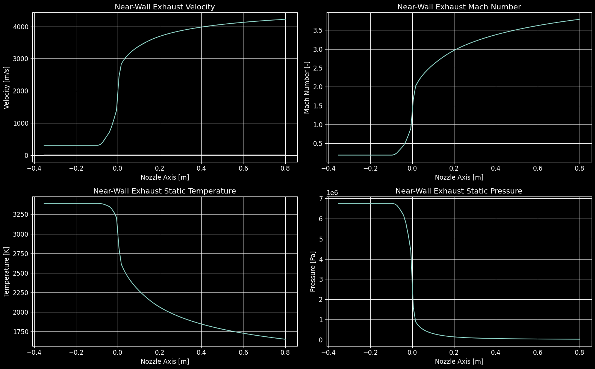

*Near-wall exhaust velocity, Mach number, static temperature, and static pressure along the nozzle
axis. These distributions are the exhaust-side boundary condition for the heat transfer model in
this part. LOX/LH2 100 [kN] upper stage example case*

## Regenerative Cooling Background

One of the fundamental challenges when working with rocket hardware is designing around the extreme physics conditions that rocket components are subjected to. Combustion chambers can reach temperatures comparable to the surface of the sun, while cryogenic propellants can be kept at temperatures near absolute zero (the coldest anything in the universe could possibly be!). During operation, rocket nozzles that are directing the super-hot exhaust flow need to maintain their shape to continue to operate as designed, but the temperature of most exhaust flows far exceeds the melting temperatures of possible materials that nozzles could be made of.

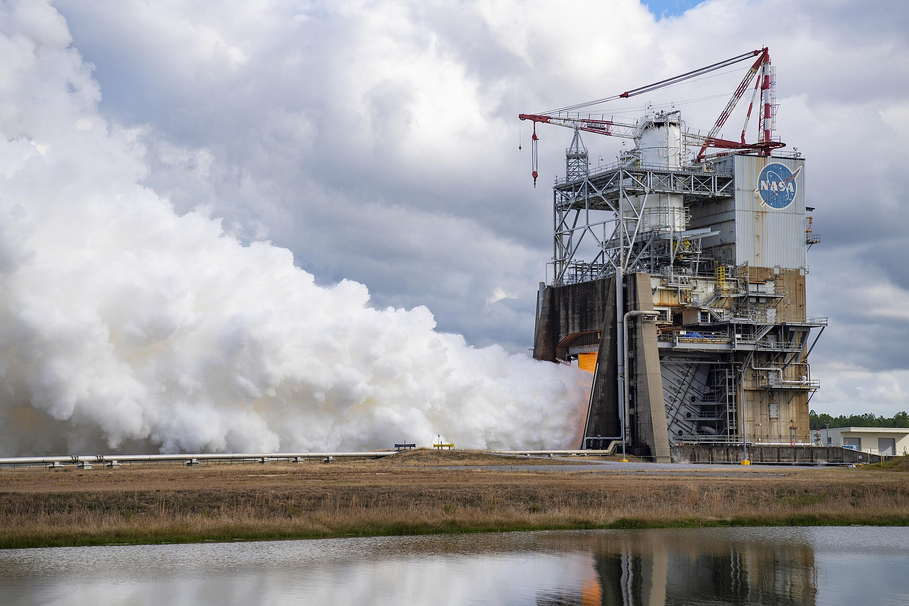

*RS-25 engine 2063 during a hot fire on the Fred Haise Test Stand at Stennis Space Center. Credit: NASA/Chris Russell, public domain*

Faced with a physics-based challenge, there are two primary approaches to the problem of nozzles eroding during operation.

### Ablative Nozzles

#### Let it melt!

The first approach is commonly referred to as "ablative" nozzle design, where the nozzle material is allowed to ablate but the rate of ablation is known and the motor/engine operation can be tailored to that ablation rate. This approach is often seen for small duration burn motors (such as missiles or small student rockets) or solid propellant applications where there is not a readily available cooling fluid.

The challenge with ablation is that the size and shape of the nozzle contour changes over time, which changes the fundamental properties of the nozzle (most notably the size of the nozzle throat, which controls the total mass flow rate and subsequent thrust production). Many ablative nozzle designs are only ablative near the nozzle throat where the highest heat transfer occurs, while the rest of the nozzle contour is made of some well-characterized high-temperature material such as a phenolic resin.

*[Figure: TRL Nozzle]*

*TRL ablative nozzle pre- and post-fire*

*[Figure: Thrust vs Time]*

*Thrust output decrease over burn duration*

### Active Cooling

#### Fighting the Sun

Allowing performance to vary with time can often be impractical for orbital applications if it is avoidable, making ablative nozzles disadvantageous for space launch vehicles or reusable applications. The alternative approach to nozzle design involves maintaining the nozzle contour shape throughout the entire burn duration (and for any number of conceivable burns), which requires some form of active cooling of (or heat transfer reduction to) the nozzle hot wall. This allows nozzles to maintain their designed performance throughout an entire long-duration burn of multiple minutes or be reused indefinitely.

*[Figure: Same Nozzle]*

*Same nozzles, same performance, different stage of mission*

But how can we keep something so hot from melting? In liquid bi-propellant and hybrid rocket engines, there is often a supply of cryogenic liquid that is being stored as propellant to feed the engines that can be utilized as a cooling fluid during operation. This has many advantages beyond the obvious one of maintaining nozzle geometry. The reason propellants are stored in their cryogenic liquid form is for volumetric efficiency, because carrying the equivalent mass of gaseous propellant would require huge high-pressure tanks and be very impractical. In their liquid form, common propellants can be hundreds of times more dense than their gaseous counterparts and therefore be storable in a much smaller volume. However, the propellant must be turned into a gas as some point before the combustion process, because only gaseous materials are capable of combusting. We're in need of a heat exchanger to expand the liquid into a gas before it reaches the combustion chamber, and there just happens to be a very convenient heat exchanger at the end of the engine directing the exhaust flow (the nozzle!).

*[Figure: Heat exchanger diagram]*

*Generic heat exchanger*

In liquid bi-propellant systems the common approach is to utilize the liquid fuel, as it often has a much higher heat capacity than the oxidizer that is also stored on-board. Heat capacity can be thought of as the amount of energy it takes to raise the temperature of a given fluid, so a higher heat capacity means that it takes more energy to raise the temperature of the fluid, or conversely that a cooling fluid can accept much more energy without raising its temperature that much. This is an advantage for fuels as coolants, because there is often a lot of nozzle and chamber wall that needs to be cooled and a limited amount of cooling fluid to work with, making this the more efficient choice.

![Space Shuttle Main Engine at full power during a 290 [s] test firing](./referenceImages/ssmeTestFiring.jpg)

*Space Shuttle Main Engine at full power during a 290 [s] test firing. The RS-25 is regeneratively cooled with liquid hydrogen fuel. Credit: NASA, public domain*

However, in hybrid engines the fuel material is a solid, leaving only cryogenic oxidizer as the lone choice for designers of active cooling systems for hybrid engines. This is not great news, as common oxidizers have a substantially lower heat capacity than common fuels.

*[Figure: Cp Comparison]*

*Liquid Methane has about twice the heat capacity of liquid oxygen*

Don't panic, though, because there are still things that can be done to successfully cool a nozzle using the oxidizer instead! We will touch more on this later, but with modern design and manufacturing techniques we can get creative with cooling geometry in new and exciting ways to unlock previously unattainable design solutions.

In general, a system that utilizes the available propellant to cool the nozzle walls *and* heats that propellant with energy from the engine operation to drive the engine cycle is called *regeneratively cooled*.

### What is *Regenerative* Cooling?

The term *regenerative* refers to the fact that energy from the exhaust flow is recaptured and used to heat the same propellant that will eventually be used in combustion to perpetuate the engine cycle. The propellant acts as a nozzle coolant during operation by being passed between the walls of the nozzle, which allows for the double use of the propellant both in combustion and as a cooling fluid.

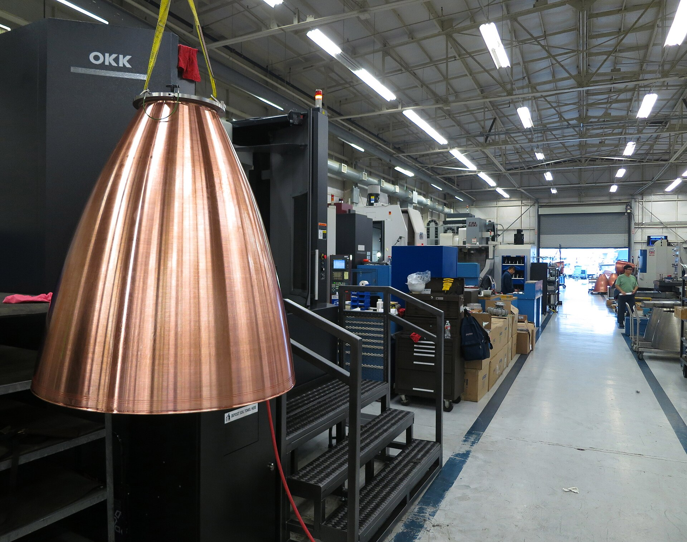

*A copper nozzle with its axial cooling channels machined in, before the outer jacket is closed out. Credit: Steve Jurvetson, CC BY 2.0*

There are other forms of active cooling, such as *film cooling*, where a thin sheet of unburnt gaseous propellant (again, typically the fuel) is passed along the nozzle hot wall to create a boundary between the exhaust and the nozzle wall, which is famously the cooling method used on the nozzle extension of the F-1 engines that lift the Saturn-V!

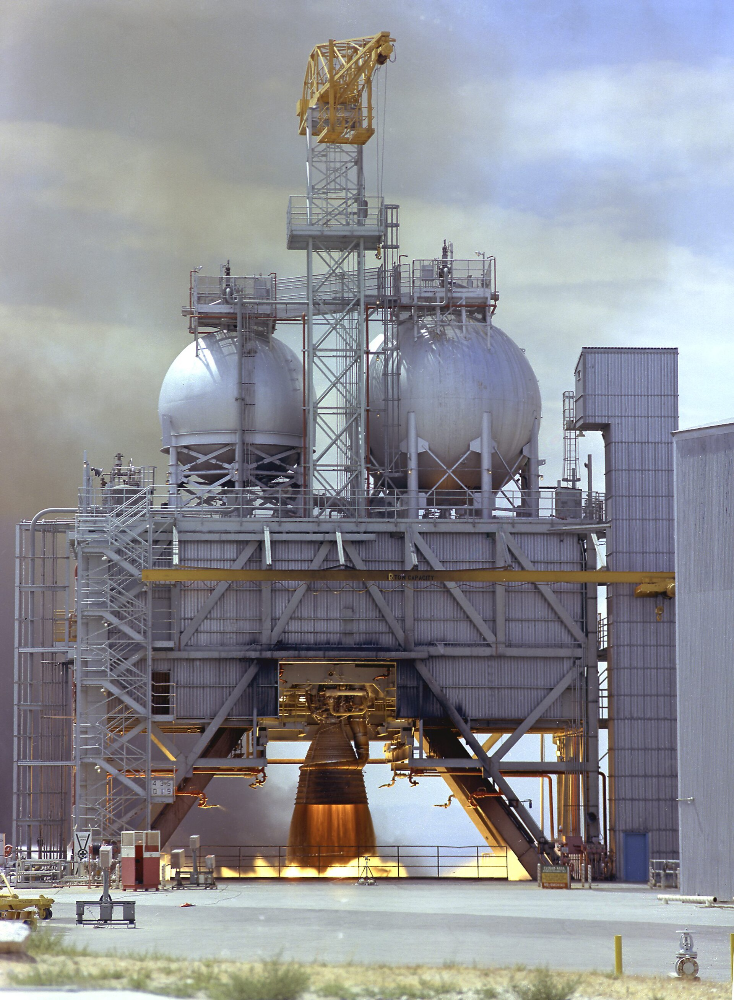

*F-1 engine static firing. The dark band at the nozzle exit, ahead of the orange plume, is the unburnt film coolant. Credit: NASA MSFC, public domain*

The dark band before the bright orange of the plume is the unburnt gas film leaving the nozzle, which eventually reacts with the oxygen in the air and burns where the plume turns all orange!

For our application the nozzle is quite small comparatively speaking, and film cooling is also impractical due to the lack of gaseous fuel on hand in a hybrid engine, therefore we will focus entirely on regenerative cooling.

## Hybrid Supercritical Oxygen Expander Cycle

The engine cycle assumed throughout this part is the Expander Cycle, which is the natural fit for an orbital-class hybrid.

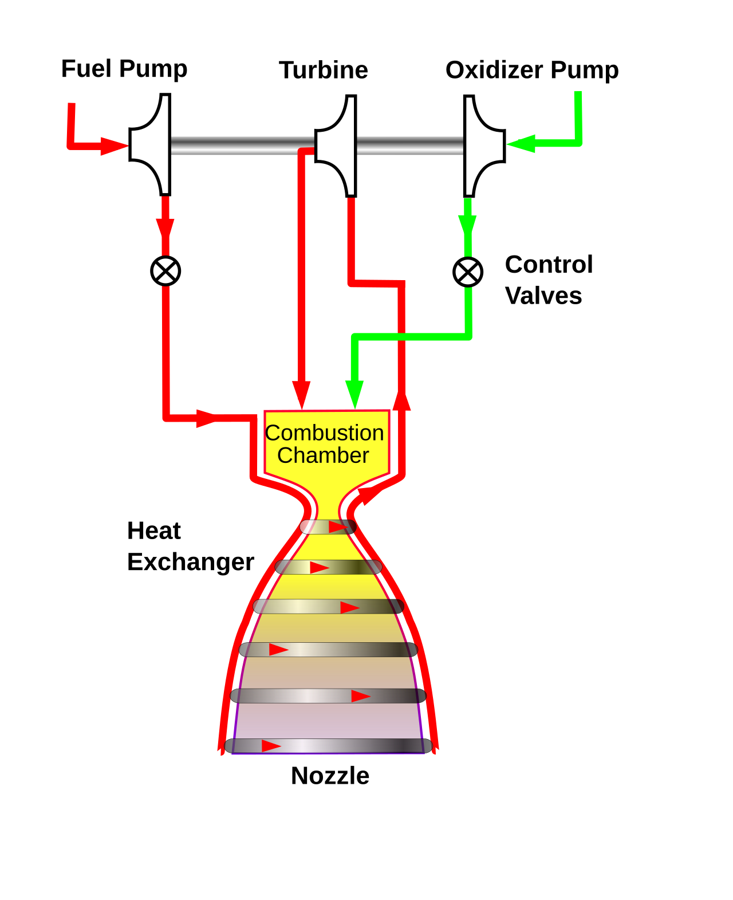

*Expander cycle flow schematic. Propellant is pumped through the cooling jacket, where it picks up heat from the chamber and nozzle, and the resulting high-energy fluid drives the turbine. Credit: Duk, CC BY-SA 3.0*

The expander cycle operates on the premise that a single fluid (typically the fuel) can be *expanded* from its compressed liquid form to a more useable high-energy form (gas/supercritical fluid) to then drive a turbine which perpetuates the engine cycle. This is the general baseline premise of the expander cycle, however for a hybrid engine application there are some niche details that distinguish the design practices used here from traditional liquid bi-prop expander cycle practices.

*[Figure: Hybrid Expander Cycle]*

*Hybrid Expander Cycle*

The first and most obvious deviation from standard practices is the use of Oxygen as the working fluid in the cooling architecture. This is not entirely unheard of, however the aforementioned disadvantageous heat capacity make Oxygen a secondary choice for other designers. With a solid-fuel hybrid, however, there is no alternative and one must make due with what is available. The second is the system pressure. The orbital-class engines being modeled here operate at a relatively high chamber pressure (~15 MPa or ~2000 psi) which leads to an interesting distinction in the fluid physics of the engine fluid system. In order to make the most accurate predictive models and design tools, it is pertinent to model the fluids in the fluid system in the most physically accurate way, and when fluids exceed what is known as their *critical* state they behave differently than fluids at more familiar temperatures and pressures. To be more clear about what this means and why it matters, the following sections briefly go over the physics of supercritical fluids and how that distinction impacts the design of a rocket fluid system. The reference design used throughout this document — chamber pressure ~15 MPa, LOX coolant, HDPE solid fuel — is one specific reduction to practice of the methods described here.

### Aside: Supercritical Fluids

To be *painfully* clear about the distinction being made here, let's start with the simplest example. At standard temperatures and pressures, referring to a substance as a "fluid" encapsulates the concepts of both "liquids" and "gasses", which share the property that the individual particles that comprise them are able to flow and take the shape of their containers. Liquids are held together by stronger intermolecular forces which causes local fluid density to be high, whereas gasses consist of individual particles whose motion and internal energy state exceed any intermolecular forces, allowing particles to move about independently of one another leading to low local fluid density. At the boundary between these two states of matter there exists a clear delineation in fluid properties and crossing over this boundary causes the state of the fluid to vary dramatically. This is more colloquially known as "vaporization", or more distinctly "evaporation" when the process happens at the liquid surface boundary and "boiling" when the process takes place within the bulk liquid. Something very interesting happens, however, when you increase the pressure past a certain threshold known as the "critical pressure".

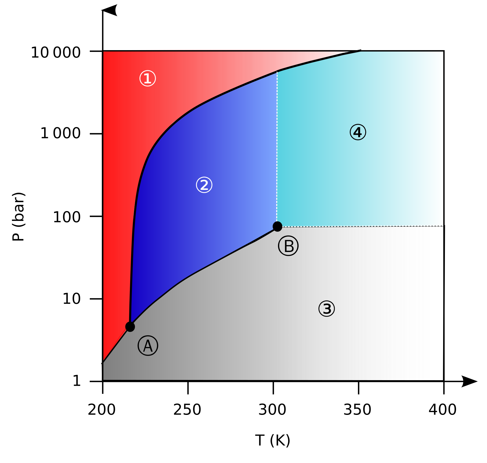

*Pressure-temperature phase diagram for carbon dioxide, with the supercritical region labelled. Oxygen behaves the same way qualitatively, at its own critical point of 5.04 [MPa] and 154.6 [K]. Credit: CC0 1.0*

In the phase diagram above, the critical point represents the physical state of the fluid where the distinction between liquid and gas loses practical meaning. This means that properties of the fluid will no longer change rapidly with increases of temperature or pressure, and instead changes in properties will be gradual and the magnitudes of the properties will be some average of the liquid and gas states. We can visualize this by plotting thermophysical properties (like density and viscosity) instead of fluid phase, to get an idea for how the properties vary with changes in temperature and pressure.

*[Figure: Oxygen Properties]*

*Oxygen Properties*

On the left we can see how Oxygen's density varies over the same temperature and pressure ranges from the phase diagram above. There is a steep drop off in density where the phase change from liquid to gas occurs, causing the density to drop from the high liquid value (~1000 [kg/m^3]) to the low gaseous value (~10 [kg/m^3]). However, at higher pressures, the drop off becomes more gradual until eventually there is no drop at all. Instead, the density varies smoothly as the temperature increases (I like to call this region the "density slide").

What this means for rocket engines is that propellant that begins the engine cycle journey as a liquid in the propellant tank does not phase change in the traditional sense at any point in the engine. Instead, we can avoid the rapid property changes and take advantage of the physics of supercritical fluids by operating at a higher system pressure, and we can create more accurate representative physics models by capturing these unique behaviors of supercritical fluids.

*[Figure: Oxygen Properties 2]*

*Oxygen Properties in Engine*

## Great, Now Let's Make a Regeneratively Cooled Nozzle Using Oxygen

To tie this all together, let's apply this knowledge to the design of a regeneratively cooled nozzle from first principles. So far we have not been speaking about legacy design practices, but rather the fundamental physics of the problem, which is a core tenant of the design philosophy used throughout. When you take a first-principles approach, there is often something natural hiding in the physics of the problem that can be taken advantage of. If you are thoughtful enough, you may find it easier to swim with the river rather than against it.

With that in mind we have a physics problem, so let's lay that out and begin to chip away at it.

### What are the problems, and what does physics want?

Let's list out some of the fundamental physics challenges that we are facing that are relevant to the design of regenerative cooling architecture:

- Sub-optimal cooling fluid (Oxygen)
- Extreme temperature gradient from exhaust to wall and coolant
- Extreme pressure gradient from internal to external volumes
- Achieving adequate propellant conditioning to drive engine cycle
- Minimization of pressure losses in system
- Limited propellant mass flow per time to use as coolant
- Optimum material selection and manufacturability

Some of these things are not changeable and we must simply work around them, such as the amount of mass flow and type of coolant that is on-hand. They are critical to identify, though, because they inform us going forward. Others have more design freedom, and I will try to motivate each thought process and decision made moving forward as we discuss potential solutions to these issues. Broadly speaking, we will focus on the underlying physics to motivate the solutions rather than any existing design practices, however when the comparison to a historical context reveals something interesting I will relate the old way to a new way of thinking. That being said, technological improvements in recent years have unlocked new avenues for designing and manufacturing components that can and will change the way we think about the solutions to these issues.

Unencumbered by legacy design choices, how might we attack these issues from the ground-up? First, let's take inventory of the tools available to us.

### What options do we have to solve the problems?

We can leverage two critical concepts to get creative with the problem solving process:

1. Additive Manufacturing
2. Algorithmic Modeling

The first concept, "*additive manufacturing*", is a manufacturing type that materializes components from the addition of material (otherwise known as *3D printing*), which allows for the design of components with complex internal geometries that would be challenging/impossible to subtractively machine. The second concept, "*algorithmic modeling*" is a design approach relying on the creation of a *base set of rules* that designs are forced to follow, and allowing resultant components to emerge naturally from specifying design parameters and allowing some algorithm to determine the resulting geometry. This approach results in something interesting that I have been referencing: here the physics of the problem create the geometry rather than a designers whims. So long as the physics is modeled accurately, such designs will need very little verification of their performance between the models and real life, because their very shape was born of the desires of physics itself.

Such an algorithmic design approach could conceivably be built to accommodate additive manufacturing constraints, which further tightens the rules that the geometry-making algorithm(s) live within. This approach has the added benefit, though, of being able to churn out thousands of parametrized designs to find optimal performance in a challenging design space.

The algorithm(s) need to know about the physics of the problem in its most accurate representation possible to then use that information to create the best performing design, regardless of what those physics conditions are. This is a powerful toolset, because you are not designing just one specific nozzle, but every conceivable nozzle that can have its physics modeled accurately at varying conditions and scales. This is incredibly helpful and time efficient when the system being designed is largely novel and tweaks to the system are common and numerous. Building tools that build tools has an up front cost, but the juice is worth the squeeze when many of the questions about a design are unanswered.

### Where do we start?

With our tools in hand, we can tackle some of the easier problems first. Some things only have a few solutions, after all, and some things are beyond our control entirely (like system requirements, the divine word). For example, the coolant fluid mass flow is simply something we must live with, as it is a fundamental parameter of the overall engine and we cannot change that without changing the engine concept entirely. We must be aware of the value, however, because it will be important information to later feed to an algorithmic design tool to provide insight into the physics of our problem, but more on that later.

What about the material selection, or how to work around the extreme physics conditions? Let's think about what would be ideal and go from there:

#### Problem Solving: Material Selection

We need to keep the nozzle cool and transfer as much heat as possible into the coolant to drive the engine cycle, so we want something with a high thermal conductivity that can effectively transfer heat, but also something that is strong enough to withstand high internal pressures and other erroneous forces. If we wanted to just resist the heat we could use something with a very low thermal conductivity (like a phenolic resin or ceramic), but in this case we are prioritizing heat transfer to condition propellant, not just keeping the nozzle alive.

Copper is a common material that has a high thermal conductivity, but there's a problem. Copper, as far as metal is concerned, might as well be butter. That just won't do if we expect to hold an extreme pressure inside of the fluid system and survive potential loads from shocks or vibrations. Well, we could use some sort of copper alloy that is much stronger, but we will have to pay a price in the heat transfer because we will have to remove some copper and replaced it with things that are much stronger but have a much lower thermal conductivity. A recent-ish development in copper alloys comes from NASA's Glenn Research Center, named GR-Cop42, which swaps the pure copper out for a ratio of [94% Copper, 4% Chromium, 2% Niobium]. With these ratios the yield and ultimate strength of the material effectively doubles, however you pay a small fee of ~15-20% in reduced thermal conductivity. [6] This trade is very much worth it, making GR-Cop42 a great choice for the cooled portion of the nozzle.

To keep the discussion brief, we have entirely neglected other printable metals that simply don't even make it out of the gate from a heat transfer perspective. However, it is the onus of the designer to properly trade study the material of any given design.

#### Problem Solving: Extreme Physics Conditions with a Sub-Optimal Cooling Fluid

One of the most distinct physics challenges to solve is the use of Oxygen as the sole cooling fluid for a nozzle. The use of Oxygen in cooling architecture is not unheard of, however it has only really been used in lab settings as opposed to flight-grade vehicle systems. We also are limited to relatively small nozzles, which at first might sound like a good thing but there is a sneaky problem that must be contended with:

In a regeneratively cooled nozzle, the volume of a cooling jacket increases cubically (to the 3rd power) while the nozzle surface area that needs to be cooled increases quadratically (to the second power). This means that as nozzles grow, the conventional wisdom is that the volume of propellant cooling the wall grows exponentially faster than the wall that needs to be cooled, so the ability to condition (heat) a propellant to drive an engine cycle gets harder the larger a nozzle becomes (Fans of pop-science may be familiar with the square-cube law problem). This problem happens in reverse for small nozzles, where lower coolant flowrates (due to smaller engines) are responsible for cooling more wall, which is further complicated by using Oxygen as a coolant.

In the days of old there were two common approaches to manufacturing the cooling architecture that were inevitable based on manufacturing constraints: brazed tubes and milled rectilinear channels. In the former case, long circular tubes were bent into the shape of a nozzle contour and welded together, and in the latter case rectangular slots were milled along the outside of a nozzle block and later capped with some sleeve to hold the fluid in.

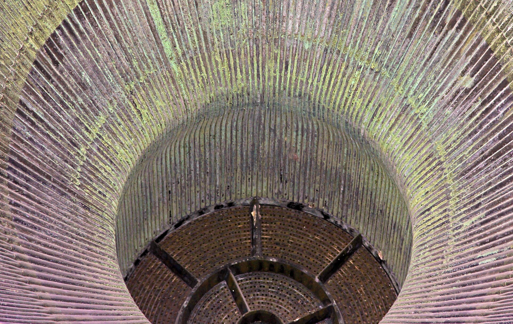

*Looking up the nozzle of an F-1 engine on a Saturn V first stage; the brazed tube-wall cooling channels converge toward the throat. Credit: Clemens Vasters, CC BY 2.0*

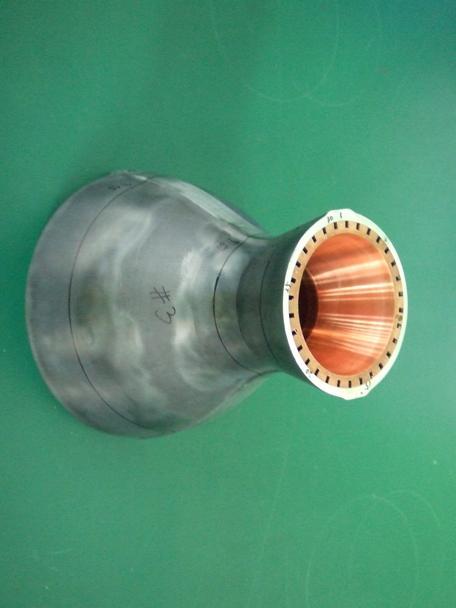

*A chamber assembly viewed end-on: the copper liner sits inside a steel jacket, with the machined axial cooling channels exposed at the flange. Credit: Romanusas2, CC BY-SA 4.0*

The geometry of cooling architectures were largely fixed at that point, which was fine for those cases because the fuel material was sufficient to cool the walls and drive the engine cycle.

With a more adept cooling fluid we may have been able to just place some straight tubes from one end of the nozzle to the other, or rely on legacy rectangular channel designs, but doing so with Oxygen-filled channels would leave us with one melty nozzle. We need a way to both increase the amount of heat transfer into the Oxygen, and increase the amount of time it is able to perform heat transfer.

There are competing problems at play that we must contend with: heat transfer and pressure drop. The longer and smaller we make the channels the greater the heat transfer, but the larger the pressure drop. This is because fluid moving faster through a smaller channel has a larger heat transfer coefficient, but also experiences more viscous pressure losses. That pressure is needed downstream to spin a turbine and maintain chamber pressure, so we can't be selfish and eat it all while cooling the nozzle down. We need a way to determine, ideally quickly and at a glance, how small variations in cooling geometry impact the heat transfer and pressure drop performance.

### Problem Solving: Listening to Physics

Rectangular shaped cooling channels were a consequence of manufacturing constraints, but engineers still retroactively justified their performance by tweaking the parameters of the channels that were able to be manipulated and determining what made the best version of the limited geometry scope. The biggest improvement came from realizing that high aspect-ratio rectangular cross section channels (skinny and tall) created natural convective vortices due to the temperature gradient from the hot side of the rectangle to the colder side, which improved coolant mixing and overall performance. If we lean further into the idea of improved mixing to improve heat transfer, we might imagine a way to induce vorticity in the flow without relying on the natural convective vortices that arise due to the temperature gradient in the cooling passages. If the fluid wants to spin regardless then let's not get in the way! If we want to get more involved in the vorticity, why don't we nudge the Oxygen into a vortex ourselves? We could make a tube that has grooves of some kind so that when you twist it you end up with a helical shape similar to the inside of a gun barrel (or a churro for my foodies).

![Sectioned 105 [mm] tank gun barrel showing the helical lands and grooves](./referenceImages/gunBarrelRifling.jpg)

*Sectioned 105 [mm] tank gun barrel showing the helical lands and grooves. Credit: baku13, CC BY-SA 3.0*

*[Figure: Churro]*

*Churros*

This will cause the Oxygen inside of the cooling channels to spin, which will disrupt thermal boundary layer development and increase variable density fluid mixing, improving overall heat transfer into the fluid and thereby increasing heat transfer to the hot wall.

We're not fighting the current, but we still have some things to keep in mind. Fluids don't *love* sharp corners from a pressure drop perspective, and both the square rifling in the tank barrel and the sharp pointy curro peaks are a bit aggressive for our purposes. We would be better off smoothening the rifling out a bit, more like a cartoon flower:

*[Figure: Spongebob Flowers]*

*Unrelated Cartoon Flowers*

Cartoon flowers are a bit exaggerated, I want something a bit more tame:

*[Figure: Single Fluted Cross Section]*

*Fluted Cross Section*

There we go. We've been calling this fluted, which is how I will refer to it from now on. This is a step in the right direction, lets extrude this and spin it about and see how it looks:

*[Figure: Straight fully-fluted channel 1]*
*[Figure: Straight fully-fluted channel 2]*

*Straight Fully-Fluted Helical Channel*

This is looking good, but we have a problem. Right now, the channels have a non-uniform hot-wall thickness because of the flutes:

*[Figure: We have a problem]*

*Variable hot wall thickness due to flutes*

This will inevitably lead to temperature variation on the hot wall, which is not ideal for us. What if we could smush all of the flutes on the side near the hot wall flat, so that on the hot wall side the cross section was a circle but it still had the flutes on the top side?

*[Figure: We have solved the probelm]*

*Fluted cross sections flattened along the hot wall*

The helix is maintained as the flutes are rolled about the channel centerline, but the flattened side is always held adjacent to the nozzle hot wall. See the above sketch of three adjactent channels. As a result, the flutes would appear to poke in and out of existance as they spun around if you looked down the length of a channel.

The heat transfer at each point along the channel is related to the velocity of the coolant. Since the massflow of coolant through the nozzle is driven by the system thrust requirement, the velocity of the coolant at any point of the channel is manipulated by varying the cross sectional area. In a stationary nozzle reference frame, when the velocity of the coolant is high, it can be thought of like an ice pack that is constantly being refreshed. The nozzle wall stays cool but the coolant does not experience adequate conditioning. The cooling architecture radius variation is designed to balance the channel outlet conditions with the nozzle wall conditions, transfering as much energy into the coolant as possible without melting critical hardware.

With this methodology of designing the channel radius distribution, it is inevitable that there would be large gaps between the channels if you were to simply align them axially along the nozzle wall. To make effecient use of the space and  maximize energy exchange, the channels, which are themselves helical, are wrapped around the nozzle wall.

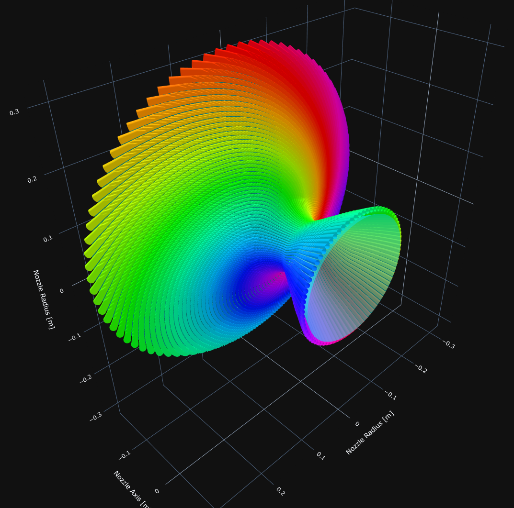

*A completed regen jacket*

## Defining the Channel Geometry

The channel geometry is not drawn, it is derived. Everything below follows from the nozzle
contour, the coolant conditions, and a handful of design parameters: the channel radius
distribution, the hot wall thickness, the flute count and amplitude, and the helix angle.

### The pathline

The pathline is the centerline of one cooling channel. The inner nozzle wall is defined by method of characteristics, so the 2D pathline is offset by one channel radius plus the desired hot wall thickness. The channel radius distribution must therefore be defined first, as a smooth transition between five control points. The inlet and outlet control points refer to the flow of the coolant, so the "inlet" is located where we would normally consider the exit plane of the nozzle and vice versa. The throat control point is automatically placed where the nozzle contour radius is smallest. The grain control point is located where the inner surface of the fuel grain intersects the nozzle contour. Finally, the "throat inlet" control point is an additional point between the throat and the grain interface. This control point is loacted at a point of inflection of a sunken contour.

The control point radii must satisfy

$$
channel Outlet Radius < channel Grain Radius
$$

$$
channel Grain Radius < channel Throat Inlet Radius
$$

$$
channel Throat Inlet Radius < channel Throat Radius
$$

$$
channel Throat Radius > channel Inlet Radius
$$

These constraints ensure that there will be no backwards roll or overlapping channels. The distribution itself is built from a combination of cubic and bezier splines, which enforce the appropriate tangencies and extrema for both traditional and sunken contours.

*[Figure: Channel Radius Control Points]*

With the channel radius distribution defined, the 2D channel centerline is a parallel offset of the contour. A few other offset curves are worth defining at the same time. The "cold wall" is offset from the hot wall by one hot wall thickness. The 3D channels will eventually rest against this imaginary wall, therefor all the heat transfer that we care about happens between the hot and cold walls. The "shell" is also generated by offsetting one hot wall thickness, one channel diameter, and one shell thickenss from the hot wall. The shell is the outermost wall that you see when you look at a completed nozzle in the real, physical world. The shell ultimately gives the nozzle wall finite depth for the channels to live within.

*[Figure: Nozzle]*

The 2D channel pathline must then be wrapped around the nozzle, which is what allows the available surface area to be used efficiently for heat transfer. Wrapping introduces a packing constraint: the maximum number of channels $N$ that can fit at any station along the nozzle is set by the local nozzle radius and the local channel radius,

$$
\begin{align}
    N = floor(w{2 \pi R\over{t_{infill} + r(2+2f)}})
\end{align}
$$

where $w$ is the channel wrap modifier, $R$ is the nozzle radius, $t$ is the infill thickness, $r$ is the channel radius, and $f$ is the flute amplitude coefficient. The check is triggered if any $N$ is less than $N$ based on the throat, inidcating that the channel radius is too large at that point. If the check is triggered at any point, the equation is solved in reverse for the maximum allowable radius at that point:

$$
\begin{align}
    r = {w 2 \pi R + N_{throat} t_{infill} \over 2N_{throat}(1+f)} 
\end{align}
$$

The offset curves are then rebuilt against this corrected radius distribution. This keeps channels from overlapping, though a visual check of the resulting jacket is always warranted. The resulting wrap angles drive a DCM roll about the nozzle axis, which lifts the 2D pathline into the 3D channel centerline.

### The cross sections

A fluted cross section starts in an "unwrapped" state in the form of a sine wave. The sine wave takes in the arguments of $n_f$ (the number of flutes) and $f$ (the flute amplitude coefficient). The wave is shifted vertically based on the local channel radius and closed by converting from polar to cartesian. The result is a set of flower shaped cross sections which vary only with the local channel radius.

$$
\begin{align}
    r_{fluted} = r_{i} + fr_{i}sin(\theta n_{f})
\end{align}
$$

$$
0<\theta<2\pi
$$

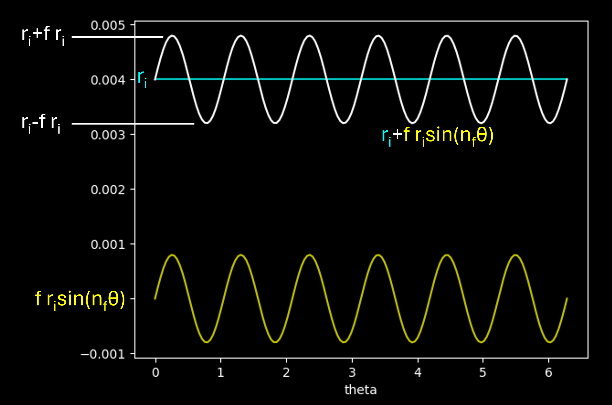

$$
\begin{align} 
    x_{fluted,i} = r_{fluted}sin(\theta) \\
    y_{fluted,i} = r_{fluted}cos(\theta) \\
\end{align}
$$

*[Figure: Wrapped Fully Fluted Cross Sections]*

### The channel

To create the helical pattern, each cross section must be rolled about its center. The amount each cross section is rolled is dependent on the user input the helix angle, the local channel radius $r_c$, and the emergent total path length. The differential path length $\Delta L$ is the length of path between one cross section and the next and $L$ is the total path length of the channel.

$$
\Delta L = \sqrt{\Delta x_{3Dpath}^{2} + \Delta y_{3Dpath}^{2} + \Delta z_{3Dpath}^{2}}
$$

$$
L = \Sigma (\Delta L)
$$

The differential roll $\phi_i$ of each cross section is a percentage of the total roll $\Phi$ of the path equivalent to the percentage of the total path length represented by that cross section:

$$
\Phi = tan(H_f) * L/r_c
$$

$$
\bar{\phi_i} = dL/L
$$

$$
\phi_i = \bar{\phi_i} * \Phi
$$

Each cross section is then rolled with a simple DCM operation:

$$
{\begin{bmatrix}
    x\\
    y\\
    0\\
\end{bmatrix}}_{rolled,i} 
= 
\begin{bmatrix}
    1 & 0     & 0     \\
    0 & cos(\phi_{i}) & -sin(\phi_{i})\\
    0 & sin(\phi_{i}) &  cos(\phi_{i})\\
\end{bmatrix}
{\begin{bmatrix}
    x\\
    y\\
    0\\
\end{bmatrix}}_{fluted,i}
$$

*[Figure: Wrapped and Rolled Fully Fluted Cross Sections]*

The fully fluted and rolled cross sections are then placed along the pathline. They are "flown" along the pathline with a DCM operation to maintain each face locally perpendicular to the pathline. In this operation, the roll has already been achieved by the wrapping step above. The pitch and yaw are calculated as such by the 3D centerline:

$$
\begin{align}
    Yaw:\psi = -arctan({\Delta z_{3Dpath}\over \Delta x_{3Dpath}})
\end{align}
$$

$$
\begin{align}
    Pitch:\theta = -arctan({\Delta y_{3Dpath}\over \sqrt{\Delta x_{3Dpath}^2 + \Delta z_{3Dpath}^2}})
\end{align}
$$

Finally, each cross section must be flattened along the cold wall. The point on the cross section closest to the hot wall is located, and a gaussian curve is superimposed over the unwrapped cross section at that point, compressing the flutes flat where the channel meets the wall while leaving them intact on the outboard side.

The compressed sin wave is then converted back to polar to yeild the final cross section.

*[Figure: Compression Process, Unwrapped]*
*[Figure: Compression Process, Wrapped]*

### The jacket

With one gaussian fluted channel defined, the jacket is the channel patterned about the nozzle axis the appropriate number of times.

*A completed regen jacket*

### Modeling the performance

To support rapid iteration, the heat transfer performance of the resulting architecture is estimated with a one dimensional model along the nozzle wall.

The heat transfer of the system is estimated using a thermal resistance model. Thermal resistance models imagine heat flux like current  and temperature like voltage in an electric circuit. The different heat transfer modes are modeled as resistances to the flow of energy.

*[Figure: Thermal Resistance]*

*A thermal resistance circuit*

The heat transfer through a circuit is

$$
\begin{align}
    \dot{Q} = \Delta T / R_{equivalent}
\end{align}
$$

where $\dot{Q}$ is constant throughout the circuit. The thermal resistances of conduction across a circular pipe wall and convection respectively are

$$
\begin{align}
    R_{COND} = {ln(r_{outer} / r_{inner}) \over 2\pi L k}
\end{align}
$$

$$
\begin{align}
    R_{CONV} ={1 \over hA}
\end{align}
$$

where $r_{outer}$ and $r_{inner}$ are the outer and inner radii of the conducting wall, $L$ is the differential path length, $k$ is the thermal conductivity of the conducting material, $h$ is the heat transfer coefficient of the convecting flow, and $A$ is the surface area. The equivalent resistance for three resistors in series is

$$
\begin{align}
    R_{equivalent} = R_{CONV,HOT} + R_{COND} + R_{CONV,COLD}
\end{align}
$$

The material properties of GR-Cop42 are well characterized, however determining convective heat transfer coefficients is very tricky and usually requires an empirical correlation. For the exhaust side we use the Bartz equations [8]:

$$
\begin{align}
    h_{Hot} = ({0.026 \over D_{throat}^{0.2}}) 
        ({\mu^{0.2}c_P \over Pr^{0.6}})
        ({P_{chamber} \over c^*})^{0.8}
        ({D_{throat} \over r_c})^{0.1}
        ({A_{throat} \over A})^{0.9}
        \sigma
\end{align}
$$

$$
\begin{align}
    \sigma = {1 \over ({1 \over 2}{T_{wall} \over T_{chamber}}(1 + {\gamma - 1 \over 2}M^2) + {1 \over 2})^{0.68}
        (1 + {\gamma - 1 \over 2}M^2)^{0.12}}
\end{align}
$$

where $r_c$ is the radius of curvature of the throat ans the Prandtl number, viscosity, and heat capacity are stagnation values.

$$
\begin{align}
    Pr = {4\gamma  \over 9\gamma - 5}
\end{align}
$$

$$
\begin{align}
    \mu = 1.184 \times 10^7MW^{0.5}T_{total}^{0.6}
\end{align}
$$

$$
\begin{align}
    c_P = R{\gamma \over \gamma - 1}
\end{align}
$$

The molecular weight, gas constant, and ratio of specific heats come from an equilibrium chemistry solution at the chamber conditions, such as NASA CEA.

Because the Bartz heat transfer coefficient equation is dependent on the yet unkown hot wall temperature, it must be run in a convergence loop.

This correlation is well chracterized for the regen nozzles of old, but it has been shown in our simulations to unable to account for two important effects in our nozzle design. First, the $\sigma$ term in is a boundary layer correction term. This holds up well for showerhead injection, however our boundary layer is appreciably effected by swirling flow. Secondly, there is no term which captures the impingement and recirculation effects of a sunken converging section. Correction terms for both of these effects are under development from a dedicated CFD study, as of 07/2025.

For the coolant flow, we use the definition of Nusselt number to calculate the convective heat transfer coefficient:

$$
\begin{align}
    h_{COLD} = {k_{fluid} * Nu \over d_H}
\end{align}
$$

where $d_H$ is the hydraulic diameter of the channel. Thermofluid properties such as thermal conductivity are evaluated from a real fluid property database, and we leverage two empirical correlations for the Nusselt number itself. We consider the Nusselt number to be in bewtween the Gnielinski correlation for circular channels [9] and the fully fluted correlation from Principles of Enhanced Heat Transfer [6].

$$
\begin{align}
    Nu_{Semi Fluted} =( 0.25*Nu_{Fluted}) + (0.75*Nu_{Gnielinski})
\end{align}
$$

$$
\begin{align}
    Nu_{Gnielinski} = {({f/8})(Re_D-1000)Pr \over 1 + 12.7(f/8)^{1/2}(Pr^{2/3}-1)}
\end{align}
$$

$$
\begin{align}
    Nu_{Fluted} = 0.064Re_{d_H}^{0.773}Pr^{0.4}({F_A\over d_H})^{-0.242}({F_P\over d_H})^{-0.108}({F_H\over 90})^{0.599}
\end{align}
$$

where the Gnielinski friction factor is $ f = (0.79*ln(Re)-1.64)^{-2} $ and $F_A$, $F_P$, and $F_H$ are the flute amplitude, pitch, and helix angle respectively.

The model resolves coolant properties, the exhaust side heat transfer coefficient, and the nozzle hot wall temperature along the nozzle axis, with equivalent circular channel results carried alongside for comparison. This is enough to narrow the cooling architecture down quickly, but the model is inherently limited: a selected design still needs a complete analysis package including three dimensional FEA and CFD.

*Sample heat transfer model outputs.*

# Part III: Worked Design Example

To tie both parts together, this section carries a single design point end to end: a 100 [kN]
LOX/LH2 upper stage nozzle. It is a useful example because the operating point is close to peak
specific impulse for the propellant combination and the chamber thermochemistry can be checked
directly against the NASA CEARun web tool.

## Design Point

| Parameter | Value | Notes |
|-----------|-------|-------|
| Propellants | LOX / LH2 | |
| Chamber pressure | 6.8948 [MPa] | 1000 [psia] |
| Mixture ratio | 5.5 | hydrogen-rich, near peak $I_{sp}$ |
| Expansion ratio | 40 | one-dimensional; sets the target exit pressure |
| Thrust | 100 [kN] | mass flow follows from it |
| Oxidizer / fuel inlet temperature | 90.17 [K] / 20.27 [K] | normal boiling points |
| Contour | truncated ideal, $L_{frac} = 0.8$ | method of characteristics |
| Chamber outer diameter | 180 [mm] | contraction ratio approximately 3.2 |

## Chamber Conditions

Equilibrium chamber properties, compared against CEARun for the same case:

| Quantity | Calculated | CEARun |
|----------|-----------|--------|
| Chamber temperature | 3398.4 [K] | ~3400 [K] |
| Chamber molecular weight | 12.662 [g/mol] | ~12.7 [g/mol] |
| Chamber $\gamma$ | 1.1475 | ~1.14 |
| Characteristic velocity $c^*$ | 2339.9 [m/s] | ~2330 [m/s] |
| Vacuum $I_{sp}$ | 453.77 [s] | ~450 [s] |
| Chamber Prandtl number | 0.5190 | ~0.5 |

## Resulting Geometry and Performance

| Quantity | Value |
|----------|-------|
| Throat radius | 50.5 [mm] |
| Exit radius | 425 [mm] |
| Contour length | ~1.0 [m] |
| Mass flow | 23.466 [kg/s] |
| Ideal $I_{sp}$ | 434.4 [s] |
| Target exit pressure | 13 993 [Pa] |

The characteristic mesh runs sonic at the throat and expands to roughly Mach 5 at the exit plane.

*Mach number contours over the generated Mach net*

*Static pressure contours over the same mesh*

*Static temperature contours over the same mesh*

## A Note on Area Ratio

The configured expansion ratio of 40 is the **one-dimensional** area ratio, and it is what sets
the target exit pressure of 13 993 [Pa]. The method of characteristics contour then converges on
that pressure at the wall, reaching it at a **geometric** area ratio of about 71.

The two numbers are not expected to be identical, because the MoC solution matches near-wall
static pressure rather than a mass-averaged one-dimensional exit state. The pressure match itself
is tight: 13 995.7 [Pa] against a 13 993.3 [Pa] target. The one-dimensional expansion ratio should
be read as the operating point that sets exit pressure, not as the geometric area ratio the
contour will land on.

# References

[1] Cronvich - A Numerical-Graphical Method of Characteristics for Axially Symmetric, Isentropic

[2] Sauer - General Charcateristics of the Flow  Through Nozzles at Near Critical Speeds

[3] Young - Automated Nozzle Design through Axis-Symmetric Method of Characteristics Coupled with Chemical

[4] Yu - A Summary of Design Techniques for Axisymmetric Hypersonic Wind Tunnels

[5] GRCop-42 and -84 Typical Average Summary

[6] Webb, Kim - Principles of Enhanced Heat Transfer

[7] RPE Nozzle Design

[8] Bartz - A Simple Equation for the Rapid Estimation of Rocket Nozzle Convective Heat Transfer

[9] Gnielinski - Neue Gleichungen fur den Warme- und den Stoffubergang in turbulent durchstromten
Rohren und Kanalen (New equations for heat and mass transfer in turbulent flow pipes and channels)

Reference photography and diagrams carry their own credits and licenses in
[referenceImages/imageCredits.md](./referenceImages/imageCredits.md).

# Authors

Part I, Nozzle Contour Design: Sean Bowman, last updated 03/21/2025

Part II, Regenerative Cooling Architecture Design: Isabella Duprey-Churn, last updated 07/16/2025

Consolidated overview compiled 07/20/2026
