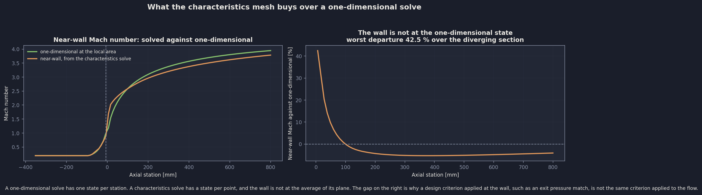
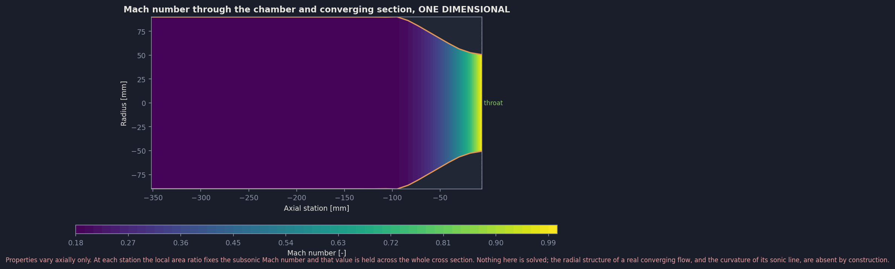
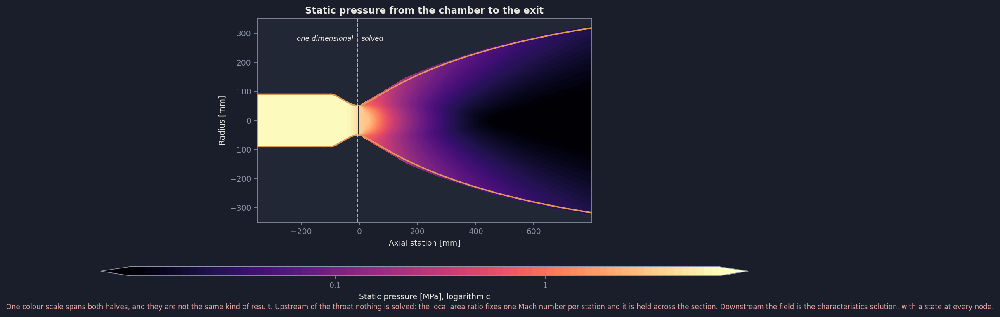

# NOVA Nozzle Contour: Verification and Assessment

An account of the effort that verified NOVA's axisymmetric method-of-characteristics contour generator: what was researched, what was rebuilt, what was found wrong, what the numbers now say, and what is still open.

The reference material this draws on is organised by topic rather than by narrative, and stays where the code links to it: [NozzleContourMethods.md](../NozzleContourMethods.md) for the contour families and how other implementations differ, [NozzleContourValidation.md](../NozzleContourValidation.md) for the full validation detail, and [references_nozzleContour_2026-09-06.md](../references_nozzleContour_2026-09-06.md) for the annotated sources. This report is the through-line.

---

## What was asked, and what came back

The ask was to assess the accuracy of the contour generation tool: cross-reference it against known implementations and against other contour methods, compare it against established engines, test the physical validity of the exit pressure matching assumption, confirm that specifying an expansion ratio actually fixes that value, and call out anywhere a one-dimensional assumption stands in silently for the flowfield.

The short answer on each.

**Specifying an expansion ratio did not fix it.** The worked case asked for 40 and was delivered 69.84, at 0.639 of the conical reference length against the 0.80 requested. Three separate causes compounded. It now delivers both requested numbers to the arithmetic.

**The exit pressure matching assumption is not physically valid as it was implemented**, for three independent reasons, and the exit plane of the delivered contour shows all three at once.

**Five defects were found**, all by comparison against something outside the code rather than by reading it. Two of them had been silently corrupting results that other parts of the tool consume, one of them by up to 600 K in the gas-side driving temperature the cooling model uses.

**Against published references the tool now holds up.** The throat sizing agrees with CEA's equilibrium characteristic velocity to 0.02 per cent. Wall angles sit within 0.6 to 1.9 degrees of the Rao chart at the conventional 80 per cent bell, with the sign of the difference explained by the contour family. The thrust coefficient reproduces the published diminishing return on bell length to within a few hundredths of a per cent.

**Eight one-dimensional dependencies were found and audited.** Two were defects and were corrected. One is exact by construction. The remaining five are disclosed with their magnitudes, and the largest of them, the single ratio of specific heats the whole mesh is built on, is 6.8 per cent in exit Mach number against CEA at the same area ratio.

The work ran in five phases. Along the way the 12,528-line `Nozzle.py` was decomposed into testable modules, which is what made most of the assessment possible at all.

---

## Phase 1: research

The purpose of this phase was to find out what the answer is supposed to be before measuring what it was.

One source settled most of it. **NASA SP-8120, the liquid rocket engine nozzle design monograph**, defines the vocabulary NOVA uses and states the recommended practice for every step it implements. Three things from it mattered immediately.

**Percent bell has a precise definition, and it is not the one the code used.** SP-8120 defines it as the length of the bell as a percent of the length of a 15 degree half-angle conical nozzle *having the same expansion area ratio*. The reference cone is tied to the area ratio the nozzle delivers. NOVA computed it from a one-dimensional Mach number instead, which at the worked operating point corresponds to an area ratio of 48.5 rather than the 40 requested, making the reference cone 12.0 per cent longer than the one the rest of the world quotes against.

**The truncated ideal contour has area ratio as its binding constraint.** SP-8120 states the method in one sentence, attributing it to Ahlberg, Hamilton, Migdal and Nilson (1961): design an ideal nozzle to a higher area ratio than required, then truncate it *to the desired area ratio*, at which point the correct nozzle length is obtained. The area ratio is what you specify and where you cut. The length is what falls out. NOVA cut on length and converged an exit pressure instead, which is a different design method with different outputs.

**The transonic starting line is a measurable simplification.** SP-8120's recommended practice at NOVA's throat curvature ratio of 1.5 is a 29-term series solution. NOVA implements Sauer's, which is the first term of that series. Kliegel and Quan write the series explicitly:

$$u(0,1) = 1 + \frac{1}{4R} + \frac{14\gamma + 15}{288 R^2} + O(R^{-3})$$

At $R = 1.5$ and $\gamma = 1.1475$ the retained first-order term contributes 0.1667 to the normalised throat wall velocity and the first neglected term contributes 0.0479. **The term Sauer drops is 29 per cent of the term he keeps.** That is not a proof of error in the contour, because the throat conditions themselves are identical across all orders and the solutions separate only away from the throat plane. It is a bound on how much confidence the starting line deserves, and it is the single largest unquantified approximation left in the tool.

Two further findings from this phase are worth carrying.

The truncated ideal contour is classified in SP-8120 as a **nonoptimum** contour, recommended where performance losses of the order of 0.25 per cent against the mathematical optimum are tolerable. That number sets the scale for any comparison against a Rao bell: a difference of that order is the expected cost of the family, not a defect.

The wall-angle chart that every bell is checked against is **extrapolated above an area ratio of about 50**, by SP-8120's own statement. Upper-stage nozzles live almost entirely in that region, so any comparison there inherits an extrapolation rather than a measurement.

A separate finding, not acted on: the separation criterion NOVA uses, exit-to-ambient pressure ratio below 0.4, is described in SP-8120 as "an early rule". The fitted alternative from the same source is $p_{wall}/p_{amb} = 0.583\,(p_{amb}/p_c)^{-0.195}$. That belongs to the plume model rather than the contour and is recorded for later.

For scale on what a complete method looks like: TDK, the JANNAF standard code, predicts delivered vacuum specific impulse to within 0.12 to 1.9 per cent of experiment, with finite-rate kinetics, a boundary layer and its displacement thickness all included. None of those are in NOVA, and that bounds what its absolute performance numbers can claim.

The taxonomy of contour families and where NOVA sits among them is in [NozzleContourMethods.md](../NozzleContourMethods.md), along with a comparison against three other axisymmetric characteristics implementations across the five axes on which such codes differ.

---

## Phase 2: decomposition

The contour solver was a closure nested inside a 1,250-line method inside a 12,528-line file. `axisymmetricMethodOfCharacteristics`, the unit process everything rests on, closed over four attributes of the `Nozzle` object and could not be imported. Nothing tested it. The plume test suite had transcribed its arithmetic into a fixture precisely because there was no way to call it.

Five modules came out.

| Module | Holds |
|---|---|
| `gasDynamics.py` | Isentropic ratios, Prandtl-Meyer and its inverse, the area-Mach relation and both branches, the conical length reference |
| `characteristics.py` | The unit processes, taking an explicit `CharacteristicGas` |
| `contourKernel.py` | Rao throat arcs, Sauer's starting line, the seeding intersections |
| `contour.py` | The truncated ideal solve, throat scaling, and the conical and Rao parabolic reference contours |
| `plume.py` | Correlations, the TN D-2327 free-jet lattice, and the march past the lip |

`Nozzle.py` went from 12,528 to 9,253 lines and became the orchestration layer: reading a configuration, running a design, and the regenerative cooling and volute geometry that has not been decomposed yet.

**Every step was held to bit-identity.** A harness ran the worked case before and after each move and compared 39 arrays and scalars. The contour solve is deterministic to the bit, which was verified first so the comparison would mean something. Every step passed at exactly zero difference, which is what makes the defects found in Phase 3 attributable to Phase 3 rather than to the move.

That discipline paid immediately. One step failed it, and the failure was the finding.

**The geometry was not reproducible under a one-ulp perturbation.** The Prandtl-Meyer function existed in four copies with two different algebraic groupings, differing by up to 7 units in the last place. Unifying them moved the delivered area ratio by 1.6 parts in 10,000 and the thrust coefficient by 2.6 parts in 100,000. A 10^-16 change in an input should not produce a 10^-4 change in an output. The cause was the outer design solve running at `xtol = 1e-2`, loose enough that a change of any size flips which iterate it stops on. The expression is now written once and the tolerance is 1e-8.

Two results came out of the new test coverage, which went from 155 tests to 280.

**The unit process is second order, verified against exact planar theory.** Far from the axis the axisymmetric term vanishes and the planar Riemann invariants must be conserved. Halving the state jump between the two upstream points quarters the departure from them. Measured orders over five refinements: 1.88, 1.94, 1.97, 1.99, 1.99. This is the only check on the scheme against a result that does not come from the code, and it is what rules out a solver that is internally consistent and physically wrong.

**The plume march and the nozzle mesh agree exactly on the first pass and separate under iteration.** The two share the compatibility relations, which a fixture holds to exact equality. Converged, they land within 1.1 per cent in Mach number and 1.3 per cent in position, because they iterate differently: the nozzle moves both upstream points toward the intersection under a fixed weight, the plume holds them and averages along the characteristics. The plume's own state note had claimed an exact identity; it was true only of the first pass, and has been corrected.

---

## Phase 3: assessment

### The defects

Five, all found by comparing against something outside the code.

**A smoothing spline was destroying the near-wall Mach number.** The near-wall arrays are resampled onto an evenly spaced contour with `UnivariateSpline`. Its default smoothing factor is an absolute residual budget of one per data point, so whether it interpolates or fits a curve depends on the numerical magnitude of the values rather than on their shape. Pressure in pascals came through untouched. Mach number, being of order one, was replaced by a single straight line through the entire wall: 2 knots retained out of 116.

The result read 4.81 at the exit against a true 4.07, and 1.90 at the throat where it must be near 1.18. The pressure array beside it stayed correct, so the two disagreed by a factor of 4.7 on the isentropic relation they were both built from. That is what made it findable: the arrays are derived from each other and had to agree.

The regenerative cooling model reads the Mach array for the recovery temperature, the gas-side driving temperature for the whole heat transfer solution. **It moved by up to 600 K when this was corrected.** The geometry and the thrust coefficient were unaffected.

Two changes followed. The resampling calls now interpolate. And the near-wall temperature, pressure and velocity are now *derived* from the interpolated Mach number rather than interpolated separately, so all four arrays satisfy the isentropic relations by construction. The worst departure along the wall went from a factor of 4.7 to exactly zero.

**The exit plane was integrated over only 92 per cent of its area.** The walk that samples the exit plane descends through the mesh from the wall and runs out of columns at about 29 per cent of the exit radius. The core was never sampled. Because the thrust integral weights each strip by area over the *full* exit area, the unsampled core subtracted directly from the thrust coefficient instead of showing up as a gap.

This surfaced from a mass balance. The exit plane must pass the same mass as the throat, and it was carrying 91.9 per cent of it. The deficit matched the missing area exactly. The plane is now closed on the axis, where the flow angle is zero by symmetry and the Mach number is extrapolated from the two innermost sampled points, and `exitPlaneSampledFraction` records how much the mesh actually supplied so the closure stays visible. Mass closure is now 97.4 per cent, the remainder being genuine discretisation.

That fix also removed a mesh dependence the thrust coefficient should never have had: the sampled fraction varied with resolution, so the thrust coefficient inherited about 1 per cent of mesh sensitivity from an integration artefact.

**The requested area ratio was never a geometric constraint.** It was converted to a CEA exit pressure and then never used again. The wall was cut on length, and the design Mach number was solved so the *wall* static pressure matched that pressure. Because the wall of a truncated contour carries the highest pressure on its exit plane, satisfying that residual drives the design toward a nozzle cut early in its straightening, which is what pushed the area ratio to 1.75 times the request.

**The reference cone was measured against the wrong area ratio**, as Phase 1 established, making it 12.0 per cent long.

**The pressure term of the thrust coefficient was halved.** It normalised by `pi * rt * 2` rather than `pi * rt^2`. With the non-dimensional throat radius at one, that divided by twice the correct value. A sixth defect of the same family was found in the conical generator, which sized itself from a one-dimensional Mach number and delivered an area ratio of 48.5 when asked for 40.

### Delivering the design point

The wall is now cut where it reaches the requested area ratio, and the design exit Mach number of the underlying ideal nozzle is solved so the length that falls out is the requested fraction of the conical reference. Both requested numbers come from one solve.

| Requested area ratio | Requested bell | Delivered area ratio | Delivered bell | Error on each |
|---|---|---|---|---|
| 10 | 0.80 | 10.0000 | 0.8000 | 0.0000 % |
| 20 | 0.80 | 20.0000 | 0.8000 | 0.0000 % |
| 40 | 0.80 | 40.0000 | 0.8000 | 0.0000 % |
| 70 | 0.80 | 70.0000 | 0.8000 | 0.0000 % |
| 40 | 0.60 | 40.0000 | 0.6000 | 0.0000 % |
| 40 | 0.70 | 40.0000 | 0.7000 | 0.0000 % |
| 40 | 0.90 | 40.0000 | 0.9000 | 0.0000 % |


*The worked case against its references. The contour against the 15 degree cone of its own area ratio and against a Rao bell at the same design point; the delivered area ratio against the requested; the near-wall Mach against the one-dimensional relation, with the pressure and Mach arrays now consistent to zero; and the exit plane, which is the subject of the pressure-matching finding below.*

### Against the Rao chart

The comparison that checks the contour itself rather than its end points. Both wall angles are measured off the generated wall.

| Area ratio | Bell | NOVA inflection | Rao chart | Difference | NOVA exit | Rao chart | Difference |
|---|---|---|---|---|---|---|---|
| 10 | 0.80 | 24.36 | 26.30 | -1.94 | 11.15 | 11.00 | +0.15 |
| 20 | 0.80 | 27.45 | 28.80 | -1.35 | 9.67 | 9.00 | +0.67 |
| 40 | 0.80 | 30.38 | 31.00 | -0.62 | 8.77 | 8.00 | +0.77 |
| 70 | 0.80 | 32.59 | 32.47 | +0.12 | 8.52 | 7.26 | +1.26 |
| 40 | 0.60 | 32.78 | 37.10 | -4.32 | 15.54 | 13.50 | +2.04 |
| 40 | 0.70 | 31.33 | 34.05 | -2.73 | 11.76 | 10.75 | +1.01 |
| 40 | 0.90 | 29.75 | 29.50 | +0.25 | 6.60 | 6.00 | +0.60 |

All angles in degrees. The area ratio 70 row is read from the extrapolated region of the chart.

The pattern is consistent and is the one the difference in families predicts. NOVA turns the wall **less** hard at the inflection and leaves it **steeper** at the exit than a thrust-optimised parabola of the same design point. A truncated ideal contour inherits the gentle opening of the ideal nozzle it was cut from, and it is cut before the straightening section has finished. A thrust-optimised contour opens harder early precisely so it can straighten more by the exit, which is where its fraction of a per cent of extra thrust comes from.

The disagreement grows as the bell shortens, from a quarter of a degree at 90 per cent to more than four degrees at 60 per cent. SP-8120 records that the optimum method fails below a minimum length and recommends the truncated ideal contour in exactly that regime, which is another way of saying the families separate there.

This is a comparison, not a validation. The reference is a different contour family and the chart is a digitisation of a figure. Neither the sign nor the size of the difference is evidence that either contour is wrong.


*Delivered against requested across seven design points; wall angles against the Rao chart over area ratio and over percent bell; grid convergence; what an exit pressure residual could be built on; and the thrust coefficient against closed-form theory with and without the divergence factor at the delivered exit angle.*

### Overlaid on reference contours


*NOVA contours drawn on top of their references. Only the RS-25 publishes enough dimensional data to overlay, and its three quoted numbers disagree with each other, so both readings of the envelope are drawn. The Rao bell in the centre follows exactly from its construction and is the only like-for-like shape comparison available. The right-hand panel is reconstructed: no wall coordinates are published for the F-1, Vulcain 2 or RL10, and the dashed curves there are Rao bells at each engine's published area ratio and an assumed length. Nothing in that panel is a dimensional claim about any of those engines.*

### Against flight engines

Four engines were run at their published operating points, spanning an area ratio of 16 to 84, two propellant combinations and a factor of five in chamber pressure. Each was given only its propellants, mixture ratio, chamber pressure, thrust, area ratio and length fraction.

| Engine | Area ratio | Chamber pressure | NOVA throat | NOVA exit | NOVA length | Inflection | Exit angle |
|---|---|---|---|---|---|---|---|
| F-1 | 16.0 | 7.76 MPa | 864.5 mm | 3458.0 mm | 3871.7 mm | 26.43 deg | 10.03 deg |
| Vulcain 2 | 58.5 | 11.70 MPa | 280.7 mm | 2147.1 mm | 2786.2 mm | 31.99 deg | 8.65 deg |
| RS-25 | 69.5 | 20.64 MPa | 273.0 mm | 2275.7 mm | 3012.1 mm | 32.53 deg | 8.48 deg |
| RL10A-4-2 | 84.0 | 4.36 MPa | 123.4 mm | 1131.0 mm | 1504.1 mm | 33.35 deg | 8.52 deg |

Read this carefully, because most of it is circular. The area ratio and the length fraction were inputs, so their agreement is arithmetic. The exit diameter and the nozzle length follow from the throat diameter and those inputs, so they carry no information the throat diameter does not.

**One quantity is a prediction: the throat diameter.** It comes from the requested thrust and the chamber conditions through the choked mass flow, and no nozzle geometry enters it. Where an engine publishes an exit diameter, comparing against it is the same test, because the exit follows from the throat by the area ratio.

| Engine | Published dimension | NOVA | Difference |
|---|---|---|---|
| RS-25 | exit diameter 2303.8 mm | 2275.7 mm | -1.22 % |
| Vulcain 2 | exit diameter 2100.0 mm | 2147.1 mm | +2.24 % |
| RL10A-4-2 | exit diameter 1170.0 mm | 1131.0 mm | -3.33 % |

**Three engines, three different operating points, all within 3.4 per cent on a quantity nothing about the nozzle geometry feeds.** That is the strongest external check the tool has on its sizing path, and it is stronger than the single-engine comparison it started as. The F-1 publishes no usable diameter and is included for the shape family only.

### The RS-25 in particular

Run at the published operating point: LOX/LH2 at a mixture ratio of 6.03, chamber pressure 20.64 MPa, vacuum thrust 2279 kN, area ratio 69.5, length fraction 0.806.

The RS-25 gets its own section because it is the only engine whose published dimensions can be checked against each other, and they fail that check.

The published dimensions are not self-consistent. A throat of 10.3 in with an exit of 90.7 in gives an area ratio of 77.6 against the published 69.5. Taking the exit diameter and the area ratio as the consistent pair puts the throat at 276.3 mm; the separately quoted 261.6 mm is 5.3 per cent from that.

| NOVA throat diameter | Against | Difference |
|---|---|---|
| 273.0 mm | 276.3 mm, implied by the published exit diameter and area ratio | -1.2 % |
| 273.0 mm | 261.6 mm, the separately quoted throat diameter | +4.4 % |

The throat sizing has a cleaner check that depends on no published dimension at all. NOVA's choked-flow relation is a perfect-gas expression at the throat ratio of specific heats; CEA computes the characteristic velocity from equilibrium thermochemistry. At this operating point they give **2320.2 m/s and 2320.7 m/s**, agreeing to **0.02 per cent**. Whatever disagreement remains against the engine is not in the throat sizing.

For scale on the rest: CEA gives a vacuum specific impulse of 462.9 s here against the RS-25's published 452.3 s, so the engine delivers 97.7 per cent of theoretical. That is a normal figure for combustion efficiency, boundary layer and kinetic losses together, and none of the three is modelled.

One thing this case does establish independently is the length convention. The 15 degree cone to the RS-25's published exit radius is 3.81 m against its quoted nozzle length of 3.07 m, which is 80.6 per cent, and the engine is described as an 80 per cent bell.

### The exit pressure matching condition

The assumption under test: that the static pressure at the end of the contour can enforce an exit pressure matching condition. It cannot, for three independent reasons, and the exit plane of the worked case shows all three at once.

| Where on the exit plane | Static pressure |
|---|---|
| At the wall | 25.2 kPa |
| Mass averaged | 18.3 kPa |
| Area averaged | 17.4 kPa |
| One-dimensional at that area ratio | 17.7 kPa |
| On the axis | 8.4 kPa |

**The wall is the right station for a thrust criterion, and an earlier reading of this was wrong.** The plane does span a factor of 3.0 in static pressure from wall to axis, and it is tempting to conclude that a residual on the wall drives the wrong quantity. It does not, for the purpose that residual serves.

Extending a nozzle by a ring of wall adds an axial force of $(P_{wall} - P_{ambient})$ times that ring's projected area, so the thrust along the wall is $\int (P_{wall} - P_{ambient})\,2\pi r\,\mathrm{d}r$ and its maximum is exactly where the wall pressure reaches ambient. Measured on the worked case at 101.3 kPa ambient, the thrust integral peaks at an area ratio of 13.18 where the wall pressure is 99.3 kPa. Cutting where the mass average reaches ambient instead stops at 10.03 and gives up 2.0 per cent of the available gain.

The non-uniformity matters for describing the exit state and for the state handed to the plume. It does not make the wall the wrong place to measure a thrust criterion.

**The target was the wrong pressure.** `targetExitPressure` was CEA's exit pressure at the requested area ratio, which is a property of the design point rather than of the atmosphere the engine flies in. A pressure match needs the operating ambient. `plumeAmbientPressure` already held that and was never used for it.

**And the target was a different model from the residual.** The target came from CEA at the requested area ratio, computed with equilibrium chemistry and a varying ratio of specific heats. The mesh is a perfect gas at the chamber value throughout. At an area ratio of 40 the two disagree before any contour exists: CEA gives an exit Mach number of 4.2234 and 13,993 Pa; the perfect-gas relation at the chamber gamma gives 3.9537 and 17,699 Pa. That is 6.8 per cent in Mach number and 20.9 per cent in pressure. Driving a perfect-gas wall pressure to an equilibrium one-dimensional target is a comparison between two models evaluated at two different places, not a matching condition.

**There is no free parameter left to satisfy all three.** A truncated ideal contour has one free parameter, the design Mach number of the ideal nozzle it is cut from. An area ratio and a length use it up, and the pressure is a result. A pressure and a length use it up equally well, and the area ratio is the result. `truncateOn` selects which, with a third mode `wallPressure` added for exactly the pressure-matched case.

The area-averaged exit pressure of 17.4 kPa against the perfect-gas one-dimensional value of 17.7 kPa at the same area ratio, a 1.8 per cent difference, is a useful check in its own right: the characteristics solution, averaged over its exit plane, agrees with the one-dimensional answer for the same area, as conservation requires.

### Grid convergence

Fifty characteristics are launched from the throat arc by default. Swept at area ratio 40 and 80 per cent bell, against the finest mesh:

| Characteristics | Exit wall angle | Error | Thrust coefficient | Error |
|---|---|---|---|---|
| 25 | 8.571 | -4.26 % | 1.78908 | -0.81 % |
| 35 | 8.947 | -0.07 % | 1.79562 | -0.44 % |
| 50 | 8.773 | -2.02 % | 1.79494 | -0.48 % |
| 70 | 8.956 | +0.03 % | 1.80170 | -0.11 % |
| 100 | 8.953 | 0 | 1.80363 | 0 |

The area ratio and the length fraction are converged trivially, because they are constraints the solve satisfies rather than results it produces.

**Neither the thrust coefficient nor the exit wall angle is converged at the default mesh.** The thrust coefficient carries about 0.5 per cent of mesh error and the exit wall angle about 2 per cent, and neither approaches its limit monotonically. An earlier version of this report called the thrust coefficient converged to 0.013 per cent; that was an artefact of computing it from a smooth one-dimensional coefficient rather than from the momentum flux, and correcting the integral exposed a sensitivity that had been there all along.

**The exit wall angle is not, and does not approach its limit monotonically.** The error at 50 characteristics is larger than at 35. That is the signature of an answer moving discretely as mesh lines land on either side of the truncation point. At the default mesh it carries about 2 per cent of mesh error, which is 0.18 degrees, and every wall angle in the Rao comparison inherits it. That is small against the 0.6 to 4 degree differences reported there, and not small against the precision those numbers are printed to.

The thrust coefficient also behaves correctly against length, which is physics rather than numerics. At area ratio 40 it rises monotonically with the bell: 1.7673 at 60 per cent, 1.7885 at 70, 1.7949 at 80, 1.7998 at 90. **The gain from 80 to 90 per cent is 0.27 per cent**, against 1.56 per cent from 60 to 80. Published practice puts an 85 per cent bell at about 99 per cent nozzle efficiency with only a further 0.2 per cent available at full length. The solver reproduces that diminishing return without being told, and it is the reason 80 per cent is the conventional choice.

### One-dimensional dependencies

Every place a one-dimensional relation stands in for the solved field.

| Where | What it sets | Cost | Status |
|---|---|---|---|
| Reference cone length | The yardstick the bell fraction is measured against | Was 12.0 % long | Corrected |
| Conical diverging section | The entire wall of a conical nozzle | Delivered area ratio 48.5 for a requested 40 | Corrected |
| Exit line of the flow-straightening kernel | Where the ideal mesh terminates | None. An ideal exit IS uniform and axial by definition, so its radius follows from continuity exactly | Exact by construction |
| Converging section wall state | Mach, pressure, temperature, velocity from chamber to throat | Not quantified. There is no solved subsonic field to compare against | Open, disclosed |
| Transport properties for cooling | Every gas-side property the regen model uses | Taken from CEA at each area ratio, so the cooling model never sees the mesh. Near-wall Mach differs from the one-dimensional value by up to 42 per cent just past the throat | Open, quantified |
| Ratio of specific heats | The entire mesh | Perfect gas at the chamber value. Against CEA at area ratio 40: 6.8 % in exit Mach, 20.9 % in exit pressure | Open, quantified |
| Throat area correction | Every dimension the tool produces | An unsourced factor reducing throat area by 0.070 per cent | Open, disclosed |
| Thrust coefficient back pressure | The pressure term of the thrust coefficient | Uses the design exit pressure as ambient, so the reported value is a design-point number, not one at operating altitude | Open, disclosed |

The largest by far is the ratio of specific heats. A perfect-gas mesh at a single gamma is the aerodynamic core of the standard method with the chemistry removed, and the standard method uses equilibrium properties.



*What the characteristics mesh buys. The near-wall Mach number departs from the one-dimensional value at the same area by 42 per cent just past the throat, where the wall turns before the core does, crosses over near 100 mm and settles about 5 per cent below it through the rest of the nozzle. A design criterion applied at the wall is therefore not the same criterion applied to the flow, which is the whole of the pressure-matching finding in one picture.*

---

## Phase 5: the chamber and converging section

The chamber and converging section are subsonic. There is no characteristics mesh there and nothing solves them. What the tool has is a station-by-station one-dimensional solve: the local area ratio fixes a Mach number, and that value is held across the cross section.

Drawing that as a field makes it comparable with the solved half and makes the difference between them visible, which is the point. Each figure states on its face that it is one-dimensional, because they sit beside fields that are not.



*Mach number from the injector face to the throat plane. Flat across every section by construction: the radial structure of a real converging flow, and the curvature of its sonic line, are absent because nothing here is solved.*


*The same quantity from chamber to exit on one colour scale, with the seam marked. The contrast between the two halves is the content: flat contours upstream where the answer is one number per station, and radial structure downstream where there is a state at every node.*



*Static pressure over the same domain, on a logarithmic scale because it falls three orders of magnitude. The radial gradient in the diverging section is the exit-plane non-uniformity that makes a wall-based pressure residual invalid, shown as a field rather than as a table.*

---

## Where the numbers stand

Stated in three categories, because they are not the same kind of claim.

**Checked against an independent reference.** The unit process is second order against the exact planar Riemann invariants, with measured orders of 1.88 through 1.99. The gas relations reproduce published compressible flow tables. The throat sizing agrees with CEA's equilibrium characteristic velocity to 0.02 per cent, and reproduces the published exit diameter of three flight engines to within 3.4 per cent across an area ratio of 58 to 84 and a factor of five in chamber pressure. The percent bell convention reproduces the RS-25's published 80 per cent. The thrust coefficient reproduces the published diminishing return on bell length. The Rao wall-angle comparison is against a published chart, with the caveat that it is a different contour family.

**Checked internally, with no external reference.** The exit plane passes 97.4 per cent of the choked throat mass flow, the remainder being discretisation. The near-wall pressure, temperature, velocity and Mach number satisfy the isentropic relations exactly everywhere along the wall. The area-averaged exit pressure agrees with the one-dimensional value at the same area ratio to 1.8 per cent. The thrust coefficient agrees with an independent momentum integral over the same exit plane to 0.03 per cent, and sits 3.7 per cent below the closed-form one-dimensional ideal, most of which is the exit plane's own 2.6 per cent mass deficit rather than physics.

**Not validated.** The flowfield itself, point by point: no source in the reference set publishes a tabulated axisymmetric solution for a rocket bell. The transonic starting line, where the omitted series term is 29 per cent of the retained one. The gas model, where nothing establishes what a single-gamma perfect gas costs against equilibrium. The converging section, which is quasi one-dimensional with nothing to check it against. And absolute performance, because there is no boundary layer and no kinetics, so the thrust coefficient is an inviscid perfect-gas result and cannot be set against a delivered engine specific impulse without accounting for both.

---

## Open work and the path forward

In the order the value justifies the effort.

**The exit wall angle is not converged at the default mesh.** Two per cent, non-monotone. The immediate fix is to raise the default, which costs solve time; the better fix is to understand why refinement is not monotone, which points at how the truncation point interacts with mesh lines. Everything the Rao comparison says about wall angles is limited by this.

**The transonic starting line.** Implementing the Kliegel and Levine series would close the largest quantified approximation in the tool. The magnitude of what Sauer omits is known; what it does to the delivered contour is not, and a sweep would answer that before any implementation is committed to.

**The gas model.** Either an equilibrium mesh or a quantified study of what the perfect-gas assumption costs. The 6.8 per cent in exit Mach against CEA at the same area ratio is the size of the question.

**The cooling model does not see the flowfield.** Every gas-side transport property comes from CEA at a one-dimensional station, while the near-wall Mach the model uses departs from that by up to 42 per cent near the throat. The two are inconsistent with each other, and the throat region is where the heat flux is highest.

**The unsourced throat correction.** A factor reducing throat area by 0.070 per cent with no reference behind it, applied to every dimension the tool produces. It is documented as unsourced in `contour.throatScalingFactor`. Published discharge coefficients for this throat curvature are an order of magnitude further from unity, so whatever it stands for, it does not reproduce one.

**Decomposition of the remaining 9,253 lines.** Regenerative cooling channels, volutes and heat transfer are still one file with no unit tests. The contour work showed what that costs: two of the five defects had been sitting in code that nothing could test.

**The plume effort**, parked with its state recorded in [plumeDevelopmentState.md](../../../experimental/plumeDevelopmentState.md). Its open items are the divergent-exit march, the advancing front, shock coalescence detection and rotational method of characteristics. Two of them were expected to be resolved by the contour work; the contour is now correct, so they can be retested against a geometry that is the one that was asked for.

---

## Reproducing

From the NOVA root with `C:\Users\seanb\miniconda3\python.exe`:

```bash
python -m pytest                                   # the suite
python featureShowcase/runBaseCase.py              # the worked LOX/LH2 case
python featureShowcase/verifyContour.py            # the single-case check
python featureShowcase/buildContourValidation.py   # the sweeps, about sixteen minutes
python featureShowcase/buildReferenceOverlays.py   # the reference overlays
python featureShowcase/buildStitchedField.py       # chamber to exit in one frame
python featureShowcase/buildChamberField.py        # the one-dimensional chamber fields
```

Every number quoted in this report is printed by one of those scripts rather than stored.

## Author's Information

Sean Bowman - Last Updated [09/06/2026]
