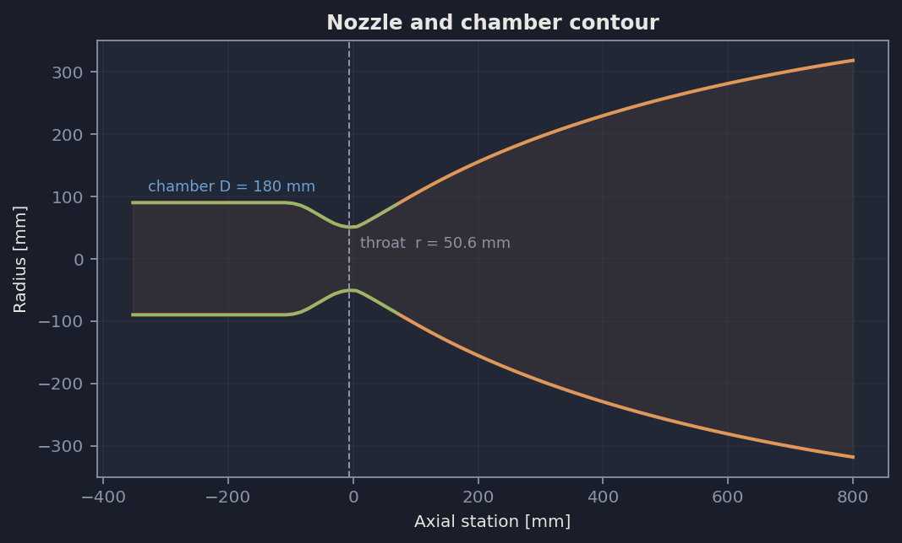
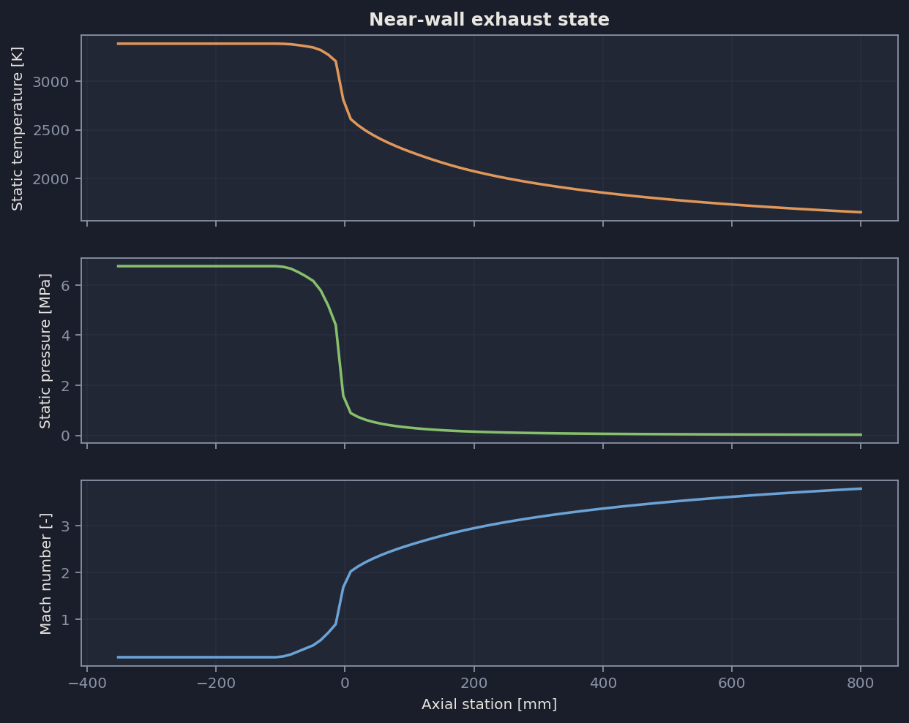
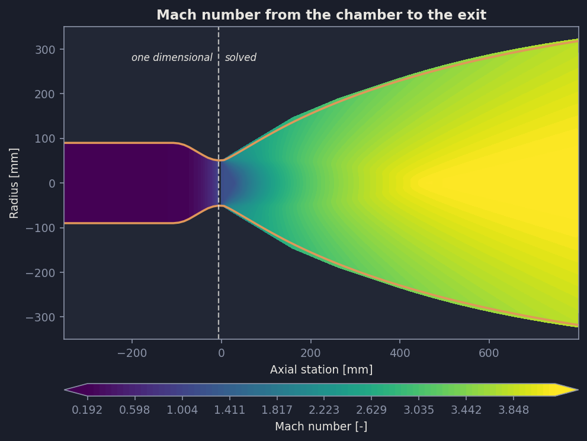
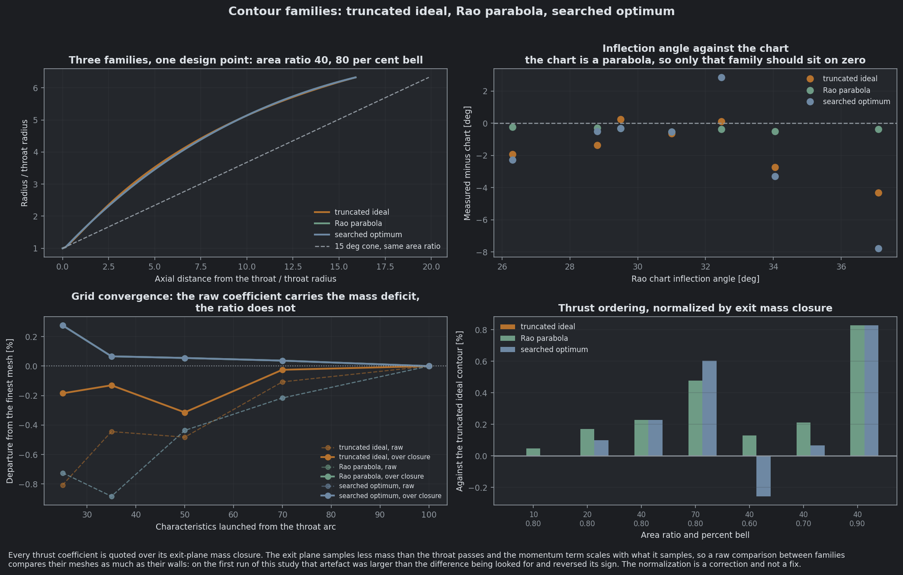
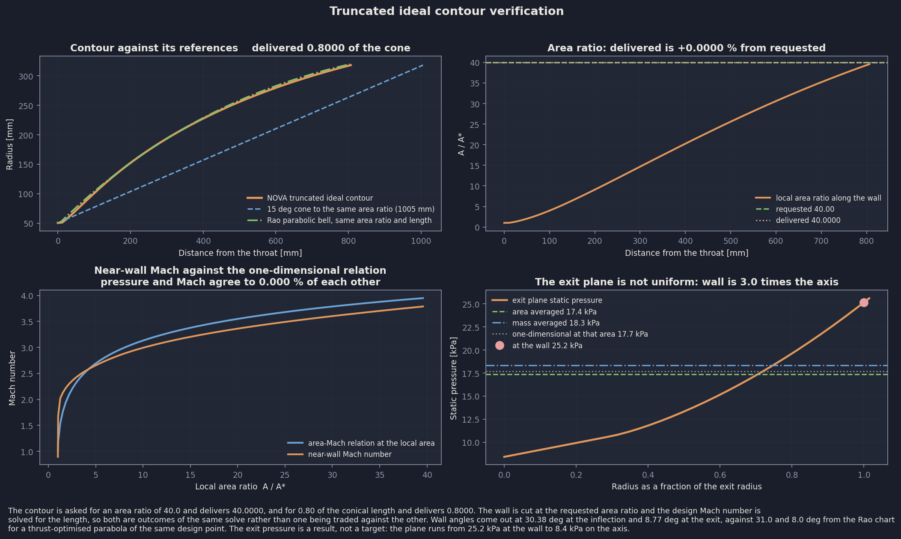
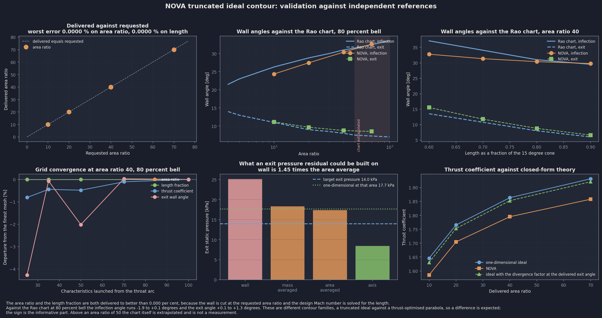
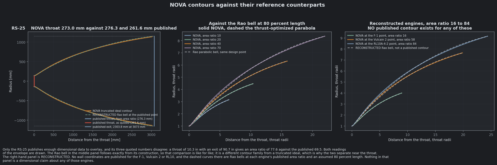
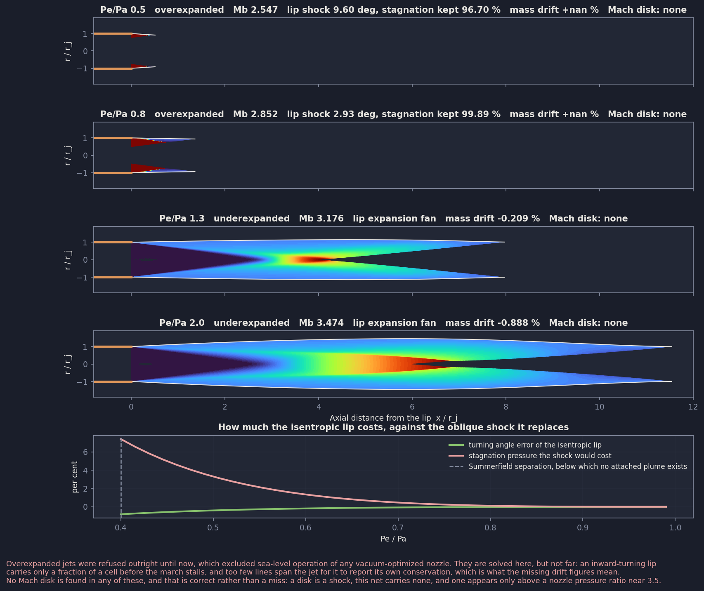
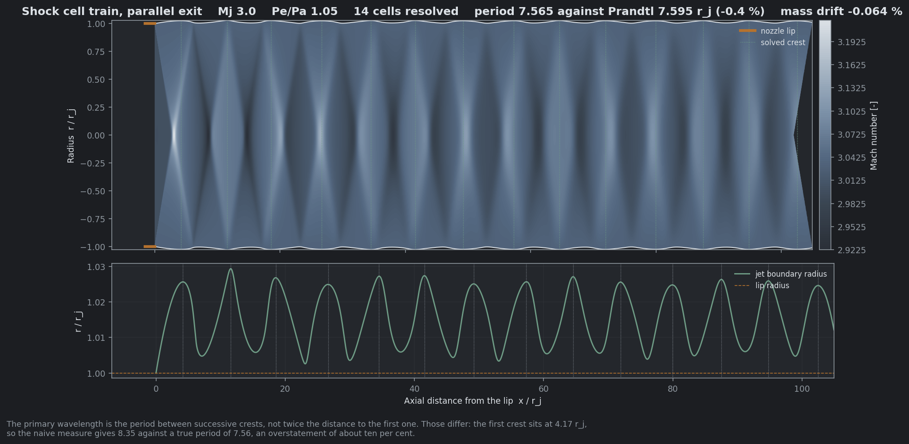
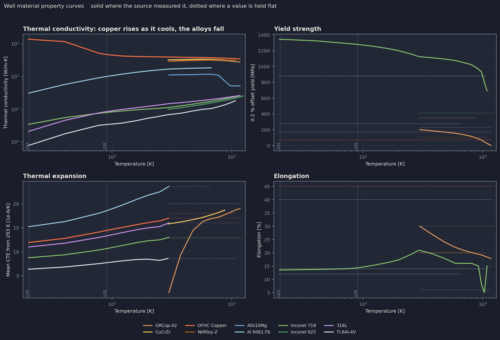

# NOVA

**Nozzle Optimization for Variable Applications**

A repository for the development of the NOVA nozzle design suite.

---

## What NOVA Is

NOVA is a computational toolset for generating and analyzing rocket nozzle geometry programmatically. Rather than drawing contours by hand in CAD, the geometry is defined through mathematical functions and design parameters, giving precise control, reproducibility, and the freedom to explore the design space across a wide range of applications.

## Design Ethos

- Nozzle contours, cooling geometry, and secondary structural features are generated fully programmatically from first-principles physics and a handful of design parameters.
- The suite is built to be adaptable to mission needs rather than to a single fixed design.
- A consistent coordinate convention is enforced across every geometry generator so output aligns cleanly with traditional CAD expectations.
- All internal quantities are in mass-base SI units for consistency and to avoid unit-conversion error. A unit conversion module is shipped with the repo to allow for inputs and outputs to be specified to the user's preference.
- Generated geometry is structured and exported to import directly into standard CAD tools without rework.

---

## Contents

- [NOVA](#nova)
  - [What NOVA Is](#what-nova-is)
  - [Design Ethos](#design-ethos)
  - [Contents](#contents)
  - [Installation](#installation)
  - [Quickstart: API](#quickstart-api)
  - [Quickstart: GUI](#quickstart-gui)
  - [Configuration reference](#configuration-reference)
    - [Contour definition](#contour-definition)
    - [Combustion](#combustion)
    - [Regenerative cooling jacket](#regenerative-cooling-jacket)
    - [Film cooling](#film-cooling)
    - [Radiative extension](#radiative-extension)
    - [Volutes](#volutes)
    - [Program options](#program-options)
  - [Outputs](#outputs)
  - [Worked example: LOX/LH2 upper-stage nozzle](#worked-example-loxlh2-upper-stage-nozzle)
    - [Inputs](#inputs)
    - [Combustion results](#combustion-results)
    - [Sizing results](#sizing-results)
    - [Generated geometry](#generated-geometry)
    - [Contour families and verification](#contour-families-and-verification)
    - [Plume](#plume)
    - [Materials](#materials)
  - [Module layout](#module-layout)
  - [Testing](#testing)
  - [Theory](#theory)

---

## Installation

NOVA targets **Python 3.10 or later** on Windows. `pyproject.toml` pins the floor at 3.10 for its `match` statements and `X | Y` union syntax.

Run from the repository root, where `pyproject.toml` lives:

```bash
pip install -e .
```

That installs the dependencies and puts `NOVA` on the import path, so `from NOVA import Nozzle` resolves from any working directory. The package itself lives in `src/NOVA/`.

Combustion thermochemistry comes from NASA CEA through [`rocketcea`](https://rocketcea.readthedocs.io/), which ships a prebuilt `cp<pyversion>-win_amd64` wheel. **No Fortran compiler is required.**

Fluid properties dispatch to REFPROP first and fall back to CoolProp if the user does not have REFPROP. CoolProp alone is sufficient and is packaged as a repo dependency so NOVA will run fully after the above pip install command.

## Quickstart: API

An API interface for NOVA is exposed for users familiar with programming. The repo ships with an example result that can be generated by calling the main pipeline wrapper with no arguments, or a user can create their own config and pass that instead:

```python
from NOVA import Nozzle

myNozzle = Nozzle()
myNozzle.generateNozzle()                       # uses assets/NOVANozzle.json
myNozzle.generateNozzle(configPath = 'myCase.json')   # or point at your own
```

To run the worked example below from a shell:

```bash
python -c "from NOVA import Nozzle; Nozzle().generateNozzle()"
```

The physics solvers used in the NOVA backend are importable on their own without needing to instantiate a `Nozzle` object:

```python
from NOVA import machFromAreaRatio, wallMaterialCurves
from NOVA import gasDynamics, materials, fluidProps
```

`generateNozzle()` runs the full pipeline: diverging contour, converging section, regen truncation, cooling channels and volutes when enabled, heat transfer, then plotting and export. Output is written to `runs/<filename>Outputs/` at the repository root, where `<filename>` can be specified in the config.

`assets/NOVANozzle.json` is the example configuration the repository ships. It is runnable as it stands, and it is what `generateNozzle()` reads when no path is given. Users can copy it as a starting point for a case of their own.

## Quickstart: GUI

[novaGui/](novaGui/) is a Tkinter front end over the same pipeline. It builds a configuration in the `NOVANozzle.json` schema, runs `generateNozzle()` on a background thread, and presents the result across five tabs. The main window opens without loading the scientific stack; NumPy, SciPy, Matplotlib and rocketcea are imported on the first run.

```bash
python -m novaGui          # from the repository root
python novaGui/run.py      # the same thing
```

On Windows, `novaGui.bat` launches it with no console window. Run `python -m novaGui` from a terminal when a startup traceback needs to be visible.

| Tab         | What it holds                                                                                                                                                                                                                                          |
| ----------- | ------------------------------------------------------------------------------------------------------------------------------------------------------------------------------------------------------------------------------------------------------ |
| Config      | Every field in the schema, grouped into collapsible sections. Dependent fields stay hidden until they apply, every dimensioned field carries a unit dropdown that converts in place, and the selected wall alloy's sampled properties show beneath it. |
| 2D Geometry | Wall contour, near-wall exhaust state, plume structure, and the Mach, pressure and temperature field figures written during the run.                                                                                                                   |
| 3D Geometry | A revolved surface of the contour rendered inline, with the interactive channel-mesh, jacket and volute views embedded through`tkinterweb`.                                                                                                          |
| Analysis    | Sizing, chamber geometry, delivered performance, station thermochemistry, and the regenerative cooling summary when a jacket was built.                                                                                                                |
| Export      | The output location and the files the last run produced. Double-click a row to open it.                                                                                                                                                                |

[novaGui/README.md](novaGui/README.md) covers the run pipeline, the plotting split between Matplotlib and plotly, display scaling and the progress model.

## Configuration reference

Grouped by section, matching the order in the config file.

### Contour definition

| Field                                    | Unit  | Meaning                                                                                                                                                        |
| ----------------------------------------- | ----- | --------------------------------------------------------------------------------------------------------------------------------------------------------------- |
| `numContourPoints`                      | --    | Points in the resampled contour                                                                                                                                |
| `chamberDiameter`                       | m     | Chamber outer diameter at the converging inlet. Sets the contraction ratio                                                                                     |
| `convergingSectionAngle`                | deg   | Converging wall angle at the throat                                                                                                                            |
| `Lstar`                                  | m     | Characteristic length Vc/At. Sizes the cylindrical chamber barrel after the converging-section volume is subtracted. Mutually exclusive with`chamberLength`  |
| `chamberLength`                         | m     | Cylindrical chamber barrel length, given directly instead of through`Lstar`. Leave both `null` for no chamber                                              |
| `divergingSectionType`                  | --    | `tic` (truncated ideal contour), `top` (thrust-optimized parabola), `toc` (thrust-optimized contour, searched) or `cone` (15 degree half angle) |
| `lengthFraction`                        | --    | Truncated ideal contour length as a fraction of the equivalent 15 degree cone. NASA SP-8120's percent bell                                                     |
| `expansionRatio`                        | --    | Geometric area ratio the wall is cut at. Mutually exclusive with`targetExitPressure`                                                                          |
| `targetExitPressure`                    | Pa    | Design exit static pressure. Mutually exclusive with`expansionRatio`: resolved to an equivalent area ratio through CEA before the wall is cut, and delivered the same way                        |
| `regenTruncationType`                   | --    | `none`, `temp` or `er`: where the regen-cooled section ends, by near-wall gas temperature or by area ratio                                              |
| `regenTruncationValue`                  | K or -- | Ignored when`regenTruncationType` is `none`. A near-wall recovery temperature [K] for `temp`, a local area ratio [-] for `er`                                |
| `numCharacteristics`                    | --    | Characteristics launched from the throat arc, setting the mesh resolution of the whole solve                                                                  |
| `transonicModel`                        | --    | `sauer` (default), `secondOrder` or `smallRadius`: which starting line the characteristics net is launched from                                          |
| `throatInletCurvature`                  | --    | Throat inlet arc radius, as a multiple of the throat radius. SP-8120 requires above 0.6                                                                        |
| `throatOutletCurvature`                 | --    | Throat outlet arc radius, as a multiple of the throat radius. 0.382 is Rao's own value                                                                         |
| `divergingSectionDesignVariables`       | deg, deg, --, -- | Pins a`toc` wall instead of searching for one: inflection angle, exit angle, inflection tension, exit tension. `null` searches                     |
| `gammaModel`                            | --    | `chamber` (default) or `effective`: which ratio of specific heats the constant-gamma contour solve runs in                                             |

`L*` is measured over the whole chamber volume, so the converging cone counts toward it and the barrel takes up the remainder. Chamber length, volume, delivered L* and contraction ratio are reported on the analysis tab of the GUI.

### Combustion

| Field                                                      | Unit | Meaning                                                                                                                            |
| ---------------------------------------------------------- | ---- | ---------------------------------------------------------------------------------------------------------------------------------- |
| `Fuel`, `Oxidizer`                                     | --   | Propellant names; see the[CEA interface docs](docs/ceaInterface.md#propellant-names)                                                |
| `OFRatio`                                                | --   | Mixture ratio, or`"maxisp"` to optimize                                                                                          |
| `chamberPressure`                                        | Pa   |                                                                                                                                    |
| `fuelInitialTemperature`, `oxidizerInitialTemperature` | K    |                                                                                                                                    |
| `thrust`                                                 | N    | Mutually exclusive with`engineMassFlow`                                                                                          |
| `engineMassFlow`                                         | kg/s | Mutually exclusive with`thrust`                                                                                                  |
| `expansionRatio`                                         | --   | Mutually exclusive with`targetExitPressure`                                                                                      |
| `targetExitPressure`                                     | Pa   | Mutually exclusive with`expansionRatio`                                                                                          |
| `plumeAmbientPressure`                                   | Pa   | Ambient the exhaust plume is drawn against. Sets the jet regime, shock cell spacing and Mach disk. Leave`null` to skip the plume |

### Regenerative cooling jacket

Coolant enters through the inlet volute at the aft end of the regen nozzle, runs forward against the exhaust, and leaves through the outlet volute at the injector face; at each end a flare turns the channels off the wall into the volute to allow for variable radial volute placement for wall thickness tailoring. The scroll area is linear in wrap angle. A `cutwater` scroll runs from the tongue at one end of the wrap to the throat at the other and stops short of a full turn by the angle its tongue wall occupies. A `ring` wraps the full turn, is fed from both directions at once, and puts the tongue half a turn from the throat, so each half serves half the ports and the two ends of the sweep match.

Gas-side heat transfer is Bartz by default with a single correlation constant along the whole wall. Measured constants vary with station: on a LOX/GH2 chamber at 150 to 1000 psia they run 0.0257 in the barrel against 0.0148 at the throat (NASA TN D-2832), so that default is about right over the barrel and 20 to 40 percent high at the throat, which buys wall margin and charges pressure drop for it. Setting `gasSideAxialModel` to `measured` takes the axial shape from those constants instead, normalized on the barrel so Bartz keeps the absolute level: unity over the barrel and 0.59 at the throat. The correlation and both options live in [src/NOVA/gasSideHeatTransfer.py](src/NOVA/gasSideHeatTransfer.py), which the ablative liner and the radiative extension read as well, and the sources are in [docs/references_gasSideHeatTransfer_2026-09-22.md](docs/references_gasSideHeatTransfer_2026-09-22.md).

Three channel families are built, one per run:

| `channelType` | Section | Held | Sized | Derived |
|---|---|---|---|---|
| `circle` | Circle | Rib | Radius | Wrap angle |
| `rectangular` | Rounded rectangle, depth along the wall normal | Rib, and the channels run straight | Depth | Width, which fills the pitch at the cold wall less the rib, and aspect ratio |
| `helical` | Rounded rectangle on a helix of `nChannel` starts | Helix angle and aspect ratio | Width | Rib, which varies along the nozzle |

`channelRadius` references both a circle's radius and half a rectangle's depth for consistency in the backend variables. At each station it is converged to be the largest channel that holds the wall at `maxWallTemperature`, within the limits of each family. Spirally fluted channels are kept in [experimental/flutedChannels.py](experimental/flutedChannels.py).

A channel may not exceed the largest that fits between its neighbors, may not reach past `maxChannelDepth` out from the wall, and may not fall below `minChannelRadius`. Coolant outlet properties are checked against `minCoolantExitPressure` and `minCoolantExitTemperature`.

The size is arrived at one of two ways, set by `channelSizingMode`. `thermal`: each station converges its own size, at about seven passes of the thermal model per station. `manual` reads the size off `manualChannelProfile` and marches each station once, so the wall temperature, the pressure drop and the coolant exit state come out as results rather than targets.

A profile is a half-extent in meters for a constant channel, or a list of `[key, half-extent]` control points, linear in the key between them and flat outside them. `manualChannelProfileKey` names the key: `areaRatio` is the local area ratio signed negative upstream of the throat, so a 3.2 contraction ratio chamber reads -3.2, the throat is -1 on the converging side and +1 on the diverging side, and no station sits between the two. `jacketFraction` is the meridional distance along the jacket from the injector face, 0 to 1, which is the key a recorded profile is written in because the area ratio holds one value along a constant radius barrel. A station whose requested size will not fit between its neighbors, or falls below the process minimum, stops the run and names the station and the bound; a channel count too high for its throat stops it too, where the search reduces the count instead.

Every run prints the profile it built and writes it to `<name>ChannelProfile.json` beside the exported geometry. A configuration may name that file as its `manualChannelProfile` instead of listing points.

What a rough wall may do to the coolant-side heat transfer is set by `coolantRoughnessModel`: Carlile's wall temperatures want more coolant-side heat transfer than a smooth-wall correlation gives, and the hydrogen coefficients of NASA TN D-7207 want less. The default is the bounded middle, Dipprey and Sabersky's measured rough-wall heat transfer.

| Field                                       | Unit | Meaning                                                                                            |
| --------------------------------------------- | ---- | ----------------------------------------------------------------------------------------------------- |
| `makeCoolingChannels`                       | --   | Build the jacket and run the heat transfer model                                                   |
| `material`                                  | --   | Wall alloy; see the material table below                                                            |
| `channelType`                               | --   | `circle`, `rectangular` or `helical`                                                               |
| `channelSizingMode`                         | --   | `thermal` converges each station's channel size against `maxWallTemperature`; `manual` reads it off `manualChannelProfile` and marches once |
| `manualChannelProfile`                      | m    | `manual` only: a half-extent for a constant channel, a list of `[key, half-extent]` control points, or a path to a profile a run recorded |
| `manualChannelProfileKey`                   | --   | `manual` only: `areaRatio`, signed negative upstream of the throat, or `jacketFraction` from the injector face. Default `areaRatio` |
| `coolantRoughnessModel`                     | --   | What a rough wall may do to the coolant-side heat transfer: `frictionOnly`, `dippreySabersky` or `fullCredit`. Roughness raises the friction factor and the pressure drop under all three |
| `channelSurfaceRoughness`                   | m    | Absolute roughness the coolant-side friction factor is built on, default 35 um for a printed channel |
| `coolantGeometryCorrections`                | --   | Enhances the coolant-side coefficient in the developing length after the inlet and through bends, by the entrance and Ito curvature factors of NASA TN D-7207 |
| `gasSideAxialModel`                         | --   | `uniform` holds one gas-side correlation constant along the wall, as Bartz does. `measured` scales it by the constants measured along a LOX/GH2 chamber: the barrel is unchanged and the throat drops about 40 percent |
| `hotWallThickness`, `shellThickness`      | m    | Combustion-side wall and outer structural shell thickness                                          |
| `infillThickness`                          | m    | Rib between channels, at least 0.5 mm. Exact at the wall for `rectangular`; the floor for `helical` |
| `nChannel`                                  | --   | Channel count, or helical starts. Reduced at run time if the throat cannot hold the minimum channel |
| `minChannelWidth`                           | m    | Narrowest `rectangular` or `helical` channel the process can build, default 1 mm                  |
| `channelCornerRadius`                       | m    | Corner radius of a `rectangular` or `helical` section. Unset is a sharp corner                     |
| `maxChannelAspectRatio`                     | --   | Depth a `rectangular` channel may reach as a multiple of its width, default 8                      |
| `maxChannelDepth`                           | m    | How far any channel may reach out from the wall, a circle's diameter included. Unset leaves a circle bounded only by the room between its neighbors |
| `channelHelixAngle`                         | deg  | `helical` only: angle to the meridian, 0 to 85                                                     |
| `channelAspectRatio`                        | --   | `helical` only: depth as a multiple of width, default 1                                            |
| `numCrossSections`, `numCSPointsChannel` | --   | Cross sections swept along each channel, and points per cross section                              |
| `maxWallTemperature`                        | K    | Hot wall temperature the jacket is held to, one value for the whole jacket. Required whenever the jacket is built |
| `maxWallTempUpperBound`, `maxWallTempLowerBound` | K | Bounds for a wall temperature search. Read by no solver: no such search is implemented |
| `nChannelUpperBound`, `nChannelLowerBound` | --   | Bounds for a channel-count search. Read by no solver: no such search is implemented |
| `coolantClass`                              | --   | `fuel` or `oxidizer`: which propellant stream feeds the jacket                                  |
| `coolant`                                   | --   | REFPROP / CoolProp fluid name                                                                       |
| `coolantInitialTemperature`                | K    | Coolant temperature entering the jacket                                                             |
| `coolantInitialPressure`                    | Pa   | Coolant pressure entering the jacket                                                                 |
| `coolantMassFlow`                           | kg/s | Coolant mass flow through the jacket                                                                |
| `minCoolantExitPressure`                    | Pa   | Lower limit on coolant pressure at the jacket exit. Checked once the jacket is solved; unset is no limit |
| `minCoolantExitTemperature`                 | K    | Lower limit on coolant temperature at the jacket exit. Checked once the jacket is solved; unset is no limit |

The `material` field is a wall alloy name resolved by `src/NOVA/materials.py`: `GRCop-42`, `CuCrZr`, `OFHC Copper`, `NARloy-Z`, `AlSi10Mg`, `Al 6061-T6`, `Inconel 718`, `Inconel 625`, `316L`, `Ti-6Al-4V`, or a recognized free-text alias. The heat transfer model samples that module's temperature-dependent thermal conductivity curve for whichever alloy is named; an unrecognized name falls back to GRCop-42 with a warning. Conductivity curves are validated against their cited sources in `tests/testMaterials.py`.

### Film cooling

Optional throughout: a configuration that names none of these describes an engine with no film. Works alongside a jacket rather than instead of one; see [NozzleCooling.md](docs/NozzleCooling.md) for the two closures.

| Field                              | Unit | Meaning                                                                                          |
| ---------------------------------- | ---- | ------------------------------------------------------------------------------------------------ |
| `filmCooling`                      | --   | Inject a sheet of coolant along the wall                                                         |
| `filmCoolingModel`                 | --   | `hatchPapell` (flat-plate correlation) or `sp8124Entrainment` (accounts for acceleration and turning) |
| `filmCoolant`                      | --   | REFPROP / CoolProp fluid name; must be a gas at its slot conditions                              |
| `filmMassFlow`                     | kg/s | Coolant through the film ring, bypassing the injector                                            |
| `filmInletTemperature`             | K    | Coolant temperature leaving the slot                                                             |
| `filmInjectionAxialPosition`       | m    | Axial position of the slot. One ring only                                                        |
| `filmSlotHeight`                   | m    | Radial height of the annular slot                                                                |
| `filmCoolantMixtureRatio`          | --   | Oxidizer to fuel ratio of the coolant itself. Zero is a pure fuel film                           |
| `filmEntrainmentMultiplier`        | --   | psi_m at the slot, for the entrainment closure. SP-8124 recommends 3 to 4                        |

### Radiative extension

Solves the wall temperature of an uncooled extension beyond the jacket. Needs a non-`none` `regenTruncationType`, since with none the jacket runs the whole contour and there is no extension to solve.

| Field                                      | Unit    | Meaning                                                                                     |
| --------------------------------------------- | ------- | ------------------------------------------------------------------------------------------- |
| `makeRadiativeExtension`                   | --      | Solve the extension                                                                          |
| `extensionMaterial`                        | --      | Named only to look up a temperature limit for the margin report. Leave empty to skip it     |
| `extensionAtmosphere`                      | --      | `inert`, `oxidising` or `oxidisingCoated`: which of the material's limits applies    |
| `extensionThickness`                       | m       | Shell thickness, setting conduction along the shell                                          |
| `extensionThermalConductivity`             | W/m-K   | Supplied rather than looked up, since the materials store carries curves only for the jacket alloys |
| `extensionInnerEmissivity`                 | --      | Gas-side surface emissivity                                                                  |
| `extensionOuterEmissivity`                 | --      | Outer surface emissivity. Wall temperature goes as its inverse fourth root                   |
| `extensionOuterViewFactor`                 | --      | Fraction of outward emission reaching the sink. One for open space                           |
| `extensionSinkTemperature`                 | K       | What the outer surface radiates to                                                           |
| `extensionGasEmissivity`                   | --      | Total emissivity of the exhaust over the mean beam length. Zero makes the gas transparent    |
| `extensionJointTemperature`                | K       | Wall temperature where the shell meets whatever is upstream. Empty makes the joint adiabatic |

### Volutes

| Field                                                | Unit | Meaning                                                                             |
| ------------------------------------------------------ | ---- | ------------------------------------------------------------------------------------ |
| `makeInletVolute`, `makeOutletVolute`             | --   | Build the inlet manifold and the outlet manifold                                    |
| `numCSVolute`, `numCSPointsVolute`               | --   | Cross sections swept around each volute, and points per cross section              |
| `voluteRelativeRoll`                               | deg  | Roll offset between the inlet and outlet volutes                                    |
| `voluteScrollType`                                 | --   | `ring` or `cutwater`                                                                 |
| `maxVoluteBore`                                    | m    | Largest scroll throat the build accepts before refusing                             |
| `inletVoluteCrossSection`, `outletVoluteCrossSection` | -- | `circle` or `squarc`. An egg section is kept in [experimental/eggVolute.py](experimental/eggVolute.py) |
| `inletVoluteAlignment`, `outletVoluteAlignment`   | --   | `c`, `n`, `s`, `i`, `o`, `ni`, `si`, `no` or `so`: which edge of a section holds still as the scroll grows, and so whether it grows toward the nozzle or away from it |
| `inletVolutePrintability`, `outletVolutePrintability` | -- | Apply overhang-safe shaping                                                        |
| `inletVoluteTilt`, `outletVoluteTilt`             | deg  | Tilt of the cross section, read by a squircle section                                |
| `inletGraylocDiameter`, `outletGraylocDiameter`   | in   | Inner diameter of the Grayloc seal ring the scroll transitions into                  |
| `inletVoluteAxialOffset`, `outletVoluteAxialOffset` | m  | Where each flare leaves the wall: upstream of the aft end for the inlet, downstream of the injector face for the outlet |
| `inletVoluteFlareRoverD`, `outletVoluteFlareRoverD` | -- | Fillet radius of the turn into each flare, over the jacket depth                  |
| `inletVoluteFlareLength`, `outletVoluteFlareLength`  | m    | Flare length                                                                          |

The chamber keep-out envelope is kept in [experimental/keepOut.py](experimental/keepOut.py) beside the sunken throat that wraps it.

### Program options

| Field           | Unit | Meaning                                                                                       |
| ----------------- | ---- | ----------------------------------------------------------------------------------------------- |
| `plotsEnabled`  | --   | Write every figure the run generates: contour, Mach, pressure, temperature and near-wall views, the interactive channel-mesh and jacket HTML views, and the volute assembly |
| `export`        | --   | Write contour text files, STL geometry and the pickled `Nozzle`                              |
| `filename`      | --   | Base name for the output folder: `<name>Outputs/`                                          |

## Outputs

A run writes to `{filename}Outputs/` beside the repository root.

| Output                                                                                                 | Written when                                               |
| ------------------------------------------------------------------------------------------------------ | ---------------------------------------------------------- |
| `contourSegmentsVisualization.png`                                                                   | `plotsEnabled`                                            |
| `machContours.png`, `pressureContours.png`, `temperatureContours.png`                            | `plotsEnabled`                                            |
| `nearWallProperties.png`                                                                             | `plotsEnabled`                                            |
| `heatTransferModelOutput.png` / `.html`                                                            | cooling channels enabled                                   |
| `threeChannelMeshViewInterfaced.html`, `regenJacketView.html`                                      | `plotsEnabled` with cooling channels                      |
| `contourInteractive.html`, `nearWallInteractive.html`, `revolvedContourView.html`                | `export`                                                     |
| `machFieldInteractive.html`, `pressureFieldInteractive.html`, `temperatureFieldInteractive.html` | `export`                                                     |
| `plumeStructureInteractive.html`                                                                     | `export`, `plumeAmbientPressure` set                     |
| `*HotWallRegenContour.txt`, `*HotWallUntruncatedContour.txt`                                       | `export`                                                 |
| `*ShellRegenContour.txt`, `*ChannelCenterline3D.txt`                                               | `export` with cooling channels                           |
| `*.stl` geometry set                                                                                 | `export` with cooling channels                           |
| `*.pkl` pickled `Nozzle` object                                                                    | `export`                                                 |

Every figure is written twice: a Matplotlib PNG and an interactive plotly HTML companion. Matplotlib is the required backend for the GUI, since it is the only one that renders into a Tk canvas; plotly is required for the browser-side interactive views. Both are drawn from one description in `src/NOVA/figures.py`, which also holds the styled renderer for each backend, so the two renderings cannot drift. [featureShowcase/](featureShowcase/) calls the same Matplotlib renderer for its documentation figures, so a run's own output looks exactly like the worked example below.

A run's own `export` writes **STL only**. A STEP writer exists in [experimental/stepExport.py](experimental/stepExport.py): it writes each component as the exact surface it is, a surface of revolution for the walls and a B-spline surface for the swept channels and volutes, rather than as triangles. It is not yet wired into `export`, and it does not perform booleans, so a run does not produce an assembled STEP body; see [docs/reports/stepExport_2026-09-20.md](docs/reports/stepExport_2026-09-20.md) for what it covers and what remains. A `rectangular` or `helical` channel needs `channelCornerRadius` above zero for it: the B-spline fit through a sharp corner rings.

Generated `*Outputs/` directories are gitignored. The curated figures above are kept in [featureShowcase/](featureShowcase/), which is also where the documentation draws its figures from.

## Worked example: LOX/LH2 upper-stage nozzle

`src/NOVA/assets/NOVANozzle.json` defines a 100 kN hydrolox upper stage which is the case every table and figure below is drawn from. It is the same operating point used as the CEA validation case in `tests/testCeaInterface.py`, so the thermochemistry can be checked directly against the [NASA CEARun web tool](https://cearun.grc.nasa.gov/). The build scripts behind the figures live in [featureShowcase/](featureShowcase/), and [featureShowcase/README.md](featureShowcase/README.md) catalogues all thirty-one of them with a line on how to read each one.

### Inputs

| Parameter                         | Value                                | Notes                         |
| --------------------------------- | ------------------------------------ | ----------------------------- |
| Propellants                       | LOX / LH2                            |                               |
| Chamber pressure                  | 6.8948 MPa                           | 1000 psia                     |
| Mixture ratio                     | 5.5                                  | hydrogen-rich, near peak Isp  |
| Expansion ratio                   | 40                                   | sets the target exit pressure |
| Thrust                            | 100 kN                               | mass flow is derived from it  |
| Oxidizer / fuel inlet temperature | 90.17 K / 20.27 K                    | normal boiling points         |
| Contour                           | truncated ideal, length fraction 0.8 | method of characteristics     |
| Chamber outer diameter            | 180 mm                               | contraction ratio ~3.2        |

In the config, a field left `null` means *not specified*. A literal `0.0` means *specified as zero*, which is not the same thing: `thrust` and `engineMassFlow` are mutually exclusive, so one of them must be `null`.

### Combustion results

CEA output at the chamber, compared against CEARun for the same case:

| Quantity                 | NOVA         | CEARun      |
| ------------------------ | ------------ | ----------- |
| Chamber temperature      | 3398.4 K     | ~3400 K     |
| Chamber molecular weight | 12.662 g/mol | ~12.7 g/mol |
| Chamber gamma            | 1.1475       | ~1.14       |
| Characteristic velocity  | 2339.9 m/s   | ~2330 m/s   |
| Vacuum Isp               | 453.77 s     | ~450 s      |
| Chamber Prandtl number   | 0.5190       | ~0.5        |

### Sizing results

| Quantity                  | Value       |
| ------------------------- | ----------- |
| Throat radius             | 50.6 mm     |
| Exit radius               | 318.3 mm    |
| Diverging section length  | 806.3 mm    |
| Delivered area ratio      | 40.000      |
| Delivered length fraction | 0.8000      |
| Mass flow                 | 23.466 kg/s |
| Thrust coefficient        | 1.795       |
| Ideal Isp                 | 434.4 s     |

### Generated geometry

The contour: converging section from the generated chamber, sonic throat, and a truncated ideal diverging section from the method of characteristics.



Near-wall exhaust state along the axis: velocity, static temperature, static pressure and Mach number.



Chamber, converging section and diverging section in one frame, with the seam between the one-dimensional chamber solve and the characteristics mesh marked. `stitchedFieldPressure.png` and `stitchedFieldTemperature.png` in [featureShowcase/](featureShowcase/) show the same frame shaded by the other two quantities.



### Contour families and verification



The three diverging families compared on one engine: truncated ideal, thrust-optimized parabola and searched thrust-optimized contour.



The worked case against its independent references: length, area ratio, near-wall consistency and the exit plane mass balance.



Sweeps over area ratio, percent bell and mesh resolution, drawn against the Rao chart.



NOVA contours drawn on the RS-25 envelope, on Rao bells, and on reconstructed engines.

### Plume



Overexpanded through underexpanded, with the cost of the isentropic lip. The four `plume_*.png` figures show one regime each at equal aspect.



The shock cell train at a parallel exit, validated against Prandtl's cell length.

### Materials



The property curves behind the material selector, drawn solid where a source measured the value and dotted where it is held flat.

Three of the studies behind these figures are slow: the Rao sweeps take about sixteen minutes, the family comparison about forty, and the subfamily search about two hours. The interactive plotly companions are regenerated rather than committed, so they are not linked here.

## Module layout

`Nozzle.py` holds the `Nozzle` class, and the class is a facade: it declares the object's state, assembles the inputs each module needs, calls that module, and copies the result back. It computes nothing. Everything that does sits in a module beside it, each of which takes its inputs explicitly and reads nothing off a `Nozzle`, so each can be driven and tested on its own.

That is checked rather than asserted. `tests/testFacade.py` holds it structurally: no module imports `Nozzle` or reaches `self` outside its own classes, no facade method contains a loop or an arithmetic operator, and every state object is complete in both directions.

`Nozzle.py` re-exports the plume and gas dynamics names, so `from Nozzle import PlumeFlow` and the like keep working.

The nozzle interior point and the plume interior point are the same relations, and the fact that they now live in separate modules is what makes it checkable: `tests/testCharacteristics.py` compares them directly and states how far apart they end up.

Program option flags (`plotsEnabled`, `export`, `makeCoolingChannels`, `makeInletVolute`, `makeOutletVolute`, `filmCooling`, `makeRadiativeExtension`, `inletVolutePrintability`, `outletVolutePrintability`) accept JSON booleans or the strings `"on"` / `"off"`.

| Module                                                      | Holds                                                                                                                                                                                                                                                          |
| ----------------------------------------------------------- | -------------------------------------------------------------------------------------------------------------------------------------------------------------------------------------------------------------------------------------------------------------- |
| `gasDynamics.py`                                          | Isentropic ratios, the Prandtl-Meyer function and its inverse, the area-Mach relation and both its branches, the conical length reference                                                                                                                      |
| `characteristics.py`                                      | The method-of-characteristics unit processes: the interior point and the wall point, taking a`CharacteristicGas`                                                                                                                                             |
| `contourKernel.py`                                        | The Rao throat arcs, the selectable transonic starting line, and the intersections that seed the net                                                                                                                                                           |
| `wallGeometry.py`                                         | Analytic wall primitives and the prescribed walls built from them: arcs, lines, quadratic and cubic Beziers, each with a closed-form tangent and ray intersection. Pure geometry, with no gas and no NOVA imports                                              |
| `directCharacteristics.py`                                | The forward march over a wall that is handed to the solver rather than solved for, and the internal shock it detects and captures                                                                                                                              |
| `contour.py`                                              | The three contoured family solves, the throat scaling into real units, and the conical reference contour                                                                                                                                                       |
| `contourOptimization.py`                                  | The direct search that produces a thrust-optimized contour: the design vector, its bounds and validity test, and the restarts and optimality evidence around the optimizer                                                                                     |
| `boundaryLayer.py`                                        | The compressible integral turbulent boundary layer on a finished wall: reference-temperature properties, the momentum-integral march, the displacement-thickness wall offset and the friction drag debit                                                       |
| `plume.py`                                                | Plume correlations, the TN D-2327 free-jet lattice, and the characteristics march past the lip                                                                                                                                                                 |
| `ceaInterface.py`                                         | Thermochemistry through rocketcea                                                                                                                                                                                                                              |
| `fluidProperties.py`                                      | One equation-of-state accessor over two backends: REFPROP when installed, CoolProp as the automatic fallback                                                                                                                                                    |
| `figures.py`                                              | One figure description per view and the styled renderer for each backend: the interactive plotly HTML, the Matplotlib PNGs a run writes and the feature showcase draws for documentation, and the 3D assembly views that have no static twin                  |
| `regenThermal.py`                                          | The regenerative jacket thermal model: Bartz on the gas side, Gnielinski on the hydraulic diameter on the coolant side, the wall as the sector each channel owns and the rib as a fin |
| `ablative.py`                                             | The charring ablator response: CMA in-depth conduction with a receding surface, Arrhenius pyrolysis, surface thermochemistry, and the station march that applies them along a contour                                                                          |
| `filmCooling.py`                                          | Two film closures and the marches that lower the driving temperature along a contour: the Hatch and Papell correlation with its property correction to the film mean temperature, and the SP-8124 entrainment model that accounts for acceleration and turning |
| `radiativeCooling.py`                                     | Gas-to-wall radiation as an exact coefficient on its own potential, and the damped Newton solve for the wall temperature of an uncooled extension                                                                                                              |
| `channelSections.py`                                       | What the thermal model reads about each channel family: flow area, perimeters, hydraulic diameter, the rib as a fin, the rectangular width and the helical spacing and loxodrome |
| `channelGeometry.py`                                       | Cooling channel cross sections: the circular profile on a transport frame, and the rounded rectangle on frames built from the wall normal |
| `channelSizing.py`                                         | The channel size solve: converging each station so the hot wall runs at the temperature it is allowed to, or building it at the size a manual profile fixes |
| `channelProfile.py`                                        | A manually fixed channel size distribution: the area ratio and jacket fraction keys, the reader, the interpolation and the profile a run records |
| `regenChannels.py`                                         | The jacket build: the fillet and flare to each volute, the channel centerline and its wrap, the swept channels and the wall meshes |
| `nozzleVolutes.py`                                        | The inlet and outlet scrolls, their walls sized against the coolant state, and their print supports                                                                                                                                                            |
| `chamber.py`                                              | The combustion chamber and the converging section                                                                                                                                                                                                              |
| `regenStations.py`                                        | Where the jacket ends, and the exhaust state at every station of both sections                                                                                                                                                                                 |
| `config.py`                                               | Reading a configuration from JSON or a dictionary                                                                                                                                                                                                              |
| `exports.py`                                              | Contours, STL geometry, exhaust properties and the pickled run                                                                                                                                                                                                 |
| `validation.py`                                           | Input validation as rule tables rather than branches, with one checker behind them                                                                                                                                                                             |
| `errors.py`                                               | The exception hierarchy every deliberate NOVA failure raises, and the context dictionary a raise site attaches to it                                                                                                                                            |
| `materials.py`, `units.py`, `geometryTools.py`, `Volute.py` | Wall alloys, unit conversion, geometry helpers, volute construction                                                                                                                                                                                          |
| `novaGui/`                                                | Tkinter front end over the same pipeline                                                                                                                                                                                                                       |
| `featureShowcase/`                                        | Build scripts for the figures above, and the curated gallery                                                                                                                                                                                                   |
| `examples/`                                               | `novaNozzle.py` runs the reference nozzle through every solver; the others drive one feature each                                                                                                                                                            |

## Testing

```bash
python -m pytest tests/ -v
```

The suite never opens a window. `tests/conftest.py` sets `NOVA_HEADLESS` before anything is imported, which selects a non-interactive matplotlib backend and stops plotly launching a browser tab per figure, and it closes any figures a test leaves behind. Nothing is suppressed except the display: every figure is still built and every file still written.

The same switch is available to any run, which is what to reach for when iterating on a feature rather than clicking through a dozen windows each time:

```bash
NOVA_HEADLESS=1 python examples/novaNozzle.py    # write the figures, open nothing
NOVA_HEADLESS=0 python -m pytest tests/testRegenChannels.py   # put the windows back
```

It is an environment variable rather than a configuration field because it describes where NOVA is running, not the engine being designed. The regression harness and the GUI both set it for themselves.

`tests/regressionHarness.py` is not part of the suite. It runs a configuration end to end, walks every public attribute of the resulting `Nozzle`, and compares against a recorded baseline at exact equality, which is what holds a refactor to moving code rather than changing answers. Record a baseline before making changes:

```bash
python tests/regressionHarness.py --record --verify   # record, and prove determinism
python tests/regressionHarness.py --compare           # after a change
```

Baselines are written to `tests/baselines/` and are carried in the repository, so a change that moves a number shows up in the diff rather than only on the machine that ran it.

`tests/testCeaInterface.py` covers the CEA interface in 50 tests that run in about two seconds: unit conversion constants, the LOX/LH2 reference case against CEARun, pressure conventions, endpoint guards over the area ratios the contour sweeps actually generate, propellant name resolution, and the lazy result mapping.

`tests/testMaterials.py` validates the wall alloy thermal conductivity curves in `materials.py` against their cited sources (Touloukian, ASM, Special Metals, ITER MPH, NASA).

`tests/testPlume.py` validates the plume correlations in `Nozzle.py`: the Prandtl-Meyer function against compressible flow tables, the Tam and Tanna equivalent diameter against an independent mass-conservation derivation, the Ashkenas and Sherman Mach disk location in both its diameter and radius forms, and the oblique shock deflection against the theta-beta-M relation solved the other way round.

## Theory

- [Nozzle Design Overview](docs/NozzleDesignOverview.md) -- consolidated contour and cooling reference, end to end ([PDF](docs/NozzleDesignOverview.pdf)).
- [Nozzle Contour](docs/NozzleContour.md) -- MOC contour generation: nomenclature, Sauer transonic analysis, characteristics, process flow.
- [Nozzle Contour Methods](docs/NozzleContourMethods.md) -- the contour families, what each optimizes, how other axisymmetric MOC implementations differ, and where this one sits.
- [Nozzle Contour Validation](docs/NozzleContourValidation.md) -- what the contour generator is checked against, the defects that check found, and an explicit statement of what is and is not validated.
- [Contour Families Report](docs/reports/contourFamilies_2026-09-15.html) -- the three families, the throat and transonic models, the boundary layer and the internal shock, with the plots behind each number.
- [arcSpline Overshoot at a Corner](docs/reports/arcSplineOvershoot_2026-09-08.md) -- why the arc-length resampler used to invent geometry outside its own input, what replaced it, and how far the contour moved.
- [Contour Verification and Assessment](docs/reports/nozzleContourEffort_2026-09-06.md) -- the narrative of that effort end to end, phase by phase, with the figures. Rendered as a standalone [HTML report](docs/reports/nozzleContourEffort_2026-09-06.html).
- [Nozzle Cooling](docs/NozzleCooling.md) -- regenerative cooling architecture and a worked example.
- [Regen Cooling Architectures](docs/regenCoolingArchitectures.md) -- cooling circuit topology: pass count, flow direction, channel count along the nozzle, independent and multi-fluid circuits, what reference practice does, and the staged path for adding each.
- [Regen Cooling Topology References](docs/references_regenCoolingTopologies_2026-10-02.md) -- annotated sources behind that document, from SP-8087 to current channel wall nozzle manufacturing.
- [CEA Interface](docs/ceaInterface.md) -- combustion thermochemistry, result keys and units, propellant naming, thread safety.
- [Plume Development State](experimental/plumeDevelopmentState.md) -- where the plume solver stands: what is validated, what is open, and the findings behind both.
- [Internal Shock State](experimental/internalShockState.md) -- how the shock inside an optimized contour is detected and captured, where the weak-shock treatment stops being defensible, and what a rotational characteristics solve would cost.
- [Plume Structure References](docs/references_plumeStructure_2026-09-04.md) -- annotated sources behind the plume correlations in `Nozzle.py`, and an explicit statement of what the correlations do and do not support.
- [Nozzle Contour References](docs/references_nozzleContour_2026-09-06.md) -- annotated sources behind the contour generator, and what they do and do not establish about it.
- [Thrust-Optimized Contour References](docs/references_thrustOptimizedContours_2026-09-13.md) -- annotated sources behind the optimized families: the direct-optimization method, the perfect-bell data set it is checked against, and what neither of them publishes.

---

## License

MIT. See [LICENSE](LICENSE).

---

Sean Bowman
