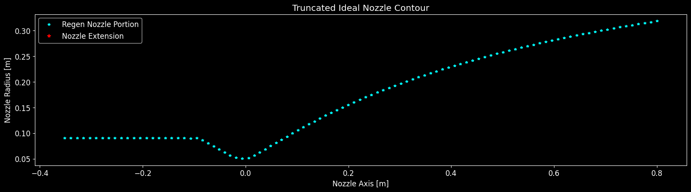
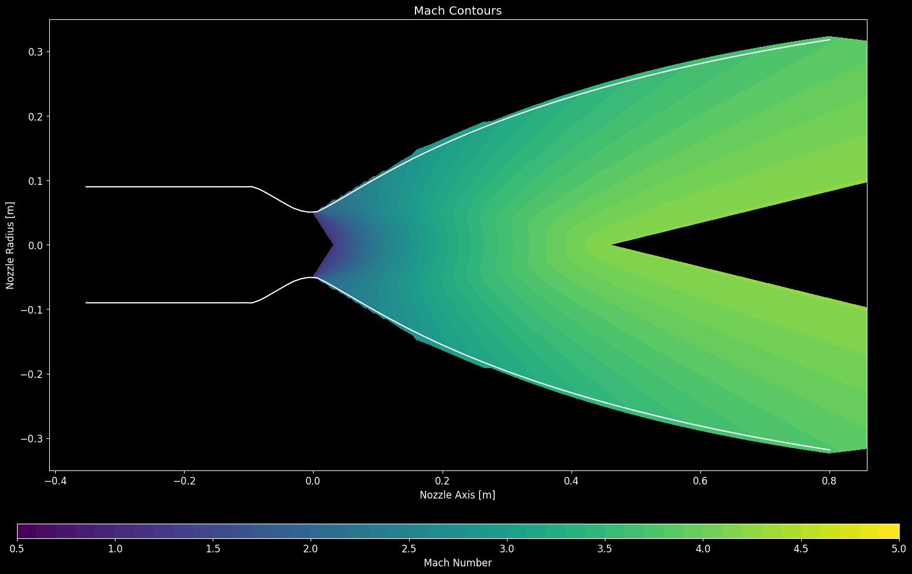
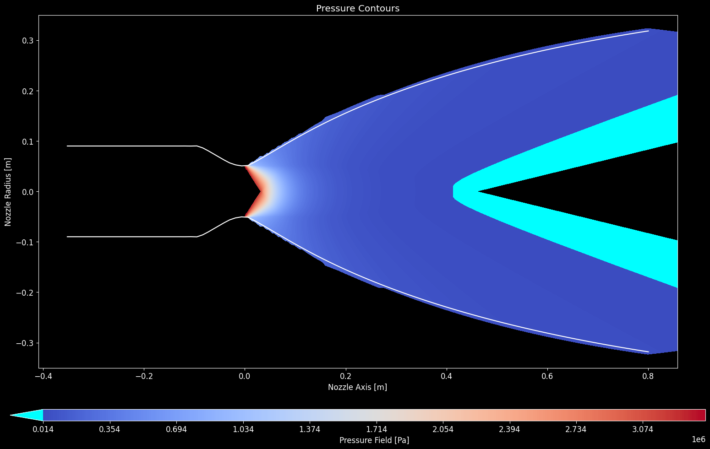
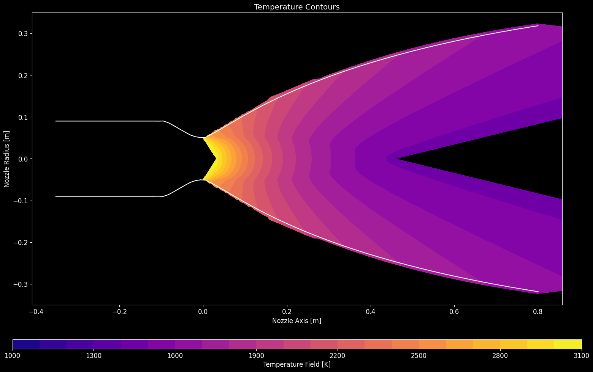

# NOVA

**Nozzle Optimization for Variable Applications**

A repository for the development of the NOVA nozzle design suite.

---

## What NOVA Is

NOVA is a computational toolset for generating and analyzing rocket nozzle geometry programmatically. Rather than drawing contours by hand in CAD, the geometry is defined through mathematical functions and design parameters, giving precise control, reproducibility, and the freedom to explore the design space across a wide range of applications.

## Design Ethos

- Nozzle contours and cooling geometry are generated fully programmatically from physics and a handful of design parameters.
- The suite is built to be adaptable mission needs rather than to a single fixed design.
- A consistent coordinate convention is enforced across every geometry generator so output aligns cleanly with traditional CAD expectations.
- All internal quantities are in mass-base SI units for consistency and to avoid unit-conversion error.
- Generated geometry is structured to import directly into standard CAD tools without rework.

---

## Contents

- [Installation](#installation)
- [Quickstart](#quickstart)
- [Worked example: LOX/LH2 upper-stage nozzle](#worked-example-loxlh2-upper-stage-nozzle)
- [Outputs](#outputs)
- [Configuration reference](#configuration-reference)
- [Testing](#testing)
- [Theory](#theory)

---

## Installation

NOVA targets **Python 3.10** on Windows.

```bash
pip install -e .
```

That installs the dependencies and puts `NOVA` on the import path, so
`from NOVA import Nozzle` resolves from any working directory. The package
itself lives in `src/NOVA/`.

Combustion thermochemistry comes from NASA CEA through
[`rocketcea`](https://rocketcea.readthedocs.io/), which ships a prebuilt
`cp310-win_amd64` wheel. **No Fortran compiler is required.**

Two dependencies are optional and imported lazily, only by the features that
need them. A JSON-driven run touches neither:

```bash
pip install pywin32 pypdf   # Excel config input; PDF report stitching
```

Fluid properties dispatch to REFPROP first and fall back to CoolProp. CoolProp
alone is sufficient.

Plotly is optional. With it, every result figure also gets an interactive HTML companion and
the 3D channel, jacket and volute views are written; without it those files are skipped and
everything else runs unchanged.

## Quickstart

```python
from NOVA import Nozzle

myNozzle = Nozzle()
myNozzle.generateNozzle()                       # uses assets/nozzleConfig.json
myNozzle.generateNozzle(configPath = 'myCase.json')   # or point at your own
```

`examples/codeInterface.py` is a ready-made driver for exactly this. To run the worked
example below:

```bash
python -c "from NOVA import Nozzle; Nozzle().generateNozzle(configPath='src/NOVA/assets/loxLh2Example.json')"
```

The solvers are importable on their own, without a `Nozzle`, and so are the
physics modules:

```python
from NOVA import machFromAreaRatio, wallMaterialCurves
from NOVA import gasDynamics, materials
```

`generateNozzle()` runs the full pipeline: diverging contour, converging
section, regen truncation, cooling channels and volutes when enabled, heat
transfer, then plotting and export. Output is written to `runs/<filename>Outputs/`
at the repository root.

Note that `assets/nozzleConfig.json` is a **zeroed template**, not a runnable
case. Start from `assets/loxLh2Example.json` instead.

## Worked example: LOX/LH2 upper-stage nozzle

`src/NOVA/assets/loxLh2Example.json` defines a 100 kN hydrolox upper
stage. It is the same operating point used as the CEA validation case in
`tests/testCeaInterface.py`, so the thermochemistry can be checked directly
against the NASA CEARun web tool.

### Inputs

| Parameter | Value | Notes |
|---|---|---|
| Propellants | LOX / LH2 | |
| Chamber pressure | 6.8948 MPa | 1000 psia |
| Mixture ratio | 5.5 | hydrogen-rich, near peak Isp |
| Expansion ratio | 40 | sets the target exit pressure |
| Thrust | 100 kN | mass flow is derived from it |
| Oxidizer / fuel inlet temperature | 90.17 K / 20.27 K | normal boiling points |
| Contour | truncated ideal, length fraction 0.8 | method of characteristics |
| Chamber outer diameter | 180 mm | contraction ratio ~3.2 |

In the config, a field left `null` means *not specified*. A literal `0.0` means
*specified as zero*, which is not the same thing: `thrust` and `engineMassFlow`
are mutually exclusive, so one of them must be `null`.

### Combustion results

CEA output at the chamber, compared against CEARun for the same case:

| Quantity | NOVA | CEARun |
|---|---|---|
| Chamber temperature | 3398.4 K | ~3400 K |
| Chamber molecular weight | 12.662 g/mol | ~12.7 g/mol |
| Chamber gamma | 1.1475 | ~1.14 |
| Characteristic velocity | 2339.9 m/s | ~2330 m/s |
| Vacuum Isp | 453.77 s | ~450 s |
| Chamber Prandtl number | 0.5190 | ~0.5 |

### Sizing results

| Quantity | Value |
|---|---|
| Throat radius | 50.6 mm |
| Exit radius | 318.3 mm |
| Diverging section length | 806.3 mm |
| Delivered area ratio | 40.000 |
| Delivered length fraction | 0.8000 |
| Mass flow | 23.466 kg/s |
| Thrust coefficient | 1.795 |
| Ideal Isp | 434.4 s |

### Generated geometry

The contour: converging section from the chamber wall, sonic throat at
`x = 0`, and a truncated ideal diverging section generated by method of
characteristics.



The MOC characteristic mesh, sonic at the throat and expanding to roughly
Mach 4 at the wall of the exit plane and Mach 4.8 on its axis:



Static pressure and temperature fields over the same mesh:





Near-wall exhaust properties along the axis, which are the inputs to the
regenerative cooling heat transfer model. Chamber temperature at the left
matches the CEA chamber value, and the exit conditions match the 1-D exit
state:


### A note on area ratio and exit pressure

`expansionRatio` is the geometric area ratio, and the contour delivers it. The
wall is cut where it reaches that ratio, and the design Mach number of the
underlying ideal nozzle is solved so the length that falls out is the requested
fraction of a 15 degree cone of the same area ratio. Both requested numbers come
from one solve, and this case delivers 40.000 and 0.8000.

The exit pressure is then a **result**, not a target. A truncated contour has a
strongly non-uniform exit plane: this one runs from 25.2 kPa at the wall to 8.4
kPa on the axis, mass-averaging to 18.3 kPa. A design with an area ratio and a
length already fixed has no free parameter left with which to also fix a third
quantity, and the wall is the least representative station on the plane to
measure it at.

Which quantity binds is set by `truncateOn`. The default, `areaRatio`, is the
truncation criterion NASA SP-8120 attributes to Ahlberg. Setting it to `length`
cuts at the requested length instead and matches the wall static pressure to a
target exit pressure, which is what earlier designs were built with and which
delivers neither the requested area ratio nor an exit plane at that pressure.
[NozzleContourValidation.md](src/NOVA/docs/NozzleContourValidation.md)
measures all of this.

## Outputs

A run writes to `{filename}Outputs/` beside the repository root.

| Output | Written when |
|---|---|
| `contourSegmentsVizualization.png` | `visualizeContour` |
| `machContours.png`, `pressureContours.png`, `temperatureContours.png` | `visualizeContour` |
| `nearWallProperties.png` | `visualizeContour` |
| `heatTransferModelOutput.png` / `.html` | cooling channels enabled |
| `threeChannelMeshViewInterfaced.html`, `regenJacketView.html` | `plotsAdv`, `plotJacket`, plotly installed |
| `contourInteractive.html`, `nearWallInteractive.html`, `revolvedContourView.html` | `export`, plotly installed |
| `machFieldInteractive.html`, `pressureFieldInteractive.html`, `temperatureFieldInteractive.html` | `export`, plotly installed |
| `plumeStructureInteractive.html` | `export`, `plumeAmbientPressure` set, plotly installed |
| `*HotWallRegenContour.txt`, `*HotWallUntruncatedContour.txt` | `export` |
| `*ShellRegenContour.txt`, `*ChannelCenterline3D.txt` | `export` with cooling channels |
| `*.stl` geometry set | `export` with cooling channels |
| `*.pkl` pickled `Nozzle` object | `export` |

Every figure is written twice when plotly is installed: a Matplotlib PNG and an interactive
plotly HTML companion. Matplotlib is the required backend because it is the only one that
renders into the GUI's Tk canvas; plotly is optional and adds the browser-side interactive
views. Both are drawn from one description in `src/NOVA/figures.py`, so the two
renderings cannot drift. Without plotly the `.html` files are simply not written and a one-line
notice says so.

Geometry export is **STL only**; there is no STEP or BREP writer.

Generated `*Outputs/` directories are gitignored. The figures above are curated
copies kept in `docs/images/`.

## Configuration reference

Grouped by section, matching the order in the config file.

### Contour definition

| Field | Unit | Meaning |
|---|---|---|
| `numContourPoints` | -- | Points in the resampled contour |
| `contourType` | -- | `trad`, `sunk`, `newSunk` |
| `divergingSectionType` | -- | `rao` (MOC) or `Conical` |
| `chamberDiameter` | m | Chamber outer diameter at the converging inlet |
| `raoThroatAngle` | deg | Converging wall angle at the throat |
| `chamberInterfaceAngle` | deg | Wall angle where the converging section meets the chamber. Must differ from `raoThroatAngle`, or the interface arc degenerates |
| `lengthFraction` | -- | Truncated ideal contour length as a fraction of the equivalent conical |
| `conicalHalfAngle` | deg | Used only when `divergingSectionType` is `Conical` |
| `truncationMethod` | -- | `none`, `temp<T>`, or an area-ratio form |
| `Lstar` | m | Characteristic length Vc/At. Sizes the cylindrical chamber barrel after the converging-section volume is subtracted. Mutually exclusive with `chamberLength` |
| `chamberLength` | m | Cylindrical chamber barrel length, given directly instead of through `Lstar`. Leave both `null` for no chamber |

A chamber is only generated for `contourType` `trad`; the sunken contour carries its own
chamber interface. `L*` is measured over the whole chamber volume, so the converging cone
counts toward it and the barrel takes up only the remainder. Chamber length, volume, delivered
L* and contraction ratio are reported on the analysis tab.

### Combustion

| Field | Unit | Meaning |
|---|---|---|
| `Fuel`, `Oxidizer` | -- | Propellant names; see the [CEA interface docs](src/NOVA/docs/ceaInterface.md#propellant-names) |
| `OFRatio` | -- | Mixture ratio, or `"maxisp"` to optimize |
| `chamberPressure` | Pa | |
| `fuelInitialTemperature`, `oxidizerInitialTemperature` | K | |
| `thrust` | N | Mutually exclusive with `engineMassFlow` |
| `engineMassFlow` | kg/s | Mutually exclusive with `thrust` |
| `expansionRatio` | -- | Mutually exclusive with `targetExitPressure` |
| `targetExitPressure` | Pa | Mutually exclusive with `expansionRatio` |
| `plumeAmbientPressure` | Pa | Ambient the exhaust plume is drawn against. Sets the jet regime, shock cell spacing and Mach disk. Leave `null` to skip the plume |

### Cooling, volutes and output

Cooling channel, volute and print-support fields are documented in
[NozzleCooling.md](src/NOVA/docs/NozzleCooling.md).

`assets/regenExample.json` is the worked example with the cooling jacket switched
on: sixty circular channels in GRCop-42, hydrogen coolant at 3.4 kg/s entering at
12 MPa and 30 K, and both volutes. `assets/regenExampleFluted.json` is the same
case with fluted channels. These are the cases `tests/regressionHarness.py`
records its baselines from.

The volume behind the chamber that the volutes have to route around is described
by a keep-out envelope rather than a chamber contour: `keepOutRadius`,
`keepOutDepth`, `keepOutHubRadius` and `keepOutAxialOffset`, any of which may be
left unset to take a default from the chamber radius. It is a packaging boundary,
not a model of a closure.

The `material` field is a wall alloy name resolved by `src/NOVA/materials.py`: `GRCop-42`, `CuCrZr`, `OFHC Copper`, `NARloy-Z`, `AlSi10Mg`, `Al 6061-T6`, `Inconel 718`, `Inconel 625`, `316L`, `Ti-6Al-4V`, plus the legacy keys `cu` / `al` / `in`. The heat transfer model samples that module's temperature-dependent thermal conductivity curve for whichever alloy is named; an unrecognized name falls back to GRCop-42 with a warning. Conductivity curves are validated against their cited sources in `tests/testMaterials.py`.

`materials.py` and `units.py` are local forks of `orbitalRockets/common`, carried here so NOVA has no external dependency; `units.py` holds the conversion constants and the US Standard Atmosphere model.

## Module layout

`Nozzle.py` holds the `Nozzle` class, and the class is a facade: it declares the object's state, assembles the inputs each module needs, calls that module, and copies the result back. It computes nothing. Everything that does sits in a module beside it, each of which takes its inputs explicitly and reads nothing off a `Nozzle`, so each can be driven and tested on its own.

That is checked rather than asserted. `tests/testFacade.py` holds it structurally: no module imports `Nozzle` or reaches `self` outside its own classes, no facade method contains a loop or an arithmetic operator, and every state object is complete in both directions.

| Module | Holds |
|---|---|
| `gasDynamics.py` | Isentropic ratios, the Prandtl-Meyer function and its inverse, the area-Mach relation and both its branches, the conical length reference |
| `characteristics.py` | The method-of-characteristics unit processes: the interior point and the wall point, taking a `CharacteristicGas` |
| `contourKernel.py` | The Rao throat arcs, Sauer's transonic starting line, and the intersections that seed the net |
| `contour.py` | The truncated ideal contour solve, the throat scaling into real units, and the conical and Rao parabolic reference contours |
| `plume.py` | Plume correlations, the TN D-2327 free-jet lattice, and the characteristics march past the lip |
| `ceaInterface.py` | Thermochemistry through rocketcea |
| `figures.py` | One figure description per view, rendered by both backends |
| `keepOut.py` | The keep-out envelope behind the chamber that the jacket and volutes pack around |
| `regenThermal.py` | The regenerative jacket thermal model: Bartz on the gas side, Gnielinski and the fluted blend on the coolant side, and the views that present them |
| `ablative.py` | The charring ablator response: CMA in-depth conduction with a receding surface, Arrhenius pyrolysis, surface thermochemistry, and the station march that applies them along a contour |
| `channelGeometry.py` | Cooling channel cross sections: the transport frame along the centreline, the circular and fluted profiles, and the printability blend |
| `channelSizing.py` | The dynamic channel radius solve: converging each station's radius so the hot wall runs at the temperature it is allowed to |
| `regenChannels.py` | The jacket build: volute interfaces, channel centreline, printability audit, the swept channels and the wall meshes |
| `nozzleVolutes.py` | The inlet and return scrolls, their walls sized against the coolant state, and their print supports |
| `chamber.py` | The combustion chamber and the converging section, traditional and sunken |
| `regenStations.py` | Where the jacket ends, and the exhaust state at every station of both sections |
| `config.py` | Reading a configuration from JSON or a dictionary |
| `exports.py` | Contours, STL geometry, exhaust properties and the pickled run |
| `validation.py` | Input validation as rule tables rather than branches, with one checker behind them |
| `materials.py`, `units.py`, `utils.py`, `Volute.py` | Wall alloys, unit conversion, geometry helpers, volute construction |

`Nozzle.py` re-exports the plume and gas dynamics names, so `from Nozzle import PlumeFlow` and the like keep working.

The nozzle interior point and the plume interior point are the same relations, and the fact that they now live in separate modules is what makes it checkable: `tests/testCharacteristics.py` compares them directly and states how far apart they end up.

Program option flags (`visualizeContour`, `plotsBasic`, `plotsAdv`,
`plotJacket`, `plotsDebug`, `export`, `makeCoolingChannels`, `makeInletVolute`,
`makeReturnVolute`, `plotKeepOut`, `printabilityCheck`) accept JSON booleans or the
strings `"on"` / `"off"`.

## Testing

```bash
python -m pytest tests/ -v
```

`tests/regressionHarness.py` is not part of the suite. It runs a configuration end
to end, walks every public attribute of the resulting `Nozzle`, and compares
against a recorded baseline at exact equality, which is what holds a refactor to
moving code rather than changing answers. Record a baseline before making changes:

```bash
python tests/regressionHarness.py --record --verify   # record, and prove determinism
python tests/regressionHarness.py --compare           # after a change
```

Baselines are written to `tests/baselines/` and are not carried in the repository.

`tests/testCeaInterface.py` covers the CEA interface in 50 tests that run in
about two seconds: unit conversion constants, the LOX/LH2 reference case against
CEARun, pressure conventions, endpoint guards over the area ratios the contour
sweeps actually generate, propellant name resolution, and the lazy result
mapping.

`tests/testMaterials.py` validates the wall alloy thermal conductivity curves in
`materials.py` against their cited sources (Touloukian, ASM, Special Metals, ITER
MPH, NASA), and checks the legacy `cu` / `al` / `in` keys still resolve to the
data the model shipped with.

`tests/testPlume.py` validates the plume correlations in `Nozzle.py`: the
Prandtl-Meyer function against compressible flow tables, the Tam and Tanna
equivalent diameter against an independent mass-conservation derivation, the
Ashkenas and Sherman Mach disk location in both its diameter and radius forms,
and the oblique shock deflection against the theta-beta-M relation solved the
other way round.

## Theory

- [Nozzle Design Overview](src/NOVA/docs/NozzleDesignOverview.md) -- consolidated contour and cooling reference, end to end ([PDF](src/NOVA/docs/NozzleDesignOverview.pdf)).
- [Nozzle Contour](src/NOVA/docs/NozzleContour.md) -- MOC contour generation: nomenclature, Sauer transonic analysis, characteristics, process flow.
- [Nozzle Contour Methods](src/NOVA/docs/NozzleContourMethods.md) -- the contour families, what each optimises, how other axisymmetric MOC implementations differ, and where this one sits.
- [Nozzle Contour Validation](src/NOVA/docs/NozzleContourValidation.md) -- what the contour generator is checked against, the defects that check found, and an explicit statement of what is and is not validated.
- [arcSpline Overshoot at a Corner](src/NOVA/docs/reports/arcSplineOvershoot_2026-09-08.md) -- why the arc-length resampler used to invent geometry outside its own input, what replaced it, and how far the contour moved.
- [Contour Verification and Assessment](src/NOVA/docs/reports/nozzleContourEffort_2026-09-06.md) -- the narrative of that effort end to end, phase by phase, with the figures. Rendered as a standalone [HTML report](src/NOVA/docs/reports/nozzleContourEffort_2026-09-06.html).
- [Nozzle Cooling](src/NOVA/docs/NozzleCooling.md) -- regenerative cooling architecture and a worked example.
- [CEA Interface](src/NOVA/docs/ceaInterface.md) -- combustion thermochemistry, result keys and units, propellant naming, thread safety.
- [Plume Development State](experimental/plumeDevelopmentState.md) -- where the plume solver stands: what is validated, what is open, and the findings behind both.
- [Plume Structure References](src/NOVA/docs/references_plumeStructure_2026-09-04.md) -- annotated sources behind the plume correlations in `Nozzle.py`, and an explicit statement of what the correlations do and do not support.
- [Nozzle Contour References](src/NOVA/docs/references_nozzleContour_2026-09-06.md) -- annotated sources behind the contour generator, and what they do and do not establish about it.

---

Sean Bowman
