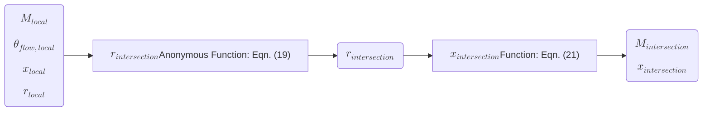
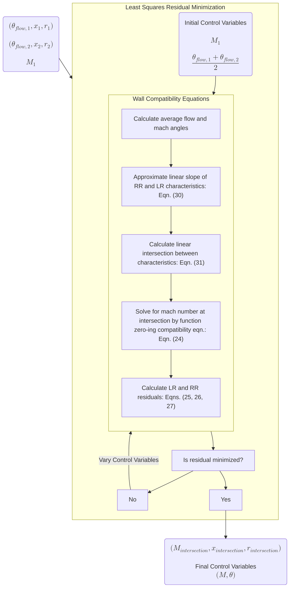
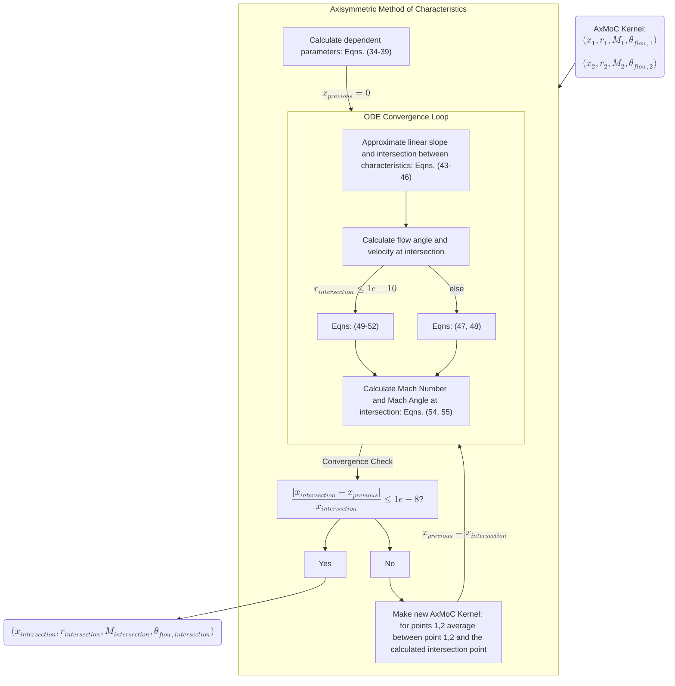
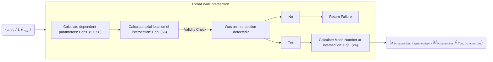
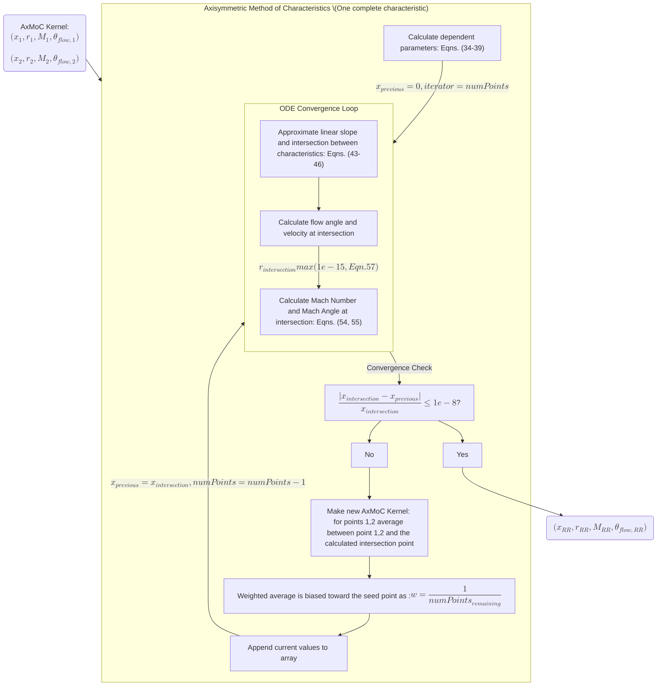
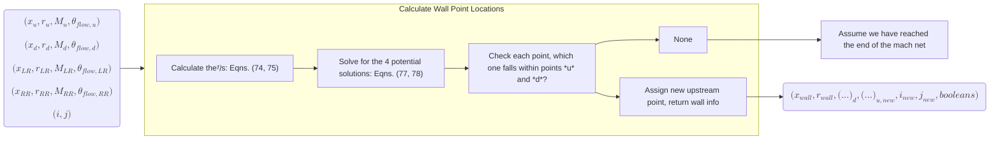
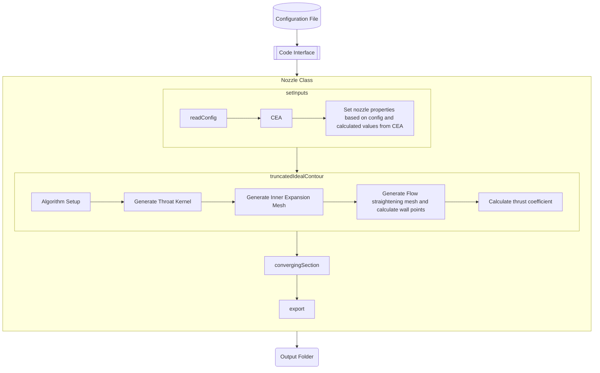

[Home](../../README.md) &gt; [Nozzle Contour](./NozzleContour.md)

# NOVA: Nozzle Contour Generation

This document describes the theory, code backend, process flow, and user interfacing of the propulsionDesign Nozzle module's contour generation via Axisymmetric Method of Characteristics.

- Nozzle
- Optimization for
- Variable
- Applications

## Nomenclature

- $A =$ area
- $b =$ linear intercept
- $C_+ =$ left running characteristic
- $C_- =$ right-running characteristic
- $c_{\tau} =$ thrust coefficient
- $L_{frac} =$ length fraction
- $LR =$ left-running
- $M =$ mach number
- $m =$ slope
- $P =$ static pressure
- $R =$ specific gas constant
- $r =$ radial position
- $RR =$ right-running
- $T =$ temperature
- $v =$ velocity
- $x =$ axial position

Greek:

- $\gamma =$ ratio of specific heats
- $\alpha =$ Sauer flow parameter
- $\epsilon =$ peak axial distance of mach 1 ahead of physical throat
- $\eta =$ trough axial distance of mach 1 behind of physical throat
- $\nu =$ prandtl meyer angle
- $\mu =$ mach angle
- $\theta =$ flow angle
- $\tau =$ thrust

Subscripts:

- $differential =$ between two values
- $local =$ at a point in the flow
- $stagnation =$ in the chamber
- $throat =$ at the nozzle throat (smallest cross sectional area)
- $curvature, inlet/outlet =$ in reference to the incoming or outgoing throat curvature
- $streamline =$ in reference to a flow streamline
- $sonicline =$ values on Sauer's solution
- $sonic =$ velocity when Mach = 1 for a given fluid
- $axial =$ in the direction of the nozzle axis
- $flow =$ with respect to the local flow direction
- $sauer =$ any property that is a derivative of Sauer's solution
- $intersection =$ in reference to a property calculated at a characteristic intersection
- $wall =$ in reference to the known throat wall locations
- $guess =$ approximate value that will be numerically converged
- $max, adiabatic =$ assuming no heat transfer to the surroundings
- $u, d =$ in reference to *upstream* and *downstream* mach net points
- $0 =$ initial/chamber properties
- $e =$ nozzle exit plane properties

Superscripts/Overheads:

- dot ($\dot{a}$) = per time
- bar ($\bar{a}$) = non-dimensional
- star (${a}^*$) = ratio

# Nozzle Contour Design

This section details the theory and implementation of the design of converging-diverging nozzle contours via Axisymmetric Method of Characteristics (AxMoC), and finishes with a worked nozzle design example.

Each section will contain information pertaining to the mathematical background as well as the process flow of the ideas presented, which will additionally be supplemented with imagery to hopefully make for a complete understanding of the underlying approach.

## Nozzle Design Background

From the absolutely massive F-1 engines that lifted the Saturn V, to the smallest Reaction Control thruster that orients a satellite in space, the physics of flow through supersonic nozzles and the fundamental design concepts that describe them are the same!

However, when it comes to the design of nozzles, there are a few different approaches. The design problem typically starts with some mission requirements that nail down important aspects of the design, such as propellant combination and thrust. With the defining parameters in place, the nozzle design may take either a very simple or dramatically complex approach:

The simple approach is to define the target outlet pressure that the exhaust flow will be expanding to, which is equivalent to specifying what altitude the nozzle is optimized for. Based on the propellants, we can use this information to define an exit mach number, and then specify the area ratio of the nozzle accordingly. This process assumes nothing of the geometry of this nozzle, just the geometric properties at the nozzle boundaries (namely the throat and exit areas and subsequent radii). This is nozzle design in its simplest form, just a list of critical requirement numbers.

However, we have to eventually make the thing so we need to define what shape is going to connect the throat and outlet of our nozzle. Depending on the use case, some designers may fall back on established principles and elect to make manufacturing easy by making the simplest possible nozzle design: a cone!

*[Figure: Cone Nozzle Reference Image]*
*Conical Nozzle Reference [7]*

For a cone of a 15 degree half angle between the specified throat and exit radii, the specific impulse ($I_{sp}$) efficiency (or how far off the measured $I_{sp}$ is from isentropically ideal $I_{sp}$) is near 98% [7]. For the uninitiated, $I_{sp}$ is vaguely comparable to a rocket engine's *fuel efficiency*, similar to miles per gallon (mpg) fuel efficiency for a car. The higher the number (for rockets $I_{sp}$ is generally somewhere around 300[s]), the more force you are able to generate per mass of propellant, and the term *isentropic* just means that the energy conversion to force was perfect. The unit of *seconds* can sometimes be confusing but it represents the duration of thrust production that is possible for a given amount of propellant to produce under its own weight. This 98% conversion rate is well good enough for designers that are only concerned with manufacturability and not inching out every fractional percentage point in performance, and is a common design choice for simple solid rockets and student projects.

However, conical nozzles are the longest a functional and efficient nozzle could be, because the distance traversed from the throat to the exit is linear. This becomes a problem as nozzles get very large or are intending to go to space and therefore need to maximize their weight efficiency. We could reach that target exit area much faster if we traversed the gap between throat and exit radii in a parabolic fashion instead, leading to the natural next step of bell nozzles!

*[Figure: Cone and Bell Nozzle Reference Image]*

But how much shorter than a cone do we want to be? We could make a nozzle that is half the length of a cone, but will the flow still expand as efficiently as just using a cone? (Spoiler alert, no it won't) It is possible to move the wall too far from the flow and end up with another problem: supersonic flow slamming into your wall and bouncing off! This is also known as a shock! So, we want to cut down on length but we don't want to introduce shocks and therefore efficiency losses, so how long do we make a parabolic nozzle? The convention generally is around 75% of the length of an equivalent 15 degree conical nozzle, and this achieves similar performance at a length reduction of ~25%, which saves substantially on overall weight.

This is all fine and good, but it feels very imprecise. We are doing rocket science, after all, isn't there a better way? There sure is! Up until now we have been talking primarily about the desires of designers and ease of manufacturing, but have we stopped to consider what the supersonic flow wants? When you take a physics-first approach to solving the problem things get much more complicated, but the juice is worth the squeeze so-to-speak. What if there was a way to follow the supersonic expanding flow as it did what it naturally wants to, and just trace a line through it for our nozzle wall? That is the philosophy behind nozzle design through a Method of Characteristics approach.

### What is the Method of Characteristics?

#### It's all characteristics? Always has been.

It may be surprising if you have never heard of the term before, but the Method of Characteristics (MoC) has nothing to do with nozzle design specifically. MoC is just a technique for solving partial differential equations that apply to hyperbolic fields and is applicable far outside of its use in nozzle design.

Conveniently for us, however, the supersonic flow field after the throat of a converging-diverging nozzle is described by hyperbolic field equations that we can solve using the MoC approach, allowing us to build a supersonic flowfield after the throat of a nozzle. If we assume that the flow is comprised of an ideal gas that is steady and maintains constant total enthalpy, then we can model the flow using:

- *2$^{nd}$ Law of Thermodynamics (assuming shock-free, inviscid, irrotational flow)*
- *Conservation of Mass*
- *Conservation of Momentum*

$$
\begin{align}
    \vec{\nabla} \times \vec{v} = 0 \\
    \nabla \cdot \big(\rho\vec{v}\big) = 0 \\
    \rho {D \vec{v} \over{D t}} + \vec{\nabla} P = 0
\end{align}
$$

It can be shown (not here, for the interested reader of the full derivation see **Ferri, A., “The Method of Characteristics,” General Theory of High Speed Aerodynamics, edited by W. Sears, The Macmillan Co., 1951**) that these governing equations can be simplified to form the *four* differential equations we need to solve the flowfield, two *characteristic* equations and two *compatibility* equations (or rather one equation for each of the right and left-running characteristics from any one point in the field):

$$
\begin{align}
    \bigg({dr\over{dx}}\bigg)_{characteristic} =& tan\big(\theta \mp \mu \big) \\
    0 =& {dv\over{v}} \mp tan(\mu)d\theta - {tan(\mu)sin(\mu)sin(\theta)\over{cos\big(\theta \pm \mu \big)}}{dx\over{r}}
\end{align}
$$

The *compatibility* equations that we are solving for our 2D Axisymmetric flow case are of the form:

$$
\begin{align}
    d(\theta \mp \nu) = {1 \over{\sqrt{M^2-1} \pm cot(\theta)}} {dr \over{r}}
\end{align}
$$

which can be shown to be writable in the form of equation (5) through some heavy manipulation that is present in the referenced paper for the interested reader. Both forms will be of use to us moving forward.

For me it helped to remember that the terms *right-running* and *left-running* are speaking with respect to the nozzle axis, so when looking along the axis the *left-running* characteristic goes to the left and is denoted as $C_+$ and the *right-running* characteristic goes to the right and is denoted as $C_-$.

*[Figure: MoC Reference Image]*

Partial differential equations can sometimes be challenging to solve, and there are simplifying assumptions and techniques that can be employed to solve these equations describing the flowfield. One simplification is to assume that the flow is perfectly planar (or 2D), and in such a case we can reduce the PDEs that describe the flowfield down to simple algebraic expressions that are outright solvable given initial conditions of the flow. This is the common approach explored in an undergrad fluids class, where the implementation is simple and effective at explaining the concept.

We, however, are not quite as lucky. The flowfield is *not* actually 2D, which would be more representative of flat nozzles that are used in supersonic wind tunnels. Our flow is more closely approximated by assuming that the flow is axisymmetric about the nozzle axis, which leads us naturally to bell nozzles. In our case, instead of simple algebra, we are tasked instead with solving the system of Ordinary Differential Equations (ODEs) given by the *characteristic* and *compatibility* equations (4, 5). More on the implementation of the governing equations later.

Once the flowfield is described, we can simply trace a streamline through the flow to draw our desired nozzle contour. Building the flowfield is a process that happens in stages that are defined by what properties of the flow we are able to assume at each stage. The MoC approach employed here is broken into 3 distinct sections: throat kernel, inner expansion mesh, and flow straightening section.

*[Figure: Characteristic Mesh Sections]*

The Mach net (or the collection of all mesh points at which we now know the mach number and flow angle) is generated in that order, and each step will be further detailed below. Sounds simple enough (maybe) but there are a few things that we need to pin down before we can actually generate a nozzle contour.

### Initial Conditions: Sauer's Transonic Solution

#### Sauer, what a guy.

In order to propagate flow information downstream of the throat and build out our flowfield, we need to prescribe some boundary conditions. One set of conditions that we can know with confidence are the flow properties at the throat of the nozzle, thanks to the work of Sauer [2]. Sauer and his extensive study of transonic flows at the throat of converging-diverging nozzles gives us a wealth of information that is critical to nozzle design. Using his technique, we are able to characterize the sonic line in the nozzle throat (where a much more appropriate approximation of the transition to Mach 1 occurs) and use the information there as an initial condition for our MoC solution.

*[Figure: Sauer Reference Image]*

Sauer's solution involves the use of two parameters, $\alpha$ and $\epsilon$ (and also $\eta = \epsilon$ for round nozzles), to determine the location of the sonic line at the nozzle throat:

$$
\begin{align}
    \alpha   =& \sqrt{{2\over{\big(\gamma + 1\big)r_{throat}r_{curvature.inlet}}}} \\
    \eta = \epsilon =& {r_t\over{8}} \sqrt{2(\gamma + 1){r_{throat}\over{r_{curvature,inlet}}}}
\end{align}
$$

where we can build a distribution of points describing the sonic line by:

$$
\begin{align}
    x_{sonicline}(r) =& -{\gamma + 1 \over{2}} \alpha r^2 + \epsilon \\
    0 &\leq{r} \leq{r_{throat}} \\
\end{align}
$$

and we can sample Mach numbers to calculate flow velocity at varying radii by solving:

$$
\begin{align}
    \textcolor{green}{M_{Sauer}} \sqrt{\gamma R T_{stagnation} \over{1 + {\gamma - 1 \over{2}}\textcolor{green}{M_{Sauer}}^2}} - v_{axial} = 0 \\
    v_{axial}(r) = v_{sonic} \bigg(1 + \big[\alpha \big(x_{sonicline}(r) - \epsilon\big) + {\gamma + 1 \over{4}}(\alpha r)^2\big]\bigg) \\
    v_{sonic} = \sqrt{\gamma R T_{sonic}} \\
    T_{sonic} = {T_{stagnation} \over{1 + {\gamma - 1 \over{2}}}}
\end{align}
$$

for $\textcolor{green}{M_{Sauer}}$ using some numerical zero-ing technique.

The parameter $\epsilon = \eta$ represents the physical distance before and after the throat where the location of Mach 1 actually occurs (see the above reference image), and what I am calling the "flow parameter" $\alpha$ is a constant of proportionality applied to the velocity potential equations when solving the initial flow field described in the $x$ and $y$ directions by:

$$
\begin{align}
    u(x,r) =& \alpha x + {\gamma+1\over{4}}\alpha^2 r + ... \\
    v(x,r) =& {\gamma+1\over{2}}\alpha^2 xr + {{\gamma+1}^2\over{16}}\alpha^3r^3 + ... \\
\end{align}
$$

An example of a function minimizer to calculate mach number could be implemented in code as follows:

```python
# Create an anonymous function where machNumber is the anonymous variable
machNumberFunction   = lambda machNumber: sqrt(chamberGamma * chamberRGasConstant * chamberStagnationTemperature / \
                                                (1 + ((chamberGamma - 1) / 2) * machNumber**2)) * machNumber - axialVelocity
# Take an initial guess at the solution
initialGuess         = axialVelocity / sonicVelocity
# Pass the anonymous function and initial guess off to a function zero-er to numerically solve for the value where the function is zero
machNumberOfInterest = fsolve(machNumberFunction, initialGuess)

```

### Initial Conditions: Diverging Section

#### Rao, what another guy.

Another influential individual in the nozzle design space is G.V.R. Rao [3,7], who determined empirical relationships for nozzle throat inlets and outlets through extensive study and experimentation. Today, the Rao throat inlet and outlet are considered synonymous with nozzle design and you will widely see the values for throat curvature cited essentially as fact. It is important to note that there are other ways to generate nozzle throat geometry (one of which involves a MoC approach that propagates backwards and defines the throat contour) but Rao nozzles have been shown to be incredibly efficient so for now that can serve as a boundary condition for our purposes.

The values for Rao's throat curvature are:

$$
\begin{align}
    r_{curvature,inlet} =& 1.5r_{throat} \\
    r_{curvature,outlet} =& 0.382r_{throat} \approx{0.4r_{throat}}
\end{align}
$$

These should look familiar from the reference image between conical and bell nozzles above.

For the diverging section of the nozzle we only need $r_{curvature,outlet}$, however both are useful to define for the generation of the converging section of the nozzle in the future.

By convention, the Rao throat diverging section extends out to a wall angle equal to 1/4 of the Prandtl-Meyer angle at the target exit Mach Number. The Prandtl-Meyer angle of a supersonic flow turning as it passes an expanding section is defined as:

$$
\begin{align}
    \nu = \sqrt{{\gamma + 1 \over{\gamma -1}}}\arctan{\bigg(\sqrt{{\gamma - 1 \over{\gamma + 1}}(M^2 - 1)}\bigg)} - \arctan\big({\sqrt{M^2 - 1}}\big)
\end{align}
$$

With the throat wall and Sauer solution boundary conditions defined, we can visualize the initial conditions of our non-dimensional design space using the relationships from equations (8, 17):

*[Figure: Boundary Conditions]*

### Kernel Generation: Creating the Mach Net

#### Propagate those characteristics, they do be intersectin'

At every point in the forthcoming Mach net we will be keeping track of the Mach Number and the Flow Angle at that location (as well as the (x, r) coordinates themselves). With our boundary conditions defined, we can calculate the first point of our Mach net by calculating where Sauer's solution intersects our throat wall. This is accomplished by solving:

$$
\begin{align}
    \tan{\bigg({\theta_{flow} + \mu_{Mach=1} + \mu_{Sauer}\over{2}}\bigg)}\bigg(\epsilon - x_{throat} - {\gamma + 1 \over{8}}\alpha \textcolor{green}{r_{intersection}}^2\bigg) + r_{throat} - \textcolor{green}{r_{intersection}} = 0 \\
    \mu_{Sauer} = \arcsin\bigg({1 \over{ M_{Sauer}}}\bigg)
\end{align}
$$

for $\textcolor{green}{r_{intersection}}$ again using some zero-ing method and, as a result:

$$
\begin{align}
    x_{intersection} =& \epsilon - {\gamma + 1 \over{8}} \alpha r_{intersection}^2 \\
    M_{intersection} =& M_{Sauer} \\
    \theta_{intersection} =& \theta_{wall}
\end{align}
$$

Here we already have a strategy from the previous section to calculate $M_{sauer}$ for equation (20).

The parameter $\mu$, the Mach angle, describes the conical angle of potential information propagation in a supersonic flow downstream of a supersonic object.

*[Figure: Mach Angle]*

We can calculate the characteristic intersection by:



*[Figure: Initial Conditions]*

The first step in generating the throat kernel is complete, but where do we go from here? One of our assumptions is that the flow angle at the throat wall is the same as the wall angle, and we know all of the wall angles by definition. To that end, we have $x, r, \theta_{flow}$ at all throat wall points and can project a characteristic point off of the wall given that we know the "upstream" and "current" points of the mesh from the wall. We can make an initial guess for the characteristic projection point by averaging the flow angles at nearby nodes and checking whether or not the guessed point satisfies the compatibility equations near the wall. This can be done numerically through a residual minimizer, where the flow angle and mach number at the intersection point are the control variables of the minimization:

$$
\begin{align}
    0 =&  {1 \over{\sqrt{M^2 - 1} \mp \cot{(\theta_{flow,intersection})}}} * \bigg({r_{intersection} - r_{1,2} \over{r_{intersection}}} - (\theta_{flow,intersection} \pm \nu_{intersection}) - (\theta_{1,2} \pm \nu_{1,2})\bigg) \\
    res_{C_-} =& {1 \over{\sqrt{M_{guess}^2 - 1} - \cot{(\theta_{flow,guess})}}} * \bigg({r_{intersection} - r_1 \over{r_{intersection}}} - (\theta_{flow,guess} + \nu_{guess}) - (\theta_1 + \nu_1)\bigg) \\
    res_{C_+} =& {1 \over{\sqrt{M_{guess}^2 - 1} + \cot{(\theta_{flow,guess})}}} * \bigg({r_{intersection} - r_2 \over{r_{intersection}}} - (\theta_{flow,guess} - \nu_{guess}) - (\theta_2 - \nu_{intersection})\bigg) \\
    res =& \sqrt{res_{C_-}^2 + res_{C_+}^2}
\end{align}
$$

where,

$$
\begin{align}
    x_{intersection} =& {b_{RR} - b_{LR} \over{m_{LR} - m_{RR}}} \\
    r_{intersection} =& {m_{LR}x_{intersection} + b_{LR} + m_{RR}x_{intersection} + b_{RR} \over{2}} \\
    m_{L,R} =& \tan{(\theta_{flow} + \mu_{guess})} , \tan{(\theta_{flow,average} - \mu_{average})} \\
    b_{L,R} =& r_{1,2} - m_{L,R}x_{1,2}
\end{align}
$$

The general form of equations should be recognizable from the compatibility equations presented in equation (6).

We can set up the residual minimizer to work like this:



Here at the first step of the kernel generation, we do not have any additional internal points to calculate that would necessitate the use of Axisymmetric Method of Characteristics (AxMoC), so just for this step we will skip over that and return to it in a moment when it is relevant.

We also need to calculate the location where the projected characteristic will intersect the limiting characteristic, given the last point in the characteristic mesh before reaching the limiting characteristic. That can be done by checking, via convergence, where the projecting characteristic satisfies Sauer's solution:

$$
\begin{align}
    -{\gamma + 1 \over{8}}\alpha r^2 + \epsilon - \bigg({r_{intersection} - \big[r_{throat} - x_{throat}\tan{(\mu_{Sauer})}\big]\over{\tan{(\mu_{Sauer})}}}\bigg) = 0 \\
    x_{intersection} = \epsilon - {\gamma + 1 \over{8}} \alpha r_{intersection}^2 \\
\end{align}
$$

As before we have a procedure for calculating where a characteristic intersects the limiting characteristic, which we can follow again to figure out where this intersection occurs.

We can visualize the first characteristic projection and first limiting characteristic intersection like this:

*[Figure: First Characteristic Projection and Limiting Characteristic Intersection]*

### Detailing the Axisymmetric Method of Characteristics Approach

With the first points of the mesh defined, we can perform our first actual step of Axisymmetric Method of Characteristics (AxMoC) toward the throat wall to find the next throat wall intersection point that will be the seed to the next step of AxMoC.

To do this, we must provide the algorithm with information about two "upstream" points in the flow and use the information at those points to propagate flow information "forward" in the mesh. The first time we do this can be a check to make sure everything is going smoothly, by choosing the throat intersection (white) and the <span style="color:green">limiting characteristic intersection</span> (green) as our first trial points and recalculating the <span style="color:red">wall characteristic projection point</span> (red) but this time with AxMoC. This is relevant because the compatibility equations from before are of the same form as the flowfield equations, just solved near the wall.

We will need the $x_i, r_i, M_i, \theta_{flow,i}$ (we can shorthandedly call this package of information about both seed points the AxMoC *kernel*) for each point we are choosing to provide the AxMoC algorithm. From there we can calculate some dependent parameters:

$$
\begin{align}
    \nu_i =& arcsin\bigg({1 \over{M_i}}\bigg) \\
    T_{local, i} =& T_{stagnation} \over{1 + {\gamma-1\over{2}}M_i^2} \\
    v_{local, i} =& M_i\sqrt{\gamma R T_{local,i}} \\
    \bar{v}_{local, i} =& cot(\nu_i)\over{v_{local,i}} \\
    LRT =& sin(\theta_{flow,1})sin(\nu_1)\over{sin(\theta_{flow,1}+\nu_1)} \\
    RRT =& sin(\theta_{flow,2})sin(\nu_2)\over{sin(\theta_{flow,2}-\nu_2)} \\
\end{align}
$$

Where $LRT$ and $RRT$ are shorthand expressions for the *left-hand term* and *right-hand term* for the respective characteristics (and it makes it easier to code to break the variables apart).

With the input points and dependent properties defined, we can now set up the solution process for the system of ODEs that will be solved to obtain our characteristic intersection point and its resultant properties $x_{intersection}, r_{intersection}, M_{intersection}, \theta_{flow,intersection}$. This process will require guessing and checking at the actual intersection point and properties, as the underlying expressions are not algebraic but differential equations, so each time these properties are calculated the variance in the calculated intersection point is checked until it falls within a specified tolerance. The *compatibility* ODEs that we are solving for our 2D Axisymmetric flow case are of the form:

$$
\begin{align}
    d(\theta \mp \nu) = {1 \over{\sqrt{M^2-1} \pm cot(\theta)}} {dr \over{r}}
\end{align}
$$

as before, which can be shown to be writable in the form of equations (5) from earlier (presented here again as a reminder of general form so the expressions below feel motivated by the underlying ODEs):

$$
\begin{align}
    0 =& {dv\over{v}} \mp tan(\mu)d\theta - {tan(\mu)sin(\mu)sin(\theta)\over{cos\big(\theta \pm \mu \big)}}{dx\over{r}}
\end{align}
$$

which is equivalent to:

$$
\begin{align}
    0 =& cot(\mu){dv\over{v}} \mp d\theta - {sin(\mu)sin(\theta)\over{cos\big(\theta \pm \mu \big)}}{dx\over{r}}
\end{align}
$$

when dividing out by $tan(\mu)$.

For a small enough distance between mach net points (or rather a sufficient enough resolution in the numerical space), we can assume that the traversal between points is approximately linear, despite the fact that the characteristics in reality are curved. We can discretize the compatibility equations for a first-order numerical scheme and calculate the approximate local characteristic slopes assuming a linear relationship between mesh points. This allows us to back out the intersection point downstream in the characteristic mesh:

$$
\begin{align}
    m_{LR} =& tan(\theta_{flow,1} + \mu_{1}) \\
    m_{RR} =& tan(\theta_{flow,2} - \mu_{2}) \\
    x_{intersection} =& {r_2 - r_1 - x_2m_{RR} + x_1m_{LR} \over{m_{LR} - m_{RR}}} \\
    r_{intersection} =& r_1 + (x_{intersection} - x_1) m_{LR}
\end{align}
$$

We can calculate the velocity and flow angle at the intersection point as:

$$
\begin{align}
    v_{intersection} =& {v_1\bar{v}_1 + v_2\bar{v}_2 + {LRT\over{r_1}}(r_{intersection} - r_1) + {RRT\over{r_2}}(r_{intersection} - r_2) + \theta_{flow,1} - \theta_{flow,2} \over{\bar{v}_1 + \bar{v}_2}} \\
    \theta_{flow,intersection} =& \theta_{flow,1} + \bar{v}_1 (v_{intersection} - v_1) - {LRT\over{r_1}}(r_{intersection} - r_1) + \theta_{flow,2} + \bar{v}_2 (v_{intersection} - v_2) + {RRT\over{r_2}}(r_{intersection} - r_2)
\end{align}
$$

The form of these equations comes from discretizing and then solving the compatibility equations for each respective variable.

This set of equations breaks down near the nozzle axis where $r$ is near 0, so instead when the intersection point is near the axis we must solve for the intersections in a different manner by solving the system all at once using its matrix representation:

$$
\begin{align}
    Ax = B
\end{align}
$$

$$
\begin{align}
    \epsilon =& {v_1\bar{v}_1 + v_2\bar{v}_2 + {RRT\over{r_2}}(r_{intersection} - r_2) + \theta_{flow,2} \over{\bar{v}_1 + \bar{v}_2}} \\
    A =&
    \begin{bmatrix}
        1 & -\bar{v}_1\over{2} & -\bar{v}_1v_1\over{2} \\
        -{1\over{\bar{v}_1} + \bar{v}_2} & 1 & \epsilon
    \end{bmatrix} \\
    B =& rref(A) = 
    \begin{bmatrix}
        1 & 0 & v_{intersection} \\
        0 & 1 & \theta_{flow,intersection}
    \end{bmatrix} \\
\end{align}
$$

Where the matrix $B$ is the *reduced row echelon form* of the matrix $A$, the last column of which contains the solutions for $v_{intersection}$ and $\theta_{flow,intersection}$.

Finally, the mach number and mach angle at the intersection point are calculated as:

$$
\begin{align}
    v_{ratio} =& {v_{intersection}\over{v_{max,adiabatic}}} \\
    M_{intersection} =& \sqrt{{2\over{\gamma-1}}\bigg({v_{ratio}\over{1 - v_{ratio}}}\bigg)^2} \\
    \mu =& arcsin\bigg({1\over{M_{intersection}}}\bigg)
\end{align}
$$

This is a good first approximation of the characteristic intersection point, however we can do much better by creating a second order solution by iterating upon the new intersection point and using it to average flow properties between the upstream points and the newly calculated intersection point and recalculating a new characteristic intersection. We can repeatedly check how much the newly calculated intersection point has changed since the last iteration and stop the convergence once the value of the intersection point change falls within a specified tolerance of 1e-8. This allows is to numerically converge to a downstream characteristic intersection with a high degree of confidence for any two starting points in the mesh.

The algorithm logic for AxMoC (for the calculation of a single mach net point due to the intersection between characteristics originating at points 1 and 2) looks like this:



In practice there is also an additional loop exit condition for max allowable iterations so that the program never gets stuck, just wanted to include that caveat here.

If we were successful in implementing the code logic, the intersection point between the kernel points for the first pass of AxMoC should directly overlap with the characteristic projection from the previous step, as that projected point came from solving the compatibility equations near the wall.

*[Figure: Axisymmetric Method of Characteristics Initial Corrector Step]*

Looks like we nailed it!

**For right now the fact that the method is *axisymmetric* doesn't seem to matter, but it will feel more relevant later during the generation of the mach net near the nozzle axis.**

The next phase of the process involves a similar procedure but for finding the location where a characteristic intersects the nozzle throat wall. We have a non-dimensional description of the location of the throat wall from assuming incoming and outgoing throat radius of curvature, so we can use that information in conjunction with linear approximations for the characteristic to determine locations of throat wall intersections. We can determine the axial location of the potential throat wall intersection by numerically solving:

$$
\begin{align}
    -\sqrt{(r_{curvature,outlet}r_{throat})^2 - \textcolor{green}{x_{intersection}}^2} + r_{throat} + r_{curvature,outlet}r_{throat} - m_{LR}\textcolor{green}{x_{intersection}} - r_{intersection} =& 0 \\
    r_{intersection} =& r - m_{LR}x \\
    m_{LR} =& tan(\theta + \mu)
\end{align}
$$



Now, we can propagate a characteristic out until we intersect the throat wall, at which point we can calculate a new characteristic projection and the cycle repeats.

*[Figure: Axisymmetric Method of Characteristics Next Step]*

This process can then be repeated back and forth between the limiting characteristic and the throat wall until we run out of throat wall points to intersect with. At that point, we have reached the end of the throat kernel.

*[Figure: Axisymmetric Method of Characteristics Next Step]*

*[Figure: Axisymmetric Method of Characteristics Next Step]*

*[Figure: Axisymmetric Method of Characteristics Next Step]*

*[Figure: Axisymmetric Method of Characteristics Next Step]*

*[Figure: Axisymmetric Method of Characteristics Next Step]*

Now that we have defined the throat kernel, we can move on to the rest of the mach net. We can start by projecting a right-running characteristic down to the nozzle axis to act as the boundary point to perform method of characteristics out until we run out of throat kernel reference points. To do this we can start in the throat kernel and perform the AxMoC algorithm process but for an entire characteristic, instead of the intersection between two characteristics. The code logic is very similar, however now we are repeating the process across $n$ points between the throat kernel and the nozzle axis. The process flow looks like:



This allows us to calculate any characteristic line (both *right-running* and *left-running*) originating from a mesh point, of which we want the right-running ($C_-$) characteristic originating in the throat kernel until it intersects the nozzle axis. This will now act in the same way that the Sauer Limiting Characteristic did as a boundary for generating characteristic intersections.

*[Figure: Initial Right Running Characteristic]*

*[Figure: Inner Expansion Mesh Step]*

*[Figure: Inner Expansion Mesh Step]*

*[Figure: Inner Expansion Mesh Step]*

Once we reach the nozzle axis, finally we are able to utilize the assumption that the flow is *axisymmetric* by copying a kernel point across the axis to create the seed points for AxMoC that we need.

*[Figure: Inner Expansion Mesh Step]*

From there we can repeat the AxMoC process until we converge the kernel down to the nozzle axis.

*[Figure: Inner Expansion Mesh Step]*

*[Figure: Inner Expansion Mesh Step]*

*[Figure: Inner Expansion Mesh Step]*

### Final Characteristic: The End of the Mach Net

Starting at the final point of the inner expansion mesh (the dark blue one in the above plot), we can define the final characteristic using the Prandtl-Meyer angle at the calculated exit mach number at the last characteristic mesh point. We can then project a long straight characteristic at that angle off of the final inner expansion mesh point knowing that the flow angle along this characteristic is essentially 0 at every point on the characteristic and the mach number is the calculated exit mach number from the final point of the inner expansion mesh. That straight characteristic ends at the calculated exit radius required for the calculated exit mach to exist at the nozzle wall.

*[Figure: Final Characteristic]*

Using these points as the new seed points for AxMoC, we can fill out the remainder of the mach net in the flow straightening section, stopping the propagation of points after roughly approximating the distance needed to fully encapsulate the flow field where a wall will be. Theoretically we can propagate this flow information far beyond where we want to bound the flow with a wall, but doing so would be computationally inefficient.

*[Figure: Axisymmetric Method of Characteristics From Last Characteristic]*

*[Figure: Axisymmetric Method of Characteristics Flow Straightening Mesh]*

We have now built a representation of a supersonic expanding flowfield where we know the mach number and flow angle at all points. We could conceivably continue the propagation of information further down the nozzle axis, but a restriction has been placed on the design space to terminate calculation if a non-dimensional radius of 1.5 is exceeded before reaching the end of the mach net. This ensures that the nozzle is not larger and heavier than the equivalent conical nozzle, and fits into the larger design problem of optimizing the system in terms of thrust coefficient (which we will discuss further later).

### Flow Straightening: Putting a Roof on Supersonic Flow

The last step is to trace a streamline through the flow, starting at the end of the throat wall until we reach the end of our mach net. This streamline will act as our nozzle wall. If we have done a good job, then this nozzle contour should be a representation of the supersonic expanding flow and not impede the flow in any way, which results in a shock-free, isentropic nozzle. The methodology here is a loose amalgomation of three concepts: approximating streamline curvature via bilinear interpolation of mach net points, streamline/characteristic intersections, and flow continuity via streamline tangency. Deep breath, we'll go through each thing slowly.

If we represent a streamline inside of a small region of the characteristic mesh as a quadratic curve (which is the simplest polynomial expression that can represent curvature) then we can say that a streamline can be represented as:

$$
\begin{align}
    r_{streamline}(x) = c_0 + c_1(x - x_{u}) + c_2(x - x_{u})^2
\end{align}
$$

where the centering term $(x - x_{u})$ locates the streamline in the flow relative to the mach net points of interest.

If we assume that the streamline originates from the upstream mach net point then:

$$
\begin{align}
    r(x_u) = r_u \\
    c_0 = r_u
\end{align}
$$

The next condition we can utilize is flow tangency along a streamline:

$$
\begin{align}
    \bigg({dr\over{dx}}\bigg)_u = tan(\theta_{flow,u}) \\
    c_1 = tan(\theta_{flow,u})
\end{align}
$$

Moreover, we can extract more information by determining flow properties at the intersection between a characteristic ($C_{+/-}$) and the streamline. For the breakdown below the derivation will be done with respect to the left-running characteristic, but the approach is analagous for the right-running characteristic.

$$
\begin{align}
    \bigg({dr\over{dx}}\bigg)_{intersection} = c_1 + 2c_2(x_{intersection} - x_u) = tan(\theta_{flow,intersection})
\end{align}
$$

From here on out, to make the nomenclature simpler, we will refer to $x_{intersection}$ as $x_{query,LR}$ because this is representative of a potential wall point on a flow streamline that is calculated with respect to the left-running characteristic. There are two solutions for $x_{query,LR}$ due to the quadratic nature of the streamline, and subsequently there are two more with respect to the right-running characteristic, but more on that later. We can approximate the flow angle and radial location at the $query,LR$ point by linearly interpolating between the downstream and left-running mach net points:

$$
\begin{align}
    \theta_{flow,query,LR} = \theta_{flow,d} + (\theta_{flow,LR} - \theta_{flow,d}){x_{query,LR} - x_d \over{x_{LR} - x_d}} \\
    r_{query,LR} = r_d + (r_{LR} - r_d){x_{query,LR} - x_d \over{x_{LR} - x_d}}
\end{align}
$$

Plugging in terms to the original quadratic expression and solving for $c_2$ leaves us with:

$$
\begin{align}
    c_2 = {\big(tan(\theta_{flow,LR}) - tan(\theta_{flow,d})\big)(x_{query,LR} - x_d)\over{2(x_{query,LR}-x_u)(x_{LR} - x_d)}} + {tan(\theta_{flow,d}) - tan(\theta_{flow,u})\over{2(x_{query,LR}-x_u)}}
\end{align}
$$

Now, we can set the expression for $r_{query,LR}$ equal to the original streamline equation and collect terms:

$$
\begin{align}
    r_{query,LR} = r_u + \tan(\theta_{flow,u})(x_{query,LR}-x_u) + c_2(x_{query,LR}-x_u)
\end{align}
$$

Substituting the expression for $c_2$:

$$
\begin{align}
    & r_{query,LR} = r_u + \tan(\theta_{flow,u})(x_{query,LR}-x_u) + \nonumber\\
    & \left[ \frac{\tan(\theta_{flow,LR}) - \tan(\theta_{flow,d})}{2(x_{LR} - x_d)} (x_{query,LR} - x_d) + \frac{\tan(\theta_{flow,d}) - \tan(\theta_{flow,u})}{2} \right] (x_{query,LR}-x_u)
\end{align}
$$

From the condition that the $r_{query,LR}$ can be approximated by linear interpolation:

$$
\begin{align}
    & r_u + \tan(\theta_{flow,u})(x_{query,LR}-x_u) + \nonumber\\
    &\left[ \frac{\tan(\theta_{flow,LR}) - \tan(\theta_{flow,d})}{2(x_{LR} -
     x_d)} (x_{query,LR} - x_d)(x_{query,LR}-x_u) + \frac{\tan(\theta_{flow,d}) - \tan(\theta_{flow,u})}{2}(x_{query,LR}-x_u)^2 \right] \nonumber\\
     &= r_d + \frac{r_{LR} - r_d}{x_{LR} - x_d} (x_{query,LR} - x_d)
\end{align}
$$

Multiply both sides by $(x_{LR} - x_d)$ to simplify fractions:

$$
\begin{align}
    & (x_{LR} - x_d) r_u + (x_{LR} - x_d) \tan(\theta_{flow,u})(x_{query,LR}-x_u) + \frac{\tan(\theta_{flow,LR}) - \tan(\theta_{flow,d})}{2}(x_{query,LR} - x_d)(x_{query,LR}-x_u) \nonumber\\
    &+ \frac{\tan(\theta_{flow,d}) - \tan(\theta_{flow,u})}{2}(x_{query,LR}-x_u)(x_{LR} - x_d) = (x_{LR} - x_d) r_d + (r_{LR} - r_d) (x_{query,LR} - x_d)
\end{align}
$$

Expanding $(x_{query,LR} - x_d)(x_{query,LR}-x_u)$:

$$
\begin{align}
    (x_{query,LR} - x_d)(x_{query,LR}-x_u) = x_{query,LR}^2 - x_{query,LR} x_u - x_{query,LR} x_d + x_u x_d
\end{align}
$$

After combining like terms, we arrive at a quadratic equation of the form:

$$
\begin{align}
x_{query,LR}^2 - \eta_{1,LR} x_{query,LR} + \eta_{2,LR} = 0
\end{align}
$$

Where:

$$
\begin{align}
    \eta_{1,LR} =& (x_u + x_d) + \frac{2(r_{LR} - r_d) - (x_{LR} - x_d)\big(\tan(\theta_{flow,u}) + \tan(\theta_{flow,d})\big)}{\tan(\theta_{flow,LR}) - \tan(\theta_{flow,d})} \\
    \eta_{2,LR} =& (x_u x_d) + \frac{2(x_{LR} - x_d)(r_u - r_d) + 2(r_{LR} - r_d)x_d - x_u(x_{LR} - x_d)\big(\tan(\theta_{flow,u}) + \tan(\theta_{flow,d})\big)}{\tan(\theta_{flow,LR}) - \tan(\theta_{flow,d})}
\end{align}
$$

We can now solve for the streamline as:

$$
\begin{align}
    r_{streamline}(x) =& x^2 - \eta_{1,LR}x + \eta_{2,LR} \\
\end{align}
$$

That was a lot, and ultimately it's just here for completeness because this derivation does not seem to exist in its entirety in any one reference and not ever once in the original code implementation, so I feel better now that it lives here.

In practice, to find valid streamline solutions we need the $(x, r, M, \theta)$ information about the mach net at 4 different points: upstream, downstream, and points from the left and right-running characteristics. There are two solutions found relative to the left-running characteristic, and two more for the right-running characteristic, only *one* of the total four is a valid streamline point that will fall axially between the upstream and downstream mach net points . We start by calculating them all and verifying which point falls within the bounding boxes between each seed point. To calculate each wall query point we can solve for the zeros of the quadratic expression:

$$
\begin{align}
    x_{query,LR/RR} =& {\eta_{1,LR/RR} \pm \sqrt{\eta_{1,LR/RR}^2 - 4\eta_{2,LR/RR}} \over{2}} \\
    r_{query,LR/RR} =& r_{d} + {(r_{LR/RR} - r_{d})(x_{query,LR/RR} - x_{d}) \over{x_{LR/RR} - x_{d}}}
\end{align}
$$

We can represent the process flow for the calculation of wall points as follows:



With the four wall query points calculated, we can check whether they fall within the bounding boxes:

*[Figure: Axisymmetric Method of Characteristics Wall Point Query]*

Here the only valid solution is the <span style="color:green">green</span> point, so we select it as a wall point and repeat the process using the wall point as the next "upstream" point.

*[Figure: Axisymmetric Method of Characteristics Wall Point Query]*

*[Figure: Final Wall Contour]*

Now that we have calculated the set of wall points, what remains is to cut the wall and to work out what the nozzle delivers. This is only the first nozzle the software generates, because a truncated ideal contour has two design numbers, an area ratio and a length, and one free parameter: the exit mach number the underlying ideal nozzle is designed to. A single guess at that parameter will not land on both design numbers at once.

The knob works like this. A larger design mach number opens the wall faster near the throat, because the inflection angle is a quarter of the prandtl-meyer angle at that mach number. A wall that opens faster reaches a given area ratio in less length and leaves the exit steeper. So the design mach number trades length against exit angle at a fixed area ratio, and that is what the outer solve is for.

The wall is cut where it reaches the requested area ratio, which is the truncation criterion NASA SP-8120 attributes to Ahlberg. The design mach number is then varied in a scalar solver until the length that falls out of that cut is the requested fraction of a 15 degree conical nozzle of the same area ratio. Both design numbers are satisfied by the same solve, and the exit pressure is whatever the resulting nozzle produces rather than something imposed on it.

That last point matters, and it is worth being plain about. The exit plane of a truncated contour is strongly non-uniform: the wall carries the highest static pressure and the lowest mach number on the plane, and on a representative case the wall pressure is more than twice the value on the axis. An exit pressure is therefore not one number, and the wall value in particular is the least representative station on the plane. A design that fixes an area ratio and a length has no free parameter left with which to also fix an exit pressure. [NozzleContourValidation.md](./NozzleContourValidation.md) measures all of this.

If a length fraction is not specified, the process repeats while also varying the length fraction of truncation, under a higher-level scalar optimizer whose objective is to maximize the delivered thrust coefficient.

The initial value that provides a representative starting guess for the design mach number is the 0-D approximation below, alongside the conventional length fraction:

$$
\begin{align}
    M_{ideal} =& \sqrt{{2\over{\gamma-1}}\bigg[\bigg({P_o\over{P_{e,target}}}\bigg)^{\gamma-1\over{\gamma}}-1\bigg]} \\
    L_{frac} \approx& 0.8
\end{align}
$$

Ordinarily the thrust coefficient can be approximated as:

$$
\begin{align}
    c_\tau = {\tau \over{A_tP_o}}
\end{align}
$$

where $\tau$ is the thrust, $A_t$ is the throat area of the nozzle, and $P_o$ is the chamber pressure. This method provides us with the theoretical ideal thrust coefficient for any nozzle configuration, which can be roughly thought of as how effectively a nozzle converts the chamber pressure into thrust.

We are able to be much more precise about the calculation of thrust coefficient because we have information about the flow angle at all positions along the nozzle exit plane thanks to our mach net. We can use that information to discern what percentage of the flow is pointed along the nozzle axis and therefore contributes to the usable thrust. The rest of the flow that is pointed off of the nozzle axis is wasted, and decreases the calculated thrust coefficient. The problem of nozzle design now centers around creating a nozzle that satisfies both a sufficient thrust coefficient (where most of the flow points along the nozzle axis) while being small and short enough to be length and weight efficient. All nozzles generated with this method will be shock-free in theory, so the game revolves largely around matching target exit mach number with an appropriate nozzle length.

We can calculate the actual thrust coefficient as:

$$
\begin{align}
    c_\tau =& c_{\tau,v} + c_{\tau,P} \\
    c_{\tau,v} =& \bigg[\sqrt{{2\gamma^2\over{\gamma-1}}{2\over{(\gamma+1)^{\gamma-1}(\gamma-1)}}\bigg(1 - \bigg({P_{e,node}\over{P_o}}\bigg)^{\gamma-1\over{\gamma}}\bigg)}\bigg]cos(\theta_{flow,node})A^*_{differential} \\
    c_{\tau,P} =& {(P_{e,node} - P_a)A_{differential}\over{P_oA_t}}
\end{align}
$$

Where $P_{e,node}$ is the average pressure between two exit plane nodes, $\theta_{flow,node}$ is the average flow angle between exit plane nodes, and $A^*_{differential} = {A_{differential}\over{A_e}}$ is the area ratio of the annular area between nodes and the nozzle exit area. We can see here that as the flow angle approaches zero, the calculation of thrust coefficient approaches the lightweight approximation of thrust coefficient assuming perfectly straight flow. The total thrust coefficient is the sum of all small annular contributions to thrust coefficient as we integrate along the nozzle exit plane:

$$
\begin{align}
    c_{\tau,total} =& \sum_i^n{\big(c_{\tau,v,i}} + c_{\tau,P,i}\big) \\
\end{align}
$$

*[Figure: Axisymmetric Method of Characteristics Initial Corrector Step]*

### Software Process Flow



### Worked Example: How to Design a Rocket Nozzle

With everything defined, we can walk through the process of what it looks like to actually generate a nozzle contour by using the ```propulsionDesign``` code repository! The fine details of the interface have been largely abstracted away, so this may seem more straightforward than it actually is under-the-hood, but we just went over the inner algorithmic mechanisms so *hopefully* it should feel less like magic.

Ina de beninging we can specify nozzle parameters in the nozzle configuration file inside of the assets directory of the repo. At the time of writing, the most up-to-date config file is $configFileNozzle.xlsx$. The only relevant parameters at the current moment are those relating to nozzle contour design, so ignore any other tabs about regeneratively cooled nozzle design for the time being. The first tab, ***Contour Definition***, is where we will define the properties of the nozzle contour:

*[Figure: Nozzle Contour Config Example]*

Here we have specified a nozzle configuration using HDPE as fuel, O2 as oxidizer, a chamber pressure of 15 [MPa], a total engine flowrate (fuel + oxidizer) of 50 [kg/s], and a target nozzle exit pressure of 70% of sea-level ambient (70927.5 [Pa]). These are the only required parameters, everything else is capable of being specified by the program to optimize the relevant parameter around the required parameters. For completeness, I have gone through and specified the other parameters as well to form a complete design problem.

In our working directory with the code repository folder saved locally, we can make a python file to act as the code interface to request a nozzle from the program. The effort of calling the nozzle class has been made as simple as possible, so a user simply needs to do this:

```python
# Import required libraries
import os
from propulsionDesign import *

# Clear the terminal when running
os.system('cls')

# Instantiate a Nozzle object from the Nozzle() class
testNozzle = Nozzle()
# Call the generateNozzle() wrapper method
testNozzle.generateNozzle()
```

The ```generateNozzle()``` method is a wrapper around the methods that read the config file, set properties, and generate nozzle geometry This wrapper also includes the generation of regenerative cooling geometry which is discussed further in this document. This is the only code interface required on the user's end. The code interface file can then be ran to produce the nozzle contour!

*[Figure: Nozzle Contour Outputs]*

*[Figure: Nozzle Contour Outputs]*

*[Figure: Nozzle Contour Outputs]*

# Related Documents

- [Nozzle Contour Methods](./NozzleContourMethods.md) -- the families of nozzle contour, what each optimizes, and where the truncated ideal contour implemented here sits among them.
- [Nozzle Contour Validation](./NozzleContourValidation.md) -- this implementation measured against published references, with the error on each quantity.
- [Nozzle Contour References](./references_nozzleContour_2026-09-06.md) -- annotated sources behind both.

# References

[1] Cronvich, L. L.: *A Numerical-Graphical Method of Characteristics for Axially Symmetric Isentropic Flow*. Journal of the Aeronautical Sciences, vol. 15, no. 3, March 1948, pp. 155-162.

[2] Sauer, R.: *General Characteristics of the Flow Through Nozzles at Near Critical Speeds*. NACA TM 1147, 1947.

[3] Young, D. G.: *Automated Nozzle Design through Axis-Symmetric Method of Characteristics Coupled with Chemical Kinetics*. Master's thesis, Auburn University, May 2012. Also AIAA 2012-4162, 48th Joint Propulsion Conference.

[4] Yu, Y.-N.: *A Summary of Design Techniques for Axisymmetric Hypersonic Wind Tunnels*. AGARDograph, North Atlantic Treaty Organization, November 1958.

[5] Sutton, G. P.; and Biblarz, O.: *Rocket Propulsion Elements*. 9th ed., Wiley, 2017, ch. 3 and 5.

[6] Anon.: *Liquid Rocket Engine Nozzles*. NASA Space Vehicle Design Criteria Monograph, NASA SP-8120, July 1976.

[7] Rao, G. V. R.: *Exhaust Nozzle Contour for Optimum Thrust*. Jet Propulsion, vol. 28, no. 6, June 1958, pp. 377-382.

[8] Ahlberg, J. H.; Hamilton, S.; Migdal, D.; and Nilson, E. N.: *Truncated Perfect Nozzles in Optimum Nozzle Design*. ARS Journal, vol. 31, no. 5, May 1961, pp. 614-620.

[9] Kliegel, J. R.; and Quan, V.: *Convergent-Divergent Nozzle Flows*. AIAA Journal, vol. 6, no. 9, September 1968, pp. 1728-1734.

# Author's Information

Sean Bowman - Last Updated [09/06/2026]
