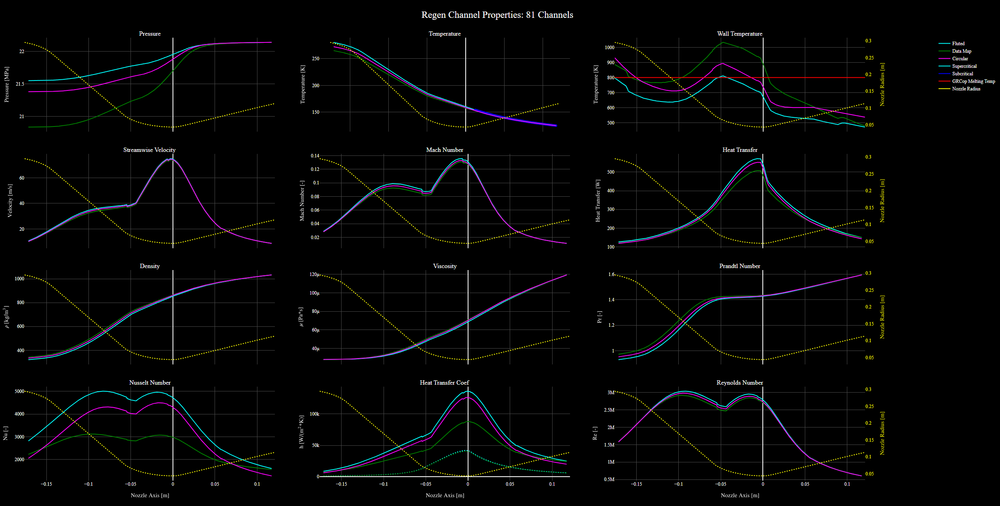

[Home](../../README.md) &gt; [Nozzle Cooling](./NozzleCooling.md)

# NOVA: Regeneratively Cooled Nozzle Design

This document describes the theory, code backend, process flow, and user interfacing of NOVA's regeneratively cooled chamber and nozzle design.

- Nozzle
- Optimization for
- Variable
- Applications

## Nomenclature

- $A =$ area

Greek:

- $\gamma =$ ratio of specific heats

Subscripts:

- $differential =$ between two values

Superscripts/Overheads:

- dot ($\dot{a}$) = per time
- bar ($\bar{a}$) = non-dimensional
- star (${a}^*$) = ratio

# Regenerative Cooling Architecture Design

This section details the theory and implementation for the design of regenerative cooling architecture, and finishes with a worked regeneratively cooled nozzle design example.

Each section will contain information pertaining to the mathematical background as well as the process flow of the ideas presented, which will additionally be supplemented with imagery to hopefully make for a complete understanding of the underlying approach.

## Regenerative Cooling Background

One of the fundamental challenges when working with rocket hardware is designing around the extreme physics conditions that rocket components are subjected to. Combustion chambers can reach temperatures comparable to the surface of the sun, while cryogenic propellants can be kept at temperatures near absolute zero (the coldest anything in the universe could possibly be!). During operation, rocket nozzles that are directing the super-hot exhaust flow need to maintain their shape to continue to operate as designed, but the temperature of most exhaust flows far exceeds the melting temperatures of possible materials that nozzles could be made of.

*[Figure: Different Engines Firing]*

*Orbital Class Engines Firing*

Faced with a physics-based challenge, there are two primary approaches to the problem of nozzles eroding during operation.

### Ablative Nozzles

#### Let it melt!

The first approach is commonly referred to as "ablative" nozzle design, where the nozzle material is allowed to ablate but the rate of ablation is known and the motor/engine operation can be tailored to that ablation rate. This approach is often seen for small duration burn motors (such as missiles or small student rockets) or solid propellant applications where there is not a readily available cooling fluid.

The challenge with ablation is that the size and shape of the nozzle contour changes over time, which changes the fundamental properties of the nozzle (most notably the size of the nozzle throat, which controls the total mass flow rate and subsequent thrust production). Many ablative nozzle designs are only ablative near the nozzle throat where the highest heat transfer occurs, while the rest of the nozzle contour is made of some well-characterized high-temperature material such as a phenolic resin.

*[Figure: TRL Nozzle]*

*TRL ablative nozzle pre- and post-fire*

*[Figure: Thrust vs Time]*

*Thrust output decrease over burn duration*

### Active Cooling

#### Fighting the Sun

Allowing performance to vary with time can often be impractical for orbital applications if it is avoidable, making ablative nozzles disadvantageous for space launch vehicles or reusable applications. The alternative approach to nozzle design involves maintaining the nozzle contour shape throughout the entire burn duration (and for any number of conceivable burns), which requires some form of active cooling of (or heat transfer reduction to) the nozzle hot wall. This allows nozzles to maintain their designed performance throughout an entire long-duration burn of multiple minutes or be reused indefinitely.

*[Figure: Same Nozzle]*

*Same nozzles, same performance, different stage of mission*

But how can we keep something so hot from melting? In liquid bi-propellant and hybrid rocket engines, there is often a supply of cryogenic liquid that is being stored as propellant to feed the engines that can be utilized as a cooling fluid during operation. This has many advantages beyond the obvious one of maintaining nozzle geometry. The reason propellants are stored in their cryogenic liquid form is for volumetric efficiency, because carrying the equivalent mass of gaseous propellant would require huge high-pressure tanks and be very impractical. In their liquid form, common propellants can be hundreds of times more dense than their gaseous counterparts and therefore be storable in a much smaller volume. However, the propellant must be turned into a gas as some point before the combustion process, because only gaseous materials are capable of combusting. We're in need of a heat exchanger to expand the liquid into a gas before it reaches the combustion chamber, and there just happens to be a very convenient heat exchanger at the end of the engine directing the exhaust flow (the nozzle!).

*[Figure: Heat exchanger diagram]*

*Generic heat exchanger*

In liquid bi-propellant systems the common approach is to utilize the liquid fuel, as it often has a much higher heat capacity than the oxidizer that is also stored on-board. Heat capacity can be thought of as the amount of energy it takes to raise the temperature of a given fluid, so a higher heat capacity means that it takes more energy to raise the temperature of the fluid, or conversely that a cooling fluid can accept much more energy without raising its temperature that much. This is an advantage for fuels as coolants, because there is often a lot of nozzle and chamber wall that needs to be cooled and a limited amount of cooling fluid to work with, making this the more efficient choice.

*[Figure: RS25 Hot Fire]*

*The Space Shuttle RS-25 Hydrolox engines are cooled with liquid Hydrogen fuel!*

However, in hybrid engines the fuel material is a solid, leaving only cryogenic oxidizer as the lone choice for designers of active cooling systems for hybrid engines. This is not great news, as common oxidizers have a substantially lower heat capacity than common fuels.

*[Figure: Cp Comparison]*

*Liquid Methane has about twice the heat capacity of liquid oxygen*

Don't panic, though, because there are still things that can be done to successfully cool a nozzle using the oxidizer instead! We will touch more on this later, but with modern design and manufacturing techniques we can get creative with cooling geometry in new and exciting ways to unlock previously unattainable design solutions.

In general, a system that utilizes the available propellant to cool the nozzle walls *and* heats that propellant with energy from the engine operation to drive the engine cycle is called *regeneratively cooled*.

### What is *Regenerative* Cooling?

The term *regenerative* refers to the fact that energy from the exhaust flow is recaptured and used to heat the same propellant that will eventually be used in combustion to perpetuate the engine cycle. The propellant acts as a nozzle coolant during operation by being passed between the walls of the nozzle, which allows for the double use of the propellant both in combustion and as a cooling fluid.

*[Figure: Regenerative Cooling]*

*Example of regen cooling*

There are other forms of active cooling, such as *film cooling*, where a thin sheet of unburnt gaseous propellant (again, typically the fuel) is passed along the nozzle hot wall to create a boundary between the exhaust and the nozzle wall, which is famously the cooling method used on the nozzle extension of the F-1 engines that lift the Saturn-V!

*[Figure: Film Cooling]*

*Film cooling exhaust of F-1*

The dark band before the bright orange of the plume is the unburnt gas film leaving the nozzle, which eventually reacts with the oxygen in the air and burns where the plume turns all orange!

A film on a hybrid nozzle means carrying a separate coolant for it, since a hybrid has no gaseous fuel on hand. NOVA models a film where one exists: `filmCooling.py` lowers the temperature the wall is driven by over the length the film survives, rather than removing heat the way a jacket does. Switch it on with `filmCooling` and give it a coolant, a flow, a temperature, a slot position and a slot height. Two closures are available through `filmCoolingModel`. The Hatch and Papell correlation from NASA TN D-130 is the default and the only one that states its own accuracy, but it was fitted in a constant-area duct and cannot see acceleration or flow turning. The entrainment model of NASA SP-8124 Appendix A accounts for both, through an empirical multiplier read off a design chart, so it is calibrated rather than validated. On a hydrogen film the two disagree by hundreds of kelvin, which is a fair measure of how well film cooling is known at rocket conditions.

The third method is to remove the coolant entirely and let the wall radiate. Past some area ratio the flux has fallen far enough that an uncooled shell settles below its own temperature limit, and carrying a jacket further costs mass and pressure drop for nothing. `radiativeCooling.py` solves that balance along the extension beyond the jacket and reports the margin against the material limit, which is the only question worth asking about an uncooled shell. Switch it on with `makeRadiativeExtension`, and note that it needs a non-`none` `regenTruncationType`, because with none the jacket runs the whole contour and there is no extension to solve.

Both combine with a jacket rather than replacing it, which is why they are described here alongside it rather than as alternatives to it.

## Expander Cycles and Supercritical Coolants

The regenerative jacket matters most in the expander cycle, where the heat the coolant picks up in the jacket is what drives the turbine.

*[Figure: Expander Cycle]*

*Liquid Bi-Prop Expander Cycle Example*

The expander cycle operates on the premise that a single fluid (typically the fuel) can be *expanded* from its compressed liquid form to a more useable high-energy form (gas/supercritical fluid) to then drive a turbine which perpetuates the engine cycle. A hybrid runs the same cycle on its oxidizer, since its solid fuel cannot flow through a jacket.

*[Figure: Hybrid Expander Cycle]*

*Hybrid Expander Cycle*

Oxygen as the working fluid is not unheard of, but the heat capacity discussed above makes it a secondary choice wherever a liquid fuel is on hand; with a solid-fuel hybrid there is no alternative, and one must make do with what is available. What every expander shares is a high system pressure. Orbital-class engines run their chambers at around 15 MPa (~2000 psi), well above the critical pressures of oxygen (5.04 MPa), methane (4.60 MPa) and hydrogen (1.30 MPa), and fluids past their *critical* state behave differently than fluids at more familiar temperatures and pressures. The configuration in `assets/NOVANozzle.json`, for one, cools with hydrogen entering the jacket at 12 MPa and 30 K, supercritical from the start. The following sections briefly go over the physics of supercritical fluids and how that distinction impacts the design of a rocket fluid system.

### Aside: Supercritical Fluids

To be *painfully* clear about the distinction being made here, let's start with the simplest example. At standard temperatures and pressures, referring to a substance as a "fluid" encapsulates the concepts of both "liquids" and "gasses", which share the property that the individual particles that comprise them are able to flow and take the shape of their containers. Liquids are held together by stronger intermolecular forces which causes local fluid density to be high, whereas gasses consist of individual particles whose motion and internal energy state exceed any intermolecular forces, allowing particles to move about independently of one another leading to low local fluid density. At the boundary between these two states of matter there exists a clear delineation in fluid properties and crossing over this boundary causes the state of the fluid to vary dramatically. This is more colloquially known as "vaporization", or more distinctly "evaporation" when the process happens at the liquid surface boundary and "boiling" when the process takes place within the bulk liquid. Something very interesting happens, however, when you increase the pressure past a certain threshold known as the "critical pressure".

*[Figure: Oxygen Phase Diagram]*

*Oxygen Phase Diagram*

In the above phase diagram for Oxygen, the "critical point" denoted by the red star represents the physical state of the fluid where the distinction between liquid and gas loses practical meaning. This means that properties of the fluid will no longer change rapidly with increases of temperature or pressure, and instead changes in properties will be gradual and the magnitudes of the properties will be some average of the liquid and gas states. We can visualize this by plotting thermophysical properties (like density and viscosity) instead of fluid phase, to get an idea for how the properties vary with changes in temperature and pressure.

*[Figure: Oxygen Properties]*

*Oxygen Properties*

On the left we can see how Oxygen's density varies over the same temperature and pressure ranges from the phase diagram above. There is a steep drop off in density where the phase change from liquid to gas occurs, causing the density to drop from the high liquid value (~1000 [kg/m^3]) to the low gaseous value (~10 [kg/m^3]). However, at higher pressures, the drop off becomes more gradual until eventually there is no drop at all. Instead, the density varies smoothly as the temperature increases (I like to call this region the "density slide").

What this means for rocket engines is that propellant that begins the engine cycle journey as a liquid in the propellant tank does not phase change in the traditional sense at any point in the engine. Instead, we can avoid the rapid property changes and take advantage of the physics of supercritical fluids by operating at a higher system pressure, and we can create more accurate representative physics models by capturing these unique behaviors of supercritical fluids.

*[Figure: Oxygen Properties 2]*

*Oxygen Properties in Engine*

## Great, Now Let's Make a Regeneratively Cooled Nozzle

To tie this all together, let's apply this knowledge to the design of a regeneratively cooled nozzle from first principles. So far we have not been speaking about legacy design practices, but rather the fundamental physics of the problem, which is a core tenant of the design philosophy used in this codebase. When you take a first-principles approach, there is often something natural hiding in the physics of the problem that can be taken advantage of. If you are thoughtful enough, you may find it easier to swim with the river rather than against it.

With that in mind we have a physics problem, so let's lay that out and begin to chip away at it.

### What are the problems, and what does physics want?

Let's list out some of the fundamental physics challenges that we are facing that are relevant to the design of regenerative cooling architecture:

- Limited coolant capacity (oxygen in a hybrid worst of all)
- Extreme temperature gradient from exhaust to wall and coolant
- Extreme pressure gradient from internal to external volumes
- Achieving adequate propellant conditioning to drive engine cycle
- Minimization of pressure losses in system
- Limited propellant mass flow per time to use as coolant
- Optimum material selection and manufacturability

Some of these things are not changeable and we must simply work around them, such as the amount of mass flow and type of coolant that is on-hand. They are critical to identify, though, because they inform us going forward. Others have more design freedom, and I will try to motivate each thought process and decision made moving forward as we discuss potential solutions to these issues. Broadly speaking, we will focus on the underlying physics to motivate the solutions rather than any existing design practices, however when the comparison to a historical context reveals something interesting I will relate the old way to a new way of thinking. That being said, technological improvements in recent years have unlocked new avenues for designing and manufacturing components that can and will change the way we think about the solutions to these issues.

Unencumbered by legacy design choices, how might we attack these issues from the ground-up? First, let's take inventory of the tools available to us.

### What options do we have to solve the problems?

We can leverage two critical concepts to get creative with the problem solving process:

1. Additive Manufacturing
2. Algorithmic Modeling

The first concept, "*additive manufacturing*", is a manufacturing type that materializes components from the addition of material (otherwise known as *3D printing*), which allows for the design of components with complex internal geometries that would be challenging/impossible to subtractively machine. The second concept, "*algorithmic modeling*" is a design approach relying on the creation of a *base set of rules* that designs are forced to follow, and allowing resultant components to emerge naturally from specifying design parameters and allowing some algorithm to determine the resulting geometry. This approach results in something interesting that I have been referencing: here the physics of the problem create the geometry rather than a designers whims. So long as the physics is modeled accurately, such designs will need very little verification of their performance between the models and real life, because their very shape was born of the desires of physics itself.

Such an algorithmic design approach could conceivably be built to accommodate additive manufacturing constraints, which further tightens the rules that the geometry-making algorithm(s) live within. This approach has the added benefit, though, of being able to churn out thousands of parametrized designs to find optimal performance in a challenging design space.

The algorithm(s) need to know about the physics of the problem in its most accurate representation possible to then use that information to create the best performing design, regardless of what those physics conditions are. This is a powerful toolset, because you are not designing just one specific nozzle, but every conceivable nozzle that can have its physics modeled accurately at varying conditions and scales. This is incredibly helpful and time efficient when the system being designed is largely novel and tweaks to the system are common and numerous. Building tools that build tools has an up front cost, but the juice is worth the squeeze when many of the questions about a design are unanswered.

### Where do we start?

With our tools in hand, we can tackle some of the easier problems first. Some things only have a few solutions, after all, and some things are beyond our control entirely (like system requirements, the divine word). For example, the coolant fluid mass flow is simply something we must live with, as it is a fundamental parameter of the overall engine and we cannot change that without changing the engine concept entirely. We must be aware of the value, however, because it will be important information to later feed to an algorithmic design tool to provide insight into the physics of our problem, but more on that later.

What about the material selection, or how to work around the extreme physics conditions? Let's think about what would be ideal and go from there:

#### Problem Solving: Material Selection

We need to keep the nozzle cool and transfer as much heat as possible into the coolant to drive the engine cycle, so we want something with a high thermal conductivity that can effectively transfer heat, but also something that is strong enough to withstand high internal pressures and other erroneous forces. If we wanted to just resist the heat we could use something with a very low thermal conductivity (like a phenolic resin or ceramic), but in this case we are prioritizing heat transfer to condition propellant, not just keeping the nozzle alive.

Copper is a common material that has a high thermal conductivity, but there's a problem. Copper, as far as metal is concerned, might as well be butter. That just won't do if we expect to hold an extreme pressure inside of the fluid system and survive potential loads from shocks or vibrations. Well, we could use some sort of copper alloy that is much stronger, but we will have to pay a price in the heat transfer because we will have to remove some copper and replaced it with things that are much stronger but have a much lower thermal conductivity. A recent-ish development in copper alloys comes from NASA's Glenn Research Center, named GR-Cop42, which swaps the pure copper out for a ratio of [94% Copper, 4% Chromium, 2% Niobium]. With these ratios the yield and ultimate strength of the material effectively doubles, however you pay a small fee of ~15-20% in reduced thermal conductivity. [6] This trade is very much worth it, making GR-Cop42 a great choice for the cooled portion of the nozzle.

To keep the discussion brief, we have entirely neglected other printable metals that simply don't even make it out of the gate from a heat transfer perspective. However, it is the onus of the designer to properly trade study the material of any given design.

#### Problem Solving: Extreme Physics Conditions with a Limited Coolant

The hardest version of this problem is a hybrid, where oxygen is the only fluid on board that can cool the nozzle, and oxygen has been used as a coolant in lab settings rather than in flight systems. Small engines have it hard too, which at first might sound backwards, but there is a sneaky problem that must be contended with:

In a regeneratively cooled nozzle, the volume of a cooling jacket increases cubically (to the 3rd power) while the nozzle surface area that needs to be cooled increases quadratically (to the second power). This means that as nozzles grow, the conventional wisdom is that the volume of propellant cooling the wall grows faster than the wall that needs to be cooled, so the ability to condition (heat) a propellant to drive an engine cycle gets harder the larger a nozzle becomes (Fans of pop-science may be familiar with the square-cube law problem). This problem happens in reverse for small nozzles, where lower coolant flowrates (due to smaller engines) are responsible for cooling more wall, which is further complicated by using Oxygen as a coolant.

In the days of old there were two common approaches to manufacturing the cooling architecture that were inevitable based on manufacturing constraints: brazed tubes and milled rectilinear channels. In the former case, long circular tubes were bent into the shape of a nozzle contour and welded together, and in the latter case rectangular slots were milled along the outside of a nozzle block and later capped with some sleeve to hold the fluid in.

*[Figure: Brazed Tube Cooling Channels]*

*Saturn V Injector and Nozzle Throat with Brazed Tube Cooling Channels*

*[Figure: Milled Regen Channels]*

*Rectilinear Cooling Channels Milled into Copper Nozzle*

The geometry of cooling architectures were largely fixed at that point, which was fine for those cases because the fuel material was sufficient to cool the walls and drive the engine cycle.

With a generous coolant and a large engine we may have been able to just place some straight tubes from one end of the nozzle to the other and call it done, but a small engine, or one cooled by oxygen, would be left with one melty nozzle. We need a way to both increase the amount of heat transfer into the coolant, and increase the amount of time it is able to perform heat transfer.

There are competing problems at play that we must contend with: heat transfer and pressure drop. The longer and smaller we make the channels the greater the heat transfer, but the larger the pressure drop. This is because fluid moving faster through a smaller channel has a larger heat transfer coefficient, but also experiences more viscous pressure losses. That pressure is needed downstream to spin a turbine and maintain chamber pressure, so we can't be selfish and eat it all while cooling the nozzle down. We need a way to determine, ideally quickly and at a glance, how small variations in cooling geometry impact the heat transfer and pressure drop performance.

### Problem Solving: Listening to Physics

Every lever we have on the coolant side comes down to two things: how fast the coolant moves past the wall, which is set by the channel's flow area, and how much surface it moves past, which is set by the channel's shape. Faster coolant draws more heat and costs pressure. More surface draws more heat too, and it is the cheaper of the two in pressure.

The brazed tube and the milled slot were both manufacturing answers; the milled slot turned out to be the better physics. A rectangular channel shares each side wall with its neighbor, and that wall, the *rib*, is a fin: heat conducts up it from the hot wall and into the coolant on both faces. Make the channels tall, narrow and many, and the ribs reach deep into the coolant, adding surface at about the same flow area. Carlile and Quentmeyer measured this at NASA Lewis in 1992 [10]: three copper chambers differing only in channel shape, where at the same coolant pressure drop the chamber with an aspect ratio of 5 ran its hot wall at 539 K against the 765 K of the baseline's 0.75, 30 percent cooler, and showed no fatigue damage after 440 thermal cycles.

Printing adds one more freedom: a channel does not have to run straight. Printed copper chambers wind many square-ish passages around the wall as a helix, so a coolant particle can make several laps of the chamber before it leaves. Held at a constant angle to the wall's meridian, the passages all fit side by side, and the rib between them grows wherever the wall's radius does.

NOVA builds three channel families from these ideas, one per run, set by `channelType`:

| `channelType` | Section | Held | Sized | Falls out |
|---|---|---|---|---|
| `circle` | Circle | Rib | Radius | Wrap angle |
| `rectangular` | Rounded rectangle, depth along the wall normal | Rib, and the channel runs straight | Depth | Width and aspect ratio |
| `helical` | Rounded rectangle on a helix of $N$ starts | Helix angle and aspect ratio | Width | Rib |

Spirally *fluted* channels are kept in `experimental/flutedChannels.py`: a circle with helical grooves, like the rifling in a gun barrel or the ridges of a churro, rolled so the coolant spins and the thermal boundary layer never settles. Their appeal is to a coolant short on capacity, oxygen in a hybrid above all. The geometry builds, but no source supports the heat transfer correlation they were rated with, so they are not one of the families NOVA offers.

## The Algorithm

Think long and hard about how you would make these cooling channels in a CAD package. Now throw those thoughts away, because the physics is going to draw them for us. NOVA solves the channel station by station against the wall temperature it is allowed, and the geometry is whatever falls out of that solve.

### Where does the jacket run?

The jacket covers the whole regen section: from the injector face, over the chamber barrel and through the throat, to wherever the regen section is truncated. The coolant enters through the *inlet volute* at the aft end and runs forward against the exhaust, so it meets the lowest heat flux first and arrives at the throat already warmed, and leaves through the *return volute* at the injector face.

At each end the channel has to turn off the wall and out to its volute. A plane is drawn normal to the axis, `inletVoluteAxialOffset` upstream of the aft end (or `returnVoluteAxialOffset` downstream of the injector face), and a fillet is placed tangent to both the wall and that plane. The channel follows the wall into the fillet, turns through it, and leaves along a straight flare of `inletVoluteFlareLength`, tilted `inletVoluteTilt` from the radial, where the volute attaches. The fillet's radius is `inletVoluteFlareRoverD` times the jacket's full radial depth at that station: hot wall, the largest channel that fits there, and shell. The return end is the same construction reflected through a plane normal to the axis, ``upstreamVoluteInterfaceCurve()``, so for the same settings the two ends are exact mirror images.

### Sizing the channel

The quantity solved for is the section's *radial half-extent*, `channelRadius`: a circle's radius, or half a rectangle's depth. Measuring every family by how far it reaches from its centerline toward the wall and away from it means the centerline offset, the shell and the volute placement are the same for all three.

At a fixed coolant flow, a smaller channel carries the coolant faster, which cools the wall harder and costs pressure; a larger one costs less pressure and runs the wall hotter. So at each station the answer we want is *the largest channel that holds the hot wall at* `maxWallTemperature`, which is also the channel with the least pressure drop. The sizing march in ``solveChannelRadii()`` starts at the coolant inlet, proposes a size, rebuilds the section, runs the thermal model at that station, reads the wall temperature back, and adjusts with an adaptive secant search until the two agree to one part in ten thousand. The search relies on the wall temperature rising monotonically with channel size, which the tests hold a rectangle's depth to.

Each family caps the size differently:

- **Circle:** the largest circle that packs between its neighbors with the rib left over, tangent to the wall offset by the hot wall:

$$
r = {R \sin(\pi/N) \over 1 - \sin(\pi/N)} - {t_{infill} \over 2}, \qquad R = r_{wall} + t_{wall} - t_{infill}
$$

- **Rectangular:** the depth may reach `maxChannelAspectRatio` times the width, and `maxChannelDepth` where one is given.
- **Helical:** the width may reach the pass spacing less the minimum rib, and the depth follows it through `channelAspectRatio`, again within `maxChannelDepth`.

Below, every family is held to the smallest the process can build: `minChannelRadius` for a circle or a rectangle's half-depth, `minChannelWidth` for a helix. Before the march starts, the throat is checked: if the channel that fits there is smaller than the minimum, `nChannel` is reduced until it is not.

### Wrapping the channel

A circle does not fill its share of the circumference, so it is wrapped around the wall: Kineo's Algorithm (named for Kineo, who wrote it and is the only person who really knows how it works) turns each station through the angle that makes the channel's projection fill its pitch, so there are no gaps between channels.

A rectangle fills its pitch by construction, so it runs straight.

A helix runs at a constant angle $\phi$ to the meridian of the cold wall, which makes it a *loxodrome*, the path a ship holding one compass heading traces on a globe:

$$
{d\theta \over ds_m} = {\tan\phi \over r_{cw}}
$$

where $\theta$ is the wrap angle, $s_m$ the arc length along the cold wall's meridian, and $r_{cw}$ the cold wall's radius. On a cylinder it winds at a constant rate; on a cone it winds as the logarithm of the radius, tighter where the wall is narrow. The helix holds its azimuth through the volute interfaces, so it winds only where it lies on the jacketed wall.

With the wrap angles in hand, the 2D centerline is rolled about the nozzle axis into three dimensions.

### The cross sections

A circle is drawn in the plane normal to the centerline, on a parallel transport frame: a frame that follows the curve without twisting about it. A circle is the same shape at any roll, so that is all it needs.

A rectangle is not, and its depth has to point along the wall normal at every station. It is drawn on frames built from the wall normal instead, ``wallNormalFrames()``: the normal of the wall's meridian, rotated to the station's azimuth, with the binormal completing the set. A parallel transport frame would drift off the wall normal wherever the centerline wraps, which is everywhere on a helix.

The rectangle's corners may be rounded at `channelCornerRadius`, and its flow area and wetted perimeter are

$$
A = w d - (4 - \pi) r_c^2, \qquad P = 2(w + d) - (8 - 2\pi) r_c
$$

with $w$ the width across the wall, $d$ the depth outward from it, and $r_c$ the corner radius, clamped to half the smaller side. Each family sets $w$ and $d$ its own way:

- **Rectangular:** the width fills the pitch at the cold wall less the rib, $w = 2\pi r_{cw} / N - t_{infill}$, so the rib at its root is exactly `infillThickness`, and the depth $d = 2 \cdot$ `channelRadius` is sized.
- **Helical:** the passes sit $s = 2\pi r_{cw} \cos\phi / N$ apart measured across the channel. The width is sized, the depth is `channelAspectRatio` times it, and the rib is what the spacing leaves, $t_{rib} = s - w$, never less than `infillThickness`.

### The jacket

With one channel defined, the jacket is that channel patterned about the nozzle axis `nChannel` times. EZPZ lemon squeezy.

*A completed regen jacket*

### Modeling the performance

To keep design iteration quick, the heat transfer is estimated by a one-dimensional thermal resistance model along the wall. Heat flow plays the part of current and temperature the part of voltage, so at each station

$$
\dot{Q} = {T_{aw} - T_{coolant} \over R_{gas} + R_{wall} + R_{coolant}}
$$

with $\dot{Q}$ the heat through one channel's share of the wall.

**The gas side** is the Bartz correlation [8], with the boundary layer correction $\sigma$ carrying the whole dependence on the wall temperature:

$$
h_{g} = \left({0.026 \over D_{t}^{0.2}}\right)\left({\mu^{0.2}c_P \over Pr^{0.6}}\right)\left({P_{c} \over c^*}\right)^{0.8}\left({D_{t} \over R_c}\right)^{0.1}\left({A_{t} \over A}\right)^{0.9}\sigma
$$

$$
\sigma = {1 \over \left({1 \over 2}{T_{wall} \over T_{c}}\left(1 + {\gamma - 1 \over 2}M^2\right) + {1 \over 2}\right)^{0.68}\left(1 + {\gamma - 1 \over 2}M^2\right)^{0.12}}
$$

with $R_c$ the throat's radius of curvature, the stagnation Prandtl number $4\gamma / (9\gamma - 5)$ and the stagnation viscosity $1.184 \times 10^{-7} MW^{0.5} T_0^{0.6}$. Because $\sigma$ depends on the unknown wall temperature, each station is converged. The gas-side area is each channel's share of the wall, $A_{hw} = (2\pi r / N) \, ds_m$ over the wall's own meridional length, so the channels tile the wall exactly at any wrap angle.

**The wall** conducts through the sector of the cylindrical shell each channel owns:

$$
R_{wall} = {r \ln(1 + t/r) \over k A_{hw}}
$$

which tends to the slab $t / (k A_{hw})$ for a wall thin against its radius.

**The coolant side** uses Gnielinski's Nusselt number [9] on the hydraulic diameter $d_H = 4A/P$ (a circle's $2r$), with the Swamee-Jain friction factor [11]:

$$
Nu = {(f/8)(Re - 1000)Pr \over 1 + 12.7(f/8)^{1/2}(Pr^{2/3} - 1)}, \qquad f = {0.25 \over \log_{10}^2\left({e \over 3.7 d_H} + {5.74 \over Re^{0.9}}\right)}
$$

and $h_c = k_{fluid} Nu / d_H$, with the coolant properties at the local state from REFPROP or CoolProp. A circle takes its heat through the half of its perimeter facing the wall. A rectangle or a helix takes it through its floor and through its two side walls as the faces of the ribs, each a straight fin of height $H$ and thickness $t_{rib}$ cooled on both faces with an adiabatic tip:

$$
A_{coolant} = \left(w_{floor} + 2\eta H\right) ds, \qquad \eta = {\tanh(mH) \over mH}, \qquad m = \sqrt{2 h_c \over k \, t_{rib}}
$$

The coolant then carries the heat it picked up to the next station, added to its enthalpy rather than taken as a rise at the station's own $c_p$, which conserves the heat the wall gave up even where $c_p$ swings across the station. It loses pressure to friction and to the bends in its path.

The heat transfer model outputs plots of the coolant properties, both heat transfer coefficients and the hot wall temperature along the nozzle axis. These are a first pass: a design worth building should still go through three-dimensional conduction and CFD.

*Sample heat transfer model outputs*

### How far can we trust it?

The gas side is checked against a worked example of the correlation as NASA SP-125 gives it, but not against a measurement.

The coolant side was put against Carlile and Quentmeyer's three chambers [10], at one station with the gas side fixed from their stated operating point. Every one of their 13 measured throat wall temperatures lies inside the band NOVA predicts once the coolant state and the channel roughness, neither of which the paper reports, are bracketed. The bands are wider than the tolerances set before the comparison, so it is a comparison, not a validation.

The comparison also exposed a limit of the coolant correlation. It uses the rough-wall friction factor inside Gnielinski's smooth-tube form, so it credits roughness with heat transfer in proportion to the friction it adds, and measured rough tubes do not deliver that [12]. At the 35 um roughness NOVA assumes for a printed channel, the model puts Carlile and Quentmeyer's baseline wall-to-coolant temperature difference 39 percent below what they measured. Read NOVA's wall temperatures as optimistic until a rough-wall correction and printed-channel data close that gap; the full account is in [carlileQuentmeyer_2026-09-22.md](./reports/carlileQuentmeyer_2026-09-22.md).

Three more things the model does not see, and it is the onus of the designer to allow for them:

- Over the chamber barrel, Bartz is used outside the throat region it is referenced to. On a straight barrel its coefficient varies only through the wall temperature, with no injector near field and no boundary layer start, and the barrel's gas state takes the chamber pressure as stagnation with no Rayleigh loss.
- The coolant is taken as fully mixed across a tall channel, where in reality it stratifies from floor to roof.
- A helical passage curves around the chamber with the hot wall on the inside of the bend, where secondary flow is expected to reduce the heat transfer, so the model is optimistic for a helix, more so the steeper its angle.

# References

[6] Webb, Kim - Principles of Enhanced Heat Transfer

[8] Bartz - A Simple Equation for the Rapid Estimation of Rocket Nozzle Convective Heat Transfer

[9] Gnielinski - Neue Gleichungen für den Wärme- und den Stoffübergang in turbulent durchströmten Rohren und Kanälen (New equations for heat and mass transfer in turbulent flow pipes and channels)

[10] Carlile, Quentmeyer - An Experimental Investigation of High-Aspect-Ratio Cooling Passages, NASA TM-105679, 1992

[11] Swamee, Jain - Explicit Equations for Pipe-Flow Problems, Journal of the Hydraulics Division, ASCE, 1976

[12] Dipprey, Sabersky - Heat and Momentum Transfer in Smooth and Rough Tubes at Various Prandtl Numbers, International Journal of Heat and Mass Transfer, 1963

Sources for the channel families and the hardware comparison are annotated in [references_regenChannels_2026-09-22.md](./references_regenChannels_2026-09-22.md).

# Author

Author: Isabella Duprey-Churn
Date:   07/16/2025
