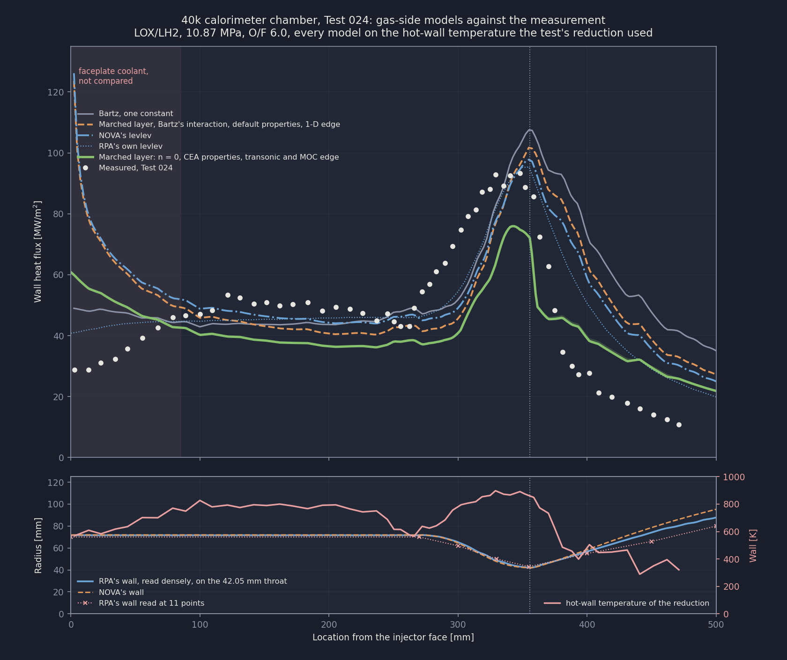
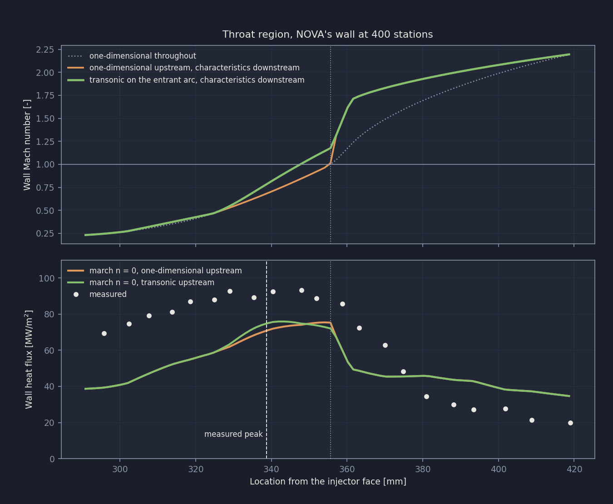
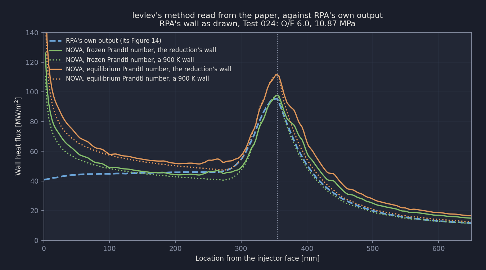
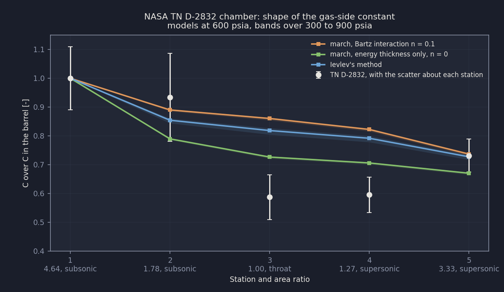

# 40k Calorimeter Chamber: NOVA's Gas Side Against Test 024

NOVA's gas-side models are compared against the wall heat flux measured in Test 024 of the MSFC 40k water-cooled calorimeter chamber: LOX and hydrogen at 10.87 MPa and a mixture ratio of 6.0. Every model runs on the hot-wall temperature the test's own data reduction used, recovered from the published heat flux and heat transfer coefficient. **Three changes take the marched boundary layer's throat-to-barrel shape error from +35 percent to +7.5 percent, and each was adopted on grounds other than this measurement:** the closure was selected on a second chamber (NASA TN D-2832), the gas properties are CEA's, and the near-wall state through the throat is two-dimensional. **The level is not validated.** On the adopted property set the closed model runs 17 to 23 percent low over the barrel, the peak and the throat, and the chemistry assumption alone moves the level by 18 points. Two shape discrepancies remain, and neither is a contour effect: the measured flux rises earlier and flatter through the convergence than any model, and past an area ratio of 1.2 on the diverging side every model runs well above the measurement.

| Metric | Measured | Bartz, one constant | Ievlev's method | Marched layer as it started | Marched layer, closed |
|---|---|---|---|---|---|
| Barrel, 100 to 250 mm | 49.3 MW/m^2 | -10 % | -7 % | -13 % | -23 % |
| Throat over barrel | 1.76 | +38 % | +20 % | +35 % | **+7.5 %** |
| Peak | 93.3 MW/m^2 | +15 % | +5 % | +9 % | -19 % |
| Peak position against the measured | 338.8 mm | +16.3 mm | +14.0 mm | +17.3 mm | +6.7 mm |
| Converging slope, q(A/A* 1.05) / q(2.5) | 1.32 | 2.02 | 1.97 | 2.16 | 1.92 |
| Diverging over converging flux at A/A* 1.5 | 0.36 | 1.17 | 1.03 | 1.14 | 0.79 |
| RMS error, 100 to 480 mm | | 103 % | 69 % | 80 % | 47 % |

"As it started" is the march with NOVA's default properties and Bartz's thickness interaction exponent of 0.1, on RPA's wall with a one-dimensional edge state. "Closed" is the same march with the energy-thickness Stanton law (n = 0) and CEA properties with an equilibrium enthalpy potential, on NOVA's own wall with the transonic (Sauer) and characteristics near-wall state. Bartz and Ievlev run on RPA's wall with a one-dimensional edge state, Ievlev with CEA's frozen Prandtl number.

---

## The test

The measurement is Test 024, Figs. 11 and 12 of Dexter, Fisher, Hulka, Denisov, Shibanov and Agarkov, Chapter 16 of AIAA Progress in Astronautics and Aeronautics Vol. 200, pp. 586 to 591. The calorimeter chamber had 116 circumferential water channels manifolded into 58 circuits, each with its own temperature and pressure measurements. Fig. 11 gives the heat flux of each circuit and Fig. 12 the hot-gas heat transfer coefficient reduced from it. The chapter states a total heat load of 9079 kW and a characteristic velocity efficiency of 100 percent. RPA's thermal analysis paper (Ponomarenko, 2012) reproduces Fig. 11 as its Figure 13, and its Figure 14 is RPA's prediction for the same test at the same operating point.

Dexter's Table 1 gives the chamber: an 84.1 mm throat, a 143.8 mm chamber, a contraction ratio of 2.92, 355.6 mm from the injector face to the throat (L'), an expansion ratio of 7 and 61 injection elements. The convergence angle and throat radius of curvature match the SSME main combustion chamber's, which the chapter does not give. RPA's design parameter table carries a "combustion chamber diameter" of 43.8 mm. That is the 143.8 mm with its first digit lost, a slip Dexter's table also prints in its regeneratively cooled column. At 10.87 MPa and CEA's characteristic velocity of 2312 m/s, the throat passes 26.11 kg/s. Wang and Luong's Table 3 (10.81 MPa, mixture ratio 6.87, 29.2 kg/s with a 1.7 kg/s film) is not this test; only their 289 K coolant water inlet temperature is used.

Three features of the hardware's operation bear on the comparison:

- **No film.** The faceplate was transpiration cooled and the outer element row carried no mixture-ratio bias, so no wall film was injected. The low flux over the first 85.6 mm is the faceplate coolant and the injector near field, and those stations are outside every number.
- **Warm fuel.** The fuel reached the injector warm, through a preburner, at a temperature the chapter does not give. CEA is run on liquid hydrogen. Hydrogen fed as gas at 298 K raises the chamber temperature from 3533 to 3608 K and the level of the march by 4.6 points, and moves its throat-to-barrel ratio by 0.2 points.
- **Injector near field.** The chapter states that near the injector the heat transfer is governed by distance from the injector, and further downstream by velocity. The barrel window starts at 100 mm, inside that region (see "The injector end").

The case lives in `tests/calorimeter40kCase.py`, which carries the digitized data, the recovered wall temperature, the edge state, the models' adapters and the scorecard; `tests/testCalorimeter40k.py` checks it. Every number below is printed by `featureShowcase/buildCalorimeter40k.py`.

### The figures, read

`featureShowcase/digitizeCalorimeter40k.py` reads the images embedded in both PDFs at their native resolution.

**The measurement.** All 58 markers of Fig. 11 are found by blob detection, with touching markers split by their area, and mapped between the gridlines to about 0.1 cm and 0.2 BTU/s-in^2 (0.3 MW/m^2). Fig. 12's markers are paired to Fig. 11's stations by the ratio of coefficient to flux; the two blobs left unpaired are the figure's arrowheads. Each figure's second axis checks its conversion: Fig. 11 puts 90 000 kW/m^2 on the 55 BTU/s-in^2 gridline, which the conversion reproduces to 0.1 percent, and Fig. 12 puts 55 kW/m^2-K at 0.01868 BTU/in^2-s-F. With each circuit given the wall between the midpoints to its neighbours on RPA's wall, the digitized flux integrates to 9268 kW against the chapter's 9079 kW: 2.1 percent high, inside what the unknown circuit boundaries allow.

The flux holds within 5 percent of its maximum from 26.6 to 3.7 mm ahead of the throat. The highest marker is 93.3 MW/m^2 at 7.6 mm ahead, and the throat station reads 87.0 MW/m^2. The region within 5 percent of the maximum is centred at 338.8 mm, 16.8 mm ahead of the throat. The coefficient runs 17.9 kW/m^2-K over the barrel, 32.9 at the throat and 35.5 at its maximum, 7.6 mm ahead.

**RPA's wall.** Read column by column and fitted with a least-squares spline on knots 6 mm apart, the wall returns a 42.3 mm throat, a contraction ratio of 2.91 and an expansion ratio of 7.06, against Table 1's 42.05 mm, 2.92 and 7: RPA drew the hardware's chamber. The case scales it radially onto the 42.05 mm throat, which moves no area ratio. Fitted with RPA's own construction it is a 30.1 degree cone between a fillet of 1.48 and an entrant arc of 1.15 throat radii, to 0.31 mm RMS. One pixel of radius is 1.3 mm, so the throat arc spans two or three pixel rows and its radius is carried as a bracket of 0.8 to 1.5 throat radii. The wall is RPA's construction of the chamber, not a survey of it.

**NOVA's wall** is NOVA's own 30 degree cone with 1.5 throat-radius arcs, ahead of a truncated ideal contour at an 80 percent length fraction. NOVA sizes the throat from the mass flow and delivers 42.08 mm.

## The wall temperature

**Every model runs on the wall temperature the test's reduction used.** Dexter reduces the coefficient as h_g = (Q/A) / (T_aw - T_wh), with T_aw = R_c T_c and the recovery factor R_c from one-dimensional equilibrium Pr, gamma and Mach number (Eqs. 22 to 24). T_wh came from a two-dimensional finite-difference model of the wall with forced convection and nucleate boiling on the water side, held at the water's saturation temperature plus 283 K once it reached it. Figs. 11 and 12 together therefore return the reduction's wall, T_wh = T_aw - (Q/A) / h_g. `reductionWallTemperature` recovers it on RPA's wall with a one-dimensional Mach number:

| Region | Recovered hot-wall temperature |
|---|---|
| Injector end, 0 to 86 mm | 570 to 770 K |
| Barrel, 100 to 250 mm | 690 to 830 K |
| Convergence, 250 to 330 mm | 565 to 900 K |
| 330 mm to the throat | 865 to 890 K |
| Diverging section, from 380 mm | 275 to 505 K |

The plateau ahead of the throat is the cap. The recovery factor needs a Prandtl number, and "equilibrium" leaves open which one. With CEA's equilibrium value the recovered wall past the throat falls to 202 K, below the 289 K water that cools it; with the frozen value it stays at 275 K or above. The frozen reading is carried. Upstream of the throat the two agree to within 11 K.

The recovered wall is the output of the reduction's thermal model, not a measurement, and carries that model's error. Against uniform walls it takes 4 points off the march's throat-to-barrel error:

| Wall, adopted properties, n = 0.1, RPA's wall, 1-D edge | Barrel | Throat over barrel | Throat |
|---|---|---|---|
| **Reduction's wall** | -17.0 % | +32.2 % | +9.7 % |
| Uniform 550 K | -9.7 % | +36.4 % | +23.1 % |
| Uniform 700 K | -14.2 % | +36.5 % | +17.1 % |
| Uniform 850 K | -18.6 % | +36.7 % | +11.2 % |

## Scoring

Every entry is a model's relative error against the measurement unless named otherwise. The barrel is the mean over measured stations from 100 to 250 mm. The throat-to-barrel ratio takes the level out. The peak position is the centroid of the region within 5 percent of each profile's own maximum, because the measurement holds a plateau rather than a single peak. The converging slope is the flux at an area ratio of 1.05 over the flux at 2.5 on the subsonic branch. The asymmetry is diverging over converging flux at matched area ratios of 1.1, 1.5 and 2.0. A model's area ratios come from its own wall and the measurement's from RPA's.

## Where the models start

On RPA's wall with a one-dimensional edge state:

| Model | Barrel | Throat over barrel | Peak | Peak position | Converging slope | Asymmetry at 1.1, 1.5, 2.0 |
|---|---|---|---|---|---|---|
| Measured | 49.3 MW/m^2 | 1.76 | 93.3 MW/m^2 | 338.8 mm | 1.32 | 0.79, 0.36, 0.28 |
| Bartz, one constant | -10 % | +38 % | +15 % | +16.3 mm | 2.02 | 1.03, 1.17, 1.12 |
| Bartz, measured axial shape | -14 % | -16 % | -32 % | 0.0 mm | 1.30 | 0.96, 0.88, 0.77 |
| Marched layer, n = 0.1, defaults | -13 % | +35 % | +9 % | +17.3 mm | 2.16 | 1.04, 1.14, 1.08 |
| RPA's own prediction | -8 % | +18 % | +2 % | +10.7 mm | 1.78 | 0.93, 0.82, 0.73 |

The measured axial shape is calibrated on TN D-2832 and carries that chamber's throat reduction onto this one, where it overshoots by 16 points. RPA's prediction is the only one whose diverging side falls below its converging side at matched area ratios, as the measurement's does.

## The contour

**The contour does not explain any of the shape errors.** NOVA's wall reaches each area ratio past the throat in 87 to 91 percent of the wall length RPA's takes:

| Area ratio | NOVA [mm] | RPA, read densely [mm] | NOVA over RPA | RPA read at 11 points [mm] |
|---|---|---|---|---|
| 1.1 | 7.8 | 8.7 | 0.90 | 7.3 |
| 1.2 | 13.4 | 14.8 | 0.91 | 14.6 |
| 1.5 | 28.0 | 31.5 | 0.89 | 36.6 |
| 2.0 | 48.7 | 55.7 | 0.87 | 72.5 |
| 2.9 | 80.6 | 93.0 | 0.87 | 123.3 |

Read at 11 points by eye, RPA's wall looks a third longer than NOVA's past an area ratio of 1.5. That is an artifact of the sparse reading, and the same reading maps the measured diverging stations to area ratios that are too small: the station at 408.8 mm is at 2.03 on the dense wall, not 1.75.

Sweeping RPA's construction under the march as it started, over a contraction ratio of 2.80 to 3.04, an entrant arc of 0.8 to 2.0 throat radii, a cone of 25 to 35 degrees and a fillet of 1.0 to 2.0 throat radii:

- the throat-to-barrel error moves between +31 and +40 percent, 10 points of it with the contraction ratio and 3 with the entrant arc;
- the peak position moves between +12.5 and +16.5 mm, all of it with the entrant arc;
- the converging slope stays between 2.07 and 2.23.

Putting NOVA's truncated ideal diverging section behind RPA's converging one moves the errors at 390 mm and 460 mm from +159 and +168 percent to +146 and +138 percent.

## Gas properties and the driving potential

**The properties set the level and not the shape.** NOVA's defaults are generic:

- a viscosity of 8.35e-5 Pa-s at the chamber temperature against CEA's 1.07e-4;
- a Prandtl number of 0.865 from 4 gamma / (9 gamma - 5) against CEA's 0.546 (equilibrium) and 0.714 (frozen) at the throat;
- a driving potential cp (T_aw - T_w) with cp = gamma R / (gamma - 1) = 4910 J/kg-K, which is 13.42 MJ/kg at an 800 K wall.

The enthalpy difference to the gas at the wall temperature, from CEA, is 10.76 MJ/kg with the wall gas recombined and 9.18 MJ/kg at chamber composition. The recombined value agrees with NIST-JANAF to 0.1 percent.

| Properties, n = 0.1, RPA's wall, 1-D edge, reduction's wall | Barrel | Throat over barrel | Throat |
|---|---|---|---|
| Defaults | -13.4 % | +34.8 % | +16.8 % |
| Defaults, equilibrium enthalpy potential | -30.7 % | +36.0 % | -5.9 % |
| CEA viscosity and equilibrium Prandtl number | +3.8 % | +31.2 % | +36.1 % |
| **Adopted:** CEA viscosity, equilibrium Prandtl number, equilibrium enthalpy potential | -17.0 % | +32.2 % | +9.7 % |
| Bound: CEA viscosity, frozen Prandtl number, frozen enthalpy potential | -34.5 % | +33.5 % | -12.5 % |
| Adopted, hydrogen fed as gas at 298 K | -12.4 % | +32.4 % | +16.0 % |

The adopted set is the consistent one for a layer near equilibrium on a catalytic copper wall at 10.9 MPa: the enthalpy potential with the transport properties that go with it, k_eq / cp_eq = mu / Pr_eq. The frozen set bounds it. The chemistry assumption moves the level by 18 points and the shape by 1.3.

The barrel's closeness under the defaults therefore rests on property shortcuts. Bartz's coefficient carries the same kind. Against CEA its viscosity fit is 45 percent low at the chamber, its specific heat 25 percent high against the equilibrium enthalpy difference at 800 K, and its Prandtl number 22 percent high against the frozen value. Its group mu^0.2 cp / Pr^0.6 lands within 2 percent of the same group on CEA's viscosity, the equilibrium enthalpy difference and the frozen Prandtl number, and 16 percent below it with the equilibrium Prandtl number.

## The injector end

**The barrel shows no film and carries part of the injector's near field.** A film at the wall would make the flux climb along the barrel as its effectiveness decayed. The measured flux falls instead: by 13.8 percent from 120 to 255 mm on a linear fit over 14 stations, with the coefficient falling 17.1 percent, where the march falls 8.3 percent from the layer's growth alone. Dexter scales the full-scale SSME chamber's heat flux over its first 127 mm or so directly from this chamber's, because there the heat transfer depends on distance from the injector. The excess decay, about 5 points across the barrel window, is the size of the near-field contribution the barrel mean carries into every throat-to-barrel ratio here.

## The near-wall state through the throat

**The asymmetry next to the throat comes from the edge state, not from the layer's history.** On NOVA's wall, with NOVA's default properties and n = 0.1:

| Edge state, NOVA's wall | Asymmetry at 1.1, 1.5, 2.0 | Throat over barrel |
|---|---|---|
| One-dimensional upstream, characteristics downstream | 0.73, 0.89, 0.92 | +30 % |
| One-dimensional throughout | 1.02, 1.13, 1.07 | +38 % |
| Measured | 0.79, 0.36, 0.28 | |

Twelve millimetres past the throat the characteristics solve puts the wall at Mach 1.82 where the one-dimensional state puts it at 1.46, and the mass flux per unit area on the wall is correspondingly lower. That brings the asymmetry at an area ratio of 1.1 to 0.73, against 0.79 measured. At 1.5 and 2.0 no edge state comes near the measurement.

Upstream, the one-dimensional state puts the sonic point at the geometric throat on every streamline, and the wall jumps from Mach 1.01 there to 1.32 at the first characteristics station 1.5 mm downstream. `nearWallStateModel: transonic` carries the transonic solution the characteristics net starts from over the entrant arc, tapered back to one-dimensional where the arc meets the cone. On NOVA's wall at 400 contour points, with the adopted properties:

| Converging near-wall state | Wall mass flux peaks | n = 0.1: throat over barrel, peak position | n = 0: throat over barrel, peak position, converging slope |
|---|---|---|---|
| One-dimensional | at the throat | +36.3 %, +10.8 mm | +12.3 %, +9.2 mm, 1.86 |
| Transonic, Sauer | 7.7 mm ahead | +31.5 %, +7.5 mm | +7.5 %, +6.7 mm, 1.92 |
| Transonic, second order | 9.2 mm ahead | +29.1 %, +6.3 mm | +5.0 %, +5.3 mm, 1.92 |

The wall's mass flux peaks where its flow goes sonic, 0.18 to 0.22 throat radii ahead of the throat, against the 0.21 Sauer's solution gives on a 1.5 throat-radius arc. The heat flux peak moves a third to a half as far, because the Stanton number keeps rising as the energy thickness thins toward the throat. The transonic state takes 5 to 7 points off the throat-to-barrel error and steepens the converging slope. Tapering it over half the arc instead of all of it moves the peak 2.0 mm downstream and the throat-to-barrel ratio by under 0.1 percent.

## Ievlev's method

`src/NOVA/ievlevHeatTransfer.py` implements Ievlev's method from the RPA paper's Eqs. 1.1 to 1.6, and `gasSideAxialModel: ievlev` makes it a gas side the jacket can run on. It differs from the marched layer in three ways:

- only the energy integral carries history, and it is integrated in closed form;
- the momentum side is algebraic, with its group ratio near 1.5 on a rocket wall, where the marched thickness ratio reaches 8 to 10 through a throat;
- the driving potential is the enthalpy difference to the wall gas at its 1500 K composition.

The paper leaves four things open:

- **The exponent in Eq. 1.2** is the heat transfer law's exponent in z_T, 0.08 from Eq. 1.3, because only then is Eq. 1.2 the exact quadrature of the energy integral.
- **The logarithm in Eq. 1.3** is base ten, which puts the Stanton number between 1e-3 and 3e-3 along the chamber.
- **The constant in Eq. 1.2** is a starting value of z_T; two decades of it move the throat by under 2 percent.
- **The Prandtl number** is CEA's frozen chamber value.

**Against RPA's own prediction, on RPA's wall at Test 024, the implementation reproduces RPA's barrel and peak to 0 and 3 percent on the reduction's wall.** RPA's paper does not state the wall temperature its prediction used, so the comparison is run on several:

| NOVA's Ievlev | Barrel against RPA | Peak against RPA | Peak over barrel | 400 mm against RPA | 500 mm against RPA |
|---|---|---|---|---|---|
| RPA's own prediction | | | 2.07 | | |
| **Frozen Pr, reduction's wall** | **+0 %** | **+3 %** | **2.12** | +16 % | +26 % |
| Frozen Pr, 550 K wall | +2 % | +17 % | 2.38 | +11 % | +12 % |
| Frozen Pr, 900 K wall | -10 % | +2 % | 2.36 | -4 % | -4 % |
| Equilibrium Pr, reduction's wall | +17 % | +17 % | 2.07 | +31 % | +40 % |
| Equilibrium Pr, 900 K wall | +5 % | +17 % | 2.31 | +8 % | +7 % |

Past the throat, where the reduction's wall falls to between 300 and 500 K, NOVA's curve runs 16 to 26 percent above RPA's; a 900 K wall brings it to within 4 percent there. RPA's barrel also rises from 40.8 MW/m^2 at the injector to 46.0 at 250 mm, which Eqs. 1.1 to 1.5 cannot produce at a constant edge state, so RPA treats the injector end in a way the paper does not describe. This is a code-to-code cross-check, not a validation.

Against the measurement, on the reduction's wall, Ievlev's method runs -7 percent in the barrel and +20 percent in throat-to-barrel ratio, with a converging slope of 1.97 and an asymmetry of 0.98, 1.03 and 0.95. RPA's own curve runs -8 and +18 percent, with an asymmetry of 0.93, 0.82 and 0.73. The two differ mainly past the throat, where the wall temperature RPA assumed is not known.

In a jacket the gas side depends on the wall temperature all the way upstream while the coolant marches from the other end, so the jacket is sized around an outer iteration on the wall temperature. On the regression jacket that closes in three passes, with 0.58 K of change on the last, and the coolant leaves at 264.0 K against 252.7 K under Bartz.

## The closure

**The energy-thickness Stanton law, n = 0, is selected on TN D-2832 and validated here.** The selection rule was fixed before any candidate ran: the RMS of the log ratio of model to measured C over C in the barrel, over stations 2 to 5 of TN D-2832, averaged over 300, 600 and 900 psia. TN D-2832 is a LOX/GH2 heat-sink chamber with a 5 in throat, a 10.77 in bore, 30 degree and 15 degree cones and a throat radius of curvature of one throat radius. Its wall, rebuilt from the report's Figure 1, puts the five instrumentation stations at the tabulated area ratios to 0.005. Its measured C is 0.0257 in the barrel, 0.0240 at an area ratio of 1.78, 0.0151 at the throat, 0.0153 at 1.27 and 0.0188 at 3.33. The case lives in `tests/tnd2832Case.py`.

| Candidate, adopted properties, 500 K wall | C over C in the barrel at stations 2 to 5, 600 psia | Selection metric |
|---|---|---|
| Measured | 0.93, 0.59, 0.60, 0.73 | |
| March, n = 0.1 (Bartz) | 0.89, 0.86, 0.82, 0.74 | 0.250 |
| **March, n = 0** | 0.79, 0.73, 0.71, 0.67 | **0.166** |
| Ievlev's method | 0.85, 0.82, 0.79, 0.73 | 0.222 |
| Bartz, one constant, for reference | 1.00, 1.02, 1.05, 1.11 | 0.447 |
| Bartz, measured axial shape, calibrated on this chamber | 0.94, 0.60, 0.62, 0.81 | 0.057 |

Every candidate underpredicts the throat's drop on TN D-2832, the selected one by 24 percent at the throat. The metric ranks three published closures; nothing was fitted.

On the 40k chamber, under the same properties, on the reduction's wall:

| Closure, RPA's wall, 1-D edge | Barrel | Throat over barrel | Peak | Throat | Converging slope | Asymmetry at 1.1, 1.5, 2.0 |
|---|---|---|---|---|---|---|
| March, n = 0.1 | -17.0 % | +32.2 % | +2.5 % | +9.7 % | 2.16 | 1.02, 1.07, 1.01 |
| **March, n = 0** | -18.6 % | **+8.5 %** | -17.4 % | -11.6 % | 1.85 | 0.97, 1.02, 0.93 |
| Ievlev's method | -6.6 % | +20.1 % | +4.8 % | +12.2 % | 1.97 | 0.98, 1.03, 0.95 |

With NOVA's wall and the transonic near-wall state as well, which is the closed model of the first table, the throat-to-barrel error is +7.5 percent (+5.0 percent under the second-order transonic solution), the throat -17 percent and the barrel -23 percent.

The exponent decides 24 points of the throat's shape error. At a thickness ratio of 8 to 10 through the throat, Bartz's factor (phi / theta)^0.1 is 1.23 to 1.26, applied where the analogy beneath it was correlated on thickness ratios of 0.3 to 1.0. Ambrok, Kays and Crawford, and Kutateladze and Leont'ev all put the friction law's power on the energy thickness alone, and Ievlev's algebraic group ratio leaves a factor near 0.95. `solveBoundaryLayer` takes n = 0 as its default; nothing else in NOVA reads the march's heat transfer, and the drag it supplies does not depend on n.

## What remains

**The level.** The closed model runs 23 percent low in the barrel, 19 percent low at the peak and 17 percent low at the throat. The property set moves the level by 18 points between its equilibrium and frozen readings, and the fuel's inlet temperature by about 5. The barrel also carries part of the injector's near field. None of these can be settled from the sources in hand, and no coefficient is adjusted to close the level.

**The converging section.** The measured flux steps from 43.1 to 49.1 MW/m^2 between 262.4 and 266.0 mm, where RPA's wall is still cylindrical; its convergence begins near 275 mm, and the recovered wall temperature dips to 566 K at the same station. By 295.8 mm, near an area ratio of 2.5, the flux is 69.4 MW/m^2, 1.41 times the barrel, and it then flattens into the plateau. Every model not calibrated on TN D-2832 rises later and steeper: 1.78 to 2.29 times from an area ratio of 2.5 to 1.05, against 1.32 measured. The closed model runs 40 percent low at 290 mm and 28 percent low at 331 mm. No edge state or closure here reproduces it. A hardware convergence that starts earlier than RPA's construction, joints between the calorimeter's sections, and concave curvature at the convergence entrance are all candidates; the sources in hand cannot separate them.

**The diverging section.** The measured flux falls to 34.6 MW/m^2 at 380.9 mm (area ratio 1.42) and 21.3 MW/m^2 at 408.8 mm (2.03). The closed model runs +49 percent at 390 mm and +111 percent at 460 mm. The contour does not explain it, no film was injected, and the acceleration parameter peaks at 1.2e-6, below the 2e-6 onset of laminarization that Wang and Luong cite from Back, Cuffel and Massier. TN D-2832's supersonic station at an area ratio of 3.33 is reproduced by every candidate to within 10 percent, so the failure is specific to this chamber. The sources in hand do not identify the mechanism.

**The peak position.** The closed model peaks 6.7 mm downstream of the measured plateau's centroid, against 17.3 mm for the model as it started.

## Validation status

**This is a comparison against measured hardware data on two chambers.** The closure was chosen among three published forms on TN D-2832 and tested on the 40k chamber, where it brings the throat-to-barrel ratio to within 7.5 percent (5.0 percent under the second-order transonic solution). That is a validation of the throat's shape for these two LOX/hydrogen chambers. It is not a validation of:

- the absolute level, which runs 17 to 23 percent low on the adopted property set and which the chemistry assumption moves by 18 points;
- the converging slope, 1.92 against 1.32 measured;
- the diverging section, where the closed model is 49 to 111 percent high.

The unknowns on the 40k chamber are the contour (RPA's construction, not the hardware's), the fuel's inlet temperature, and the injector near field's share of the barrel. The wall temperature is the reduction's own, recovered with a frozen-Prandtl recovery factor because the equilibrium one puts the downstream wall below the water. The comparison on TN D-2832 converts each model's coefficient to the report's correlation constant with one reference-temperature property evaluation for every station. That report states that its own property choices moved every constant by about 30 percent together, which is why only the shape is compared.

Verified against closed forms and stated values:

- the digitized flux integrates to the chapter's total heat load to 2.1 percent, reproduces both figures' second axes, and RPA's wall returns Table 1's throat, contraction ratio and expansion ratio (`tests/testCalorimeter40k.py`);
- the transonic wall state reproduces the starting line's throat-wall velocity to 1e-12 and Sauer's sonic point exactly (`tests/testContourKernel.py`);
- Ievlev's quadrature is exact in a straight duct to 1e-10, and its wall gas enthalpy agrees with NIST-JANAF to 0.1 percent (`tests/testIevlev.py`).

## Reproducing

    python featureShowcase/digitizeCalorimeter40k.py <Dexter chapter PDF> <RPA thermal paper PDF> [overlay folder]
    python featureShowcase/buildCalorimeter40k.py                  # every phase and the figures
    python featureShowcase/buildCalorimeter40k.py 4 figures        # the closure and the figures
    python -m pytest tests/testCalorimeter40k.py tests/testIevlev.py tests/testContourKernel.py

The NOVA builds are cached under `runs/calorimeter40k/`.

## Sources

- C. E. Dexter, M. F. Fisher, J. R. Hulka, K. P. Denisov, A. A. Shibanov and A. F. Agarkov, "Scaling Techniques for Design, Development, and Test", Chapter 16 of *Liquid Rocket Thrust Chambers: Aspects of Modeling, Analysis, and Design*, Progress in Astronautics and Aeronautics Vol. 200, AIAA, 2004, pp. 553-600, DOI 10.2514/5.9781600866760.0553.0600. Section IV: Table 1 (the hardware), Eqs. 21 to 24 (the reduction), Figs. 11 and 12 (Test 024), the stated heat load, and the near-injector scaling.
- A. Ponomarenko, "RPA: Tool for Rocket Propulsion Analysis. Thermal Analysis of Thrust Chambers", June 2012. Eqs. 1.1 to 1.6 (Ievlev's method), the design parameter table, Figure 13 (the measurement) and Figure 14 (RPA's prediction and wall).
- A. Ponomarenko, "RPA: Design Tool for Liquid Rocket Engine Analysis", Space Propulsion Conference, Cologne, May 2014. The same Ievlev equations, and RPA's parametric chamber construction.
- Ten-See Wang and Van Luong, "Hot-Gas-Side and Coolant-Side Heat Transfer in Liquid Rocket Engine Combustors", Journal of Thermophysics and Heat Transfer, Vol. 8, No. 3, 1994, pp. 524-530. The coolant water inlet temperature and the onset of laminarization.
- R. L. Schacht, R. J. Quentmeyer and W. L. Jones, "Experimental Investigation of Hot-Gas Side Heat-Transfer Rates for a Hydrogen-Oxygen Rocket", NASA TN D-2832, June 1965, NTRS 19650016811. The holdout chamber, its stations and its correlation constants.
- D. R. Bartz, "Turbulent Boundary-Layer Heat Transfer from Rapidly Accelerating Flow of Rocket Combustion Gases and of Heated Air", JPL, December 1963, NTRS 19650013685. The thickness interaction factor, Eq. 42.
- D. R. Bartz, D. G. Elliott and S. Silver, "Calculation of Turbulent Boundary-Layer Growth and Heat Transfer in Axi-Symmetric Nozzles", JPL Technical Report 32-387, February 1963. The integral equations and the Stanton closure.
- M. W. Chase, NIST-JANAF Thermochemical Tables, 4th edition, 1998. Water vapour and hydrogen enthalpies at 500 and 600 K.
