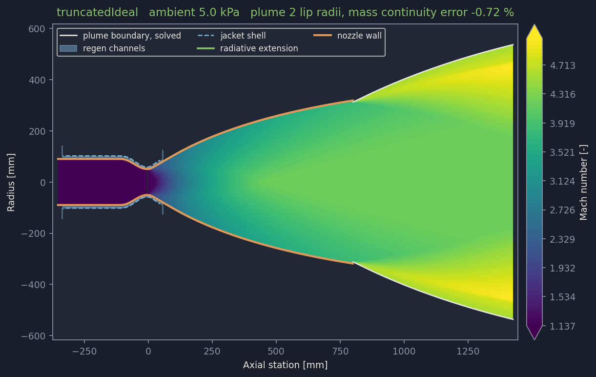
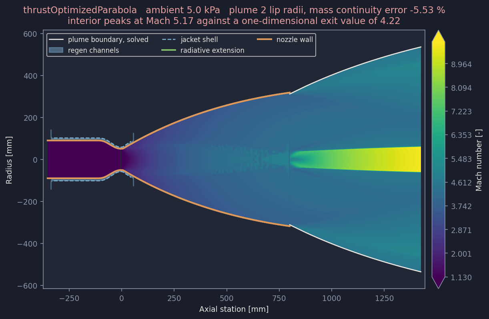
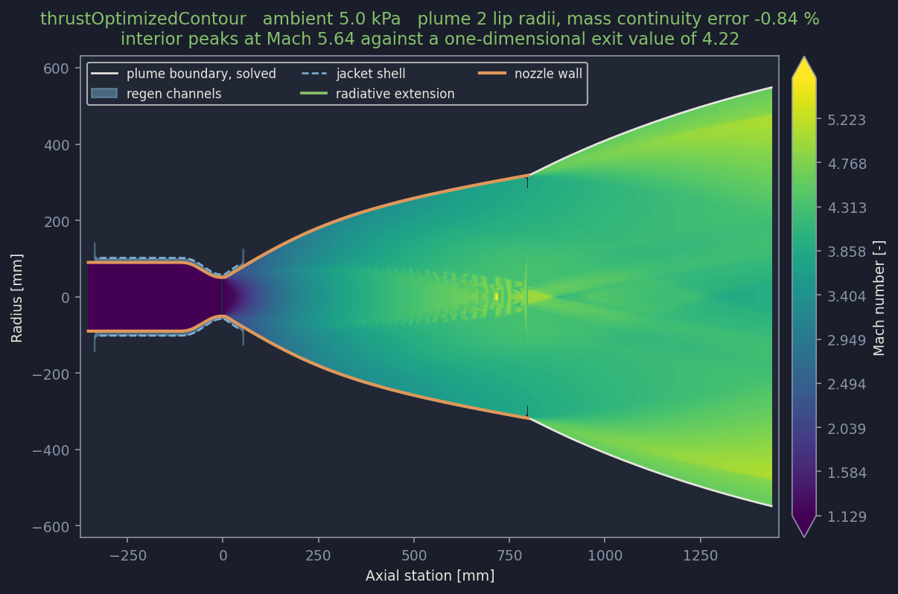
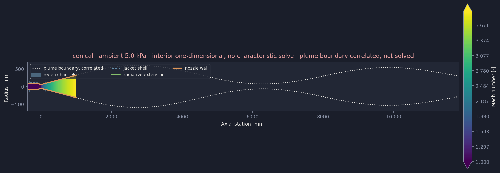

# Diverging section families: what a worked example reaches

Generated 2026-09-28 by `featureShowcase/buildFamilyShowcase.py`, running the shipped `NOVANozzle.json` configuration once per diverging section family with every feature enabled: chamber, cooling jacket, film, radiative extension, volutes and plume. Ambient pressure 5.0 kPa, plume drawn to 2 lip radii.

## Capability matrix

| Stage | truncatedIdeal | thrustOptimizedParabola | thrustOptimizedContour | conical |
|---|---|---|---|---|
| Contour | yes | yes | yes | yes |
| Internal field | yes | yes | yes | NO |
| Near-wall gas state | yes | yes | yes | yes |
| Regen jacket | yes | yes | yes | yes |
| Radiative extension | yes | yes | yes | yes |
| Plume, correlated | underexpanded | underexpanded | underexpanded | underexpanded |
| Plume, marched | yes | yes | yes | NO |
| Plume conserves mass | yes | NO | yes | NO |
| Mass continuity error | -0.72 % | -5.53 % | -0.84 % | -- |

## truncatedIdeal

Contour 100 wall points, internal field 13813 mesh nodes, jacket 60 sized stations, coolant exit 160.8 K.

Plume: Marched 2.00 lip radii on 130 stations, stopping on maxLength. Worst mass continuity error -0.72 per cent of the exit mass flow. It conserves mass over this reach.

## thrustOptimizedParabola

Contour 100 wall points, internal field 11248 mesh nodes, jacket 60 sized stations, coolant exit 160.5 K.

Plume: Marched 2.00 lip radii on 134 stations, stopping on maxLength. Worst mass continuity error -5.53 per cent of the exit mass flow. It does NOT conserve mass over this reach.

Interior mesh: peaks at Mach 5.17 against a one-dimensional exit value of 4.22. A contour that does not straighten its exit leaves a non-uniform exit plane, so a centre-line above the one-dimensional average is expected rather than wrong; what would be wrong is an extreme, and the fold guard in the forward march removes those.

## thrustOptimizedContour

Contour 100 wall points, internal field 11025 mesh nodes, jacket 60 sized stations, coolant exit 159.4 K.

Plume: Marched 2.00 lip radii on 130 stations, stopping on maxLength. Worst mass continuity error -0.84 per cent of the exit mass flow. It conserves mass over this reach.

Interior mesh: peaks at Mach 5.64 against a one-dimensional exit value of 4.22. A contour that does not straighten its exit leaves a non-uniform exit plane, so a centre-line above the one-dimensional average is expected rather than wrong; what would be wrong is an extreme, and the fold guard in the forward march removes those.

## conical

Contour 100 wall points, internal field 0 mesh nodes, jacket 60 sized stations, coolant exit 182.1 K.

Plume: not marched. No characteristic mesh on this contour, so the march has no nozzle solution to continue. Conical nozzles take the correlated plume structure instead.

## Gaps

### The cone, closed

The cone now builds end to end and reaches every stage the contoured families do except the
marched plume. `solveConicalContour` puts it through the same `finishContourSolution` as the rest,
supplying the two things a characteristic solve would have provided: the near-wall state, from the
one-dimensional area-Mach relation at the local wall radius, and the thrust coefficient, from a
source-flow exit plane handed to the same integral the bells use. The divergence loss falls out of
that integration, so `divergenceLossFactor` is not applied on top.

It had failed because `Nozzle.generateNozzle` calls `truncateForRegen()` unconditionally, before
it checks whether cooling is even switched on, and `regenStations.solveRegenStations` then sliced a
near-wall temperature array that `chamber.py` never populated: the block that computes it was
guarded by `divergingSectionFamily(...) != 'conical'` in two places. Both guards are gone, because
the cone now supplies its own near-wall Mach number and the concatenation below them does not care
which solve produced it.

Two limits are worth recording against the result. The one-dimensional near-wall state carries no
radial structure and no wave reflections, so it misses the overexpansion at the arc-to-cone
junction that SP-8120 warns can stand a shock. And the source-flow exit plane is the classical
approximation rather than a solve, so the thrust coefficient inherits whatever that costs.

The marched plume still refuses a cone, correctly: there is no characteristic mesh to continue and
the correlated plume structure stands in. Closing that would mean solving the cone's interior with
the method of characteristics, which is the same forward solve the optimized families need.

### The thrust-optimized parabola hands over a corrupt exit plane

The parabola builds, carries a mesh, cools and reaches a marched plume, but its exit profile is
not physical. Across the exit plane it is non-monotone in both Mach number and flow angle, and it
carries a node at 50.8 degrees of flow angle on a wall that turns 8.15 degrees. The truncated
ideal contour on the same configuration is monotone in both, 4.203 down to 3.797 in Mach and 0 up
to 8.69 degrees in angle, against a wall exit angle of 8.77 degrees.

The consequence is measurable rather than cosmetic. Marched two lip radii, the parabola loses
5.53 per cent of the exit mass flow where the truncated ideal contour loses 0.72 per cent, so the
plume is drawn and is not trustworthy.

The cause is that the stored characteristic mesh is the one used to design the contour, not a
solve of the duct that was built. A thrust-optimized parabola is fitted between two wall angles
and its wall is not a streamline of the mesh behind it, so reading the mesh at the exit abscissa
samples a flow field that the physical nozzle does not contain.

What closes it: solve the actual duct. Running the method of characteristics forward through the
built parabola, with the wall as a boundary condition rather than as an output, produces an exit
plane that belongs to the nozzle. That is a new solve rather than a repair of the existing one.

### The stored mesh carries states the nozzle never reaches

On both optimized families 113 of 6124 interior mesh nodes, 1.8 per cent, sit above the nozzle's
own exit Mach number of 4.223, peaking at 6.29 for the parabola and 7.53 for the contour. Inside
a duct that exits at 4.223 there is nowhere for Mach 7.5 to be. The truncated ideal contour has
none: its mesh spans 1.137 to 4.203 and stops there.

This is the same defect as the corrupt exit plane seen from a different angle, and it is what
forces the showcase figures to cap their colour scale. The identical node count on two different
contours points at the shared kernel generation rather than at either contour routine.

What closes it: the same forward solve. A check that no interior node exceeds the exit Mach number
would also catch it at build time, which nothing does today.

### The thrust-optimized contour is usable and marginal

The contour reaches every stage and its plume conserves mass to 0.96 per cent over two lip radii,
inside the one per cent the field is called trustworthy within but not by much, against 0.72 per
cent for the truncated ideal contour. Its exit profile is also non-monotone, though far less so
than the parabola's, and it carries a duplicated radius where two mesh rows cross the exit plane
at the same station. The same forward solve that fixes the parabola would settle this one.

### A defect found while probing, and fixed

`_exitPlaneCrossings` short-circuited on any node that happened to lie within rounding of the exit
abscissa, taking that node in place of the whole block's interpolated crossings. A single
coincidental node was enough to discard a block. The parabola put exactly one node there and lost
44 crossings behind it, which is why both optimized families reported no readable exit plane at
all before this run. The truncated ideal contour has no node on the plane, so the defect never
fired on the shipped example. The branch now requires `exitPlaneMinimumNodes` before it will
stand in for the crossings.
